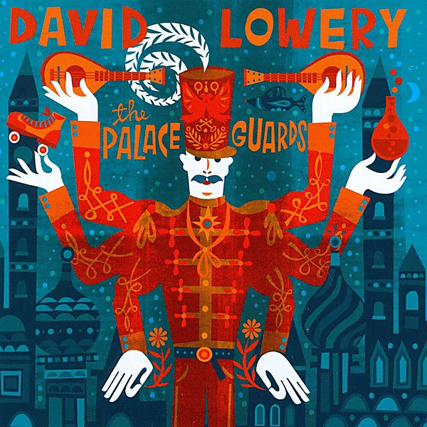

# The Palace Guards

By **David Lowery**

## Album Data

- **Catalog:** Beets
- **Format:** Digital, Album
- **Album:** The Palace Guards
- **Artist:** David Lowery
- **Albumartist:** David Lowery
- **Genre:** Indie Rock
- **MusicBrainz Album Artist ID:** [31e382d2-13dc-44f0-896b-78e2c6326f16](https://musicbrainz.org/artist/31e382d2-13dc-44f0-896b-78e2c6326f16)
- **MusicBrainz Album ID:** [1bbf2eb5-893e-4780-8086-655ffe6ada30](https://musicbrainz.org/release/1bbf2eb5-893e-4780-8086-655ffe6ada30)
- **MusicBrainz Release Group ID:** [7a4a33cd-d14c-4f1b-9167-8ba15f78a055](https://musicbrainz.org/release-group/7a4a33cd-d14c-4f1b-9167-8ba15f78a055)
- **Year:** 2011
- **Catalog #:** 
- **Label:** 429 Records
- **Total Tracks:** 09

## Album Tracks

### Track 01 - Raise 'em Up on Honey

- **Artist:** David Lowery
- **Format:** AAC
- **Genre:** Indie Rock
- **Length:** 4:27
- **MusicBrainz Track ID:** [5039c01e-30e7-49ab-b5fc-4ba5ed05a5f4](https://musicbrainz.org/recording/5039c01e-30e7-49ab-b5fc-4ba5ed05a5f4)
- **Title:** Raise 'em Up on Honey
- **Track:** 01
- **Year:** 2011

### Track 02 - The Palace Guards

- **Artist:** David Lowery
- **Format:** AAC
- **Genre:** Indie Rock
- **Length:** 3:40
- **MusicBrainz Track ID:** [f534fa05-398a-4374-82cd-363d64cd5521](https://musicbrainz.org/recording/f534fa05-398a-4374-82cd-363d64cd5521)
- **Title:** The Palace Guards
- **Track:** 02
- **Year:** 2011

### Track 03 - Deep Oblivion

- **Artist:** David Lowery
- **Format:** AAC
- **Genre:** Indie Rock
- **Length:** 5:35
- **MusicBrainz Track ID:** [08ffaaa8-b9ec-434f-80a9-e62950b64c90](https://musicbrainz.org/recording/08ffaaa8-b9ec-434f-80a9-e62950b64c90)
- **Title:** Deep Oblivion
- **Track:** 03
- **Year:** 2011

### Track 04 - Ah You Left Me

- **Artist:** David Lowery
- **Format:** AAC
- **Genre:** Indie Rock
- **Length:** 3:47
- **MusicBrainz Track ID:** [456cf5e3-d020-4973-a02c-e730ccb51c0a](https://musicbrainz.org/recording/456cf5e3-d020-4973-a02c-e730ccb51c0a)
- **Title:** Ah You Left Me
- **Track:** 04
- **Year:** 2011

### Track 05 - Baby, All Those Girls Meant Nothing to Me

- **Artist:** David Lowery
- **Format:** AAC
- **Genre:** Indie Rock
- **Length:** 4:07
- **MusicBrainz Track ID:** [57053a18-2195-4114-8725-d8f1df65e8b4](https://musicbrainz.org/recording/57053a18-2195-4114-8725-d8f1df65e8b4)
- **Title:** Baby, All Those Girls Meant Nothing to Me
- **Track:** 05
- **Year:** 2011

### Track 06 - I Sold the Arabs the Moon

- **Artist:** David Lowery
- **Format:** AAC
- **Genre:** Indie Rock
- **Length:** 4:03
- **MusicBrainz Track ID:** [c6a766aa-6470-4254-8bf1-b6e2293cd48d](https://musicbrainz.org/recording/c6a766aa-6470-4254-8bf1-b6e2293cd48d)
- **Title:** I Sold the Arabs the Moon
- **Track:** 06
- **Year:** 2011

### Track 07 - Marigold

- **Artist:** David Lowery
- **Format:** AAC
- **Genre:** Indie Rock
- **Length:** 5:29
- **MusicBrainz Track ID:** [6bb4c579-7a63-46bf-a7ee-7c33dee9c808](https://musicbrainz.org/recording/6bb4c579-7a63-46bf-a7ee-7c33dee9c808)
- **Title:** Marigold
- **Track:** 07
- **Year:** 2011

### Track 08 - Big Life

- **Artist:** David Lowery
- **Format:** AAC
- **Genre:** Indie Rock
- **Length:** 4:25
- **MusicBrainz Track ID:** [aee2f5f3-34fe-42ef-ae32-fa54a334f04b](https://musicbrainz.org/recording/aee2f5f3-34fe-42ef-ae32-fa54a334f04b)
- **Title:** Big Life
- **Track:** 08
- **Year:** 2011

### Track 09 - Submarine

- **Artist:** David Lowery
- **Format:** AAC
- **Genre:** Indie Rock
- **Length:** 3:47
- **MusicBrainz Track ID:** [5f8b0616-26d5-4131-95df-0c54ed2f6788](https://musicbrainz.org/recording/5f8b0616-26d5-4131-95df-0c54ed2f6788)
- **Title:** Submarine
- **Track:** 09
- **Year:** 2011

## See also

- [Deep Oblivion](Deep_Oblivion.md)
