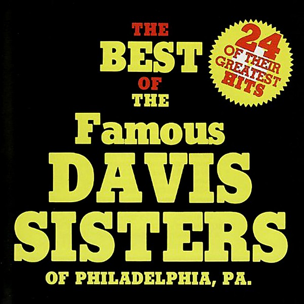

# The Best of the Davis Sisters

By **Davis Sisters**

## Album Data

- **Catalog:** Beets
- **Format:** Digital, Album
- **Album:** The Best of the Davis Sisters
- **Artist:** Davis Sisters
- **Albumartist:** Davis Sisters
- **Genre:** Rockabilly
- **MusicBrainz Album Artist ID:** 
- **MusicBrainz Album ID:** 
- **MusicBrainz Release Group ID:** 
- **Year:** 1978
- **Catalog #:** 
- **Label:** 
- **Total Tracks:** 24

## Album Tracks

### Track 01 - Twelve Gates to the City

- **Artist:** Davis Sisters
- **Format:** AAC
- **Genre:** Rockabilly
- **Length:** 2:54
- **MusicBrainz Track ID:** 
- **Title:** Twelve Gates to the City
- **Track:** 01
- **Year:** 1978

### Track 02 - Sinner Man Where You Gonna Run To

- **Artist:** Davis Sisters
- **Format:** AAC
- **Genre:** Rockabilly
- **Length:** 2:54
- **MusicBrainz Track ID:** 
- **Title:** Sinner Man Where You Gonna Run To
- **Track:** 02
- **Year:** 1978

### Track 03 - I Want to Be More Like Jesus

- **Artist:** Davis Sisters
- **Format:** AAC
- **Genre:** Rockabilly
- **Length:** 2:28
- **MusicBrainz Track ID:** 
- **Title:** I Want to Be More Like Jesus
- **Track:** 03
- **Year:** 1978

### Track 04 - You Got the River of Jordan to Cross

- **Artist:** Davis Sisters
- **Format:** AAC
- **Genre:** Rockabilly
- **Length:** 2:45
- **MusicBrainz Track ID:** 
- **Title:** You Got the River of Jordan to Cross
- **Track:** 04
- **Year:** 1978

### Track 05 - When I Get Inside

- **Artist:** Davis Sisters
- **Format:** AAC
- **Genre:** Rockabilly
- **Length:** 2:54
- **MusicBrainz Track ID:** 
- **Title:** When I Get Inside
- **Track:** 05
- **Year:** 1978

### Track 06 - Shine On Me

- **Artist:** Davis Sisters
- **Format:** AAC
- **Genre:** Rockabilly
- **Length:** 5:30
- **MusicBrainz Track ID:** 
- **Title:** Shine On Me
- **Track:** 06
- **Year:** 1978

### Track 07 - Plant My Feet On Higher Ground

- **Artist:** Davis Sisters
- **Format:** AAC
- **Genre:** Rockabilly
- **Length:** 2:35
- **MusicBrainz Track ID:** 
- **Title:** Plant My Feet On Higher Ground
- **Track:** 07
- **Year:** 1978

### Track 08 - He's My King

- **Artist:** Davis Sisters
- **Format:** AAC
- **Genre:** Rockabilly
- **Length:** 3:18
- **MusicBrainz Track ID:** 
- **Title:** He's My King
- **Track:** 08
- **Year:** 1978

### Track 09 - Rain In Jerusalem

- **Artist:** Davis Sisters
- **Format:** AAC
- **Genre:** Rockabilly
- **Length:** 2:40
- **MusicBrainz Track ID:** 
- **Title:** Rain In Jerusalem
- **Track:** 09
- **Year:** 1978

### Track 10 - Blessed Quietness

- **Artist:** Davis Sisters
- **Format:** AAC
- **Genre:** Rockabilly
- **Length:** 2:50
- **MusicBrainz Track ID:** 
- **Title:** Blessed Quietness
- **Track:** 10
- **Year:** 1978

### Track 11 - What He's Done for Me

- **Artist:** Davis Sisters
- **Format:** AAC
- **Genre:** Rockabilly
- **Length:** 2:19
- **MusicBrainz Track ID:** 
- **Title:** What He's Done for Me
- **Track:** 11
- **Year:** 1978

### Track 12 - Jonah

- **Artist:** Davis Sisters
- **Format:** AAC
- **Genre:** Rockabilly
- **Length:** 1:56
- **MusicBrainz Track ID:** 
- **Title:** Jonah
- **Track:** 12
- **Year:** 1978

### Track 13 - (Jesus) He's My Precious King

- **Artist:** Davis Sisters
- **Format:** AAC
- **Genre:** Rockabilly
- **Length:** 5:13
- **MusicBrainz Track ID:** 
- **Title:** (Jesus) He's My Precious King
- **Track:** 13
- **Year:** 1978

### Track 14 - We Need Power

- **Artist:** Davis Sisters
- **Format:** AAC
- **Genre:** Rockabilly
- **Length:** 2:43
- **MusicBrainz Track ID:** 
- **Title:** We Need Power
- **Track:** 14
- **Year:** 1978

### Track 15 - Tired

- **Artist:** Davis Sisters
- **Format:** AAC
- **Genre:** Rockabilly
- **Length:** 3:14
- **MusicBrainz Track ID:** 
- **Title:** Tired
- **Track:** 15
- **Year:** 1978

### Track 16 - Bye and Bye

- **Artist:** Davis Sisters
- **Format:** AAC
- **Genre:** Rockabilly
- **Length:** 5:28
- **MusicBrainz Track ID:** 
- **Title:** Bye and Bye
- **Track:** 16
- **Year:** 1978

### Track 17 - Jesus Gave Me Water

- **Artist:** Davis Sisters
- **Format:** AAC
- **Genre:** Rockabilly
- **Length:** 3:23
- **MusicBrainz Track ID:** 
- **Title:** Jesus Gave Me Water
- **Track:** 17
- **Year:** 1978

### Track 18 - I Believe I'll Go Back Home

- **Artist:** Davis Sisters
- **Format:** AAC
- **Genre:** Rockabilly
- **Length:** 2:55
- **MusicBrainz Track ID:** 
- **Title:** I Believe I'll Go Back Home
- **Track:** 18
- **Year:** 1978

### Track 19 - He'll Understand and Say Well Done

- **Artist:** Davis Sisters
- **Format:** AAC
- **Genre:** Rockabilly
- **Length:** 3:20
- **MusicBrainz Track ID:** 
- **Title:** He'll Understand and Say Well Done
- **Track:** 19
- **Year:** 1978

### Track 20 - There Is a Tree On Each Side of the River

- **Artist:** Davis Sisters
- **Format:** AAC
- **Genre:** Rockabilly
- **Length:** 3:12
- **MusicBrainz Track ID:** 
- **Title:** There Is a Tree On Each Side of the River
- **Track:** 20
- **Year:** 1978

### Track 21 - Keeping Me Alive

- **Artist:** Davis Sisters
- **Format:** AAC
- **Genre:** Rockabilly
- **Length:** 2:51
- **MusicBrainz Track ID:** 
- **Title:** Keeping Me Alive
- **Track:** 21
- **Year:** 1978

### Track 22 - My Wonderful Counselor

- **Artist:** Davis Sisters
- **Format:** AAC
- **Genre:** Rockabilly
- **Length:** 2:48
- **MusicBrainz Track ID:** 
- **Title:** My Wonderful Counselor
- **Track:** 22
- **Year:** 1978

### Track 23 - Won't It Be Wonderful There

- **Artist:** Davis Sisters
- **Format:** AAC
- **Genre:** Rockabilly
- **Length:** 2:57
- **MusicBrainz Track ID:** 
- **Title:** Won't It Be Wonderful There
- **Track:** 23
- **Year:** 1978

### Track 24 - Almost Home

- **Artist:** Davis Sisters
- **Format:** AAC
- **Genre:** Rockabilly
- **Length:** 2:47
- **MusicBrainz Track ID:** 
- **Title:** Almost Home
- **Track:** 24
- **Year:** 1978

