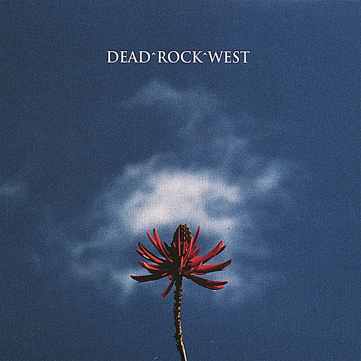

# Honey and Salt

By **Dead Rock West**

## Album Data

- **Catalog:** Beets
- **Format:** Digital, Album
- **Album:** Honey and Salt
- **Artist:** Dead Rock West
- **Albumartist:** Dead Rock West
- **Genre:** Americana
- **MusicBrainz Album Artist ID:** [7a798b31-2fd0-4048-bf04-c95e2df553aa](https://musicbrainz.org/artist/7a798b31-2fd0-4048-bf04-c95e2df553aa)
- **MusicBrainz Album ID:** [9c31624d-28d8-453c-96dd-c73b973e3340](https://musicbrainz.org/release/9c31624d-28d8-453c-96dd-c73b973e3340)
- **MusicBrainz Release Group ID:** [b731b671-e355-359d-b551-04d495eb5d1b](https://musicbrainz.org/release-group/b731b671-e355-359d-b551-04d495eb5d1b)
- **Year:** 2007
- **Catalog #:** 
- **Label:** 
- **Total Tracks:** 12

## Album Tracks

### Track 01 - Highway One

- **Artist:** Dead Rock West
- **Format:** ALAC
- **Genre:** Americana
- **Length:** 3:15
- **MusicBrainz Track ID:** [e850e20a-a57f-41ae-aeb1-b76784b20d2d](https://musicbrainz.org/recording/e850e20a-a57f-41ae-aeb1-b76784b20d2d)
- **Title:** Highway One
- **Track:** 01
- **Year:** 2007

### Track 02 - On the Outside

- **Artist:** Dead Rock West
- **Format:** ALAC
- **Genre:** Americana
- **Length:** 2:39
- **MusicBrainz Track ID:** [52a7549f-0238-4278-bff3-7d396689824d](https://musicbrainz.org/recording/52a7549f-0238-4278-bff3-7d396689824d)
- **Title:** On the Outside
- **Track:** 02
- **Year:** 2007

### Track 03 - Rocket From the Crypt

- **Artist:** Dead Rock West
- **Format:** ALAC
- **Genre:** Americana
- **Length:** 2:29
- **MusicBrainz Track ID:** [8f1bc84e-3405-4ec5-b8e5-035555dc26f8](https://musicbrainz.org/recording/8f1bc84e-3405-4ec5-b8e5-035555dc26f8)
- **Title:** Rocket From the Crypt
- **Track:** 03
- **Year:** 2007

### Track 04 - Pretty Disaster

- **Artist:** Dead Rock West
- **Format:** ALAC
- **Genre:** Americana
- **Length:** 3:38
- **MusicBrainz Track ID:** [68fb01f3-572b-4c95-8fb0-e7b05b5c3434](https://musicbrainz.org/recording/68fb01f3-572b-4c95-8fb0-e7b05b5c3434)
- **Title:** Pretty Disaster
- **Track:** 04
- **Year:** 2007

### Track 05 - Desert Rose

- **Artist:** Dead Rock West
- **Format:** ALAC
- **Genre:** Americana
- **Length:** 3:25
- **MusicBrainz Track ID:** [d13f3e6a-3476-4d4a-987a-7e58acea18cd](https://musicbrainz.org/recording/d13f3e6a-3476-4d4a-987a-7e58acea18cd)
- **Title:** Desert Rose
- **Track:** 05
- **Year:** 2007

### Track 06 - Don't Worry About Me

- **Artist:** Dead Rock West
- **Format:** ALAC
- **Genre:** Americana
- **Length:** 3:10
- **MusicBrainz Track ID:** [cfef792b-a8fa-4460-a5c7-d9548a697223](https://musicbrainz.org/recording/cfef792b-a8fa-4460-a5c7-d9548a697223)
- **Title:** Don't Worry About Me
- **Track:** 06
- **Year:** 2007

### Track 07 - Boredom (How Did I Get Here)

- **Artist:** Dead Rock West
- **Format:** ALAC
- **Genre:** Americana
- **Length:** 3:39
- **MusicBrainz Track ID:** [22ed4b42-35ec-4048-a2ab-8d49ac731269](https://musicbrainz.org/recording/22ed4b42-35ec-4048-a2ab-8d49ac731269)
- **Title:** Boredom (How Did I Get Here)
- **Track:** 07
- **Year:** 2007

### Track 08 - Going Home

- **Artist:** Dead Rock West
- **Format:** ALAC
- **Genre:** Americana
- **Length:** 4:18
- **MusicBrainz Track ID:** [120a1bba-927a-4755-94ad-c221c3566ddf](https://musicbrainz.org/recording/120a1bba-927a-4755-94ad-c221c3566ddf)
- **Title:** Going Home
- **Track:** 08
- **Year:** 2007

### Track 09 - Telephone

- **Artist:** Dead Rock West
- **Format:** ALAC
- **Genre:** Americana
- **Length:** 2:22
- **MusicBrainz Track ID:** [b4def96e-1fe4-4c56-a242-786a60152dc7](https://musicbrainz.org/recording/b4def96e-1fe4-4c56-a242-786a60152dc7)
- **Title:** Telephone
- **Track:** 09
- **Year:** 2007

### Track 10 - I Really Wanted You

- **Artist:** Dead Rock West
- **Format:** ALAC
- **Genre:** Americana
- **Length:** 3:46
- **MusicBrainz Track ID:** [43d77db4-cafd-4728-a852-69330fbb7edf](https://musicbrainz.org/recording/43d77db4-cafd-4728-a852-69330fbb7edf)
- **Title:** I Really Wanted You
- **Track:** 10
- **Year:** 2007

### Track 11 - Burning House of Love

- **Artist:** Dead Rock West
- **Format:** ALAC
- **Genre:** Americana
- **Length:** 4:01
- **MusicBrainz Track ID:** [637c9505-1e38-43d3-b40e-27201d2ccadd](https://musicbrainz.org/recording/637c9505-1e38-43d3-b40e-27201d2ccadd)
- **Title:** Burning House of Love
- **Track:** 11
- **Year:** 2007

### Track 12 - All I Know

- **Artist:** Dead Rock West
- **Format:** ALAC
- **Genre:** Americana
- **Length:** 5:26
- **MusicBrainz Track ID:** [fa347afa-1391-41a2-84d9-5eed9eafa1d0](https://musicbrainz.org/recording/fa347afa-1391-41a2-84d9-5eed9eafa1d0)
- **Title:** All I Know
- **Track:** 12
- **Year:** 2007

