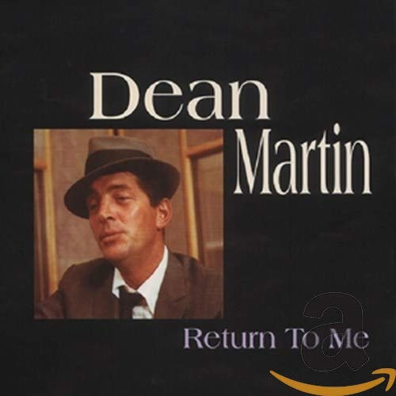

# Return To Me (Box Set)

By **Dean Martin**

## Album Data

- **Catalog:** Beets
- **Format:** Digital, Album
- **Album:** Return To Me (Box Set)
- **Artist:** Dean Martin
- **Albumartist:** Dean Martin
- **Genre:** Swing
- **MusicBrainz Album Artist ID:** 
- **MusicBrainz Album ID:** 
- **MusicBrainz Release Group ID:** 
- **Year:** 0000
- **Catalog #:** 
- **Label:** 
- **Total Tracks:** 00

## Album Tracks

### Track 21 - Cindy V2 (with Ricky Nelson & Walter Brennan)

- **Artist:** Dean Martin
- **Format:** AAC
- **Genre:** Swing
- **Length:** 1:19
- **MusicBrainz Track ID:** 
- **Title:** Cindy V2 (with Ricky Nelson & Walter Brennan)
- **Track:** 21
- **Year:** 0000

## See also

- [Capitol Collectors Series](Capitol_Collectors_Series.md)
- [Vinyl: ](../../Vinyl/Dean_Martin/Dean_Martin.md)
- [Vinyl: Everybody Loves Somebody / A Little Voice](../../Vinyl/Dean_Martin/Everybody_Loves_Somebody_-_A_Little_Voice.md)
- [Vinyl: "Let Me Go, Lover"](../../Vinyl/Dean_Martin/Let_Me_Go__Lover.md)
