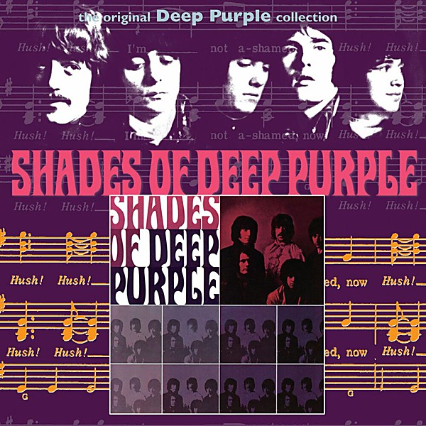

# Deep Purple

By **Deep Purple**

## Album Data

- **Catalog:** Beets
- **Format:** Digital, Album
- **Album:** Deep Purple
- **Artist:** Deep Purple
- **Albumartist:** Deep Purple
- **Genre:** Psychedelic Rock
- **MusicBrainz Album Artist ID:** 
- **MusicBrainz Album ID:** 
- **MusicBrainz Release Group ID:** 
- **Year:** 1969
- **Catalog #:** 
- **Label:** 
- **Total Tracks:** 08

## Album Tracks

### Track 05 - The Painter (Stereo Mix)

- **Artist:** Deep Purple
- **Format:** MP3
- **Genre:** Progressive Rock
- **Length:** 3:50
- **MusicBrainz Track ID:** 
- **Title:** The Painter (Stereo Mix)
- **Track:** 05
- **Year:** 0000

### Track 06 - Why Didn’t Rosemary?

- **Artist:** Deep Purple
- **Format:** MP3
- **Genre:** Progressive Rock
- **Length:** 5:03
- **MusicBrainz Track ID:** [b5294844-2742-42f8-be00-673eda31cf41](https://musicbrainz.org/recording/b5294844-2742-42f8-be00-673eda31cf41)
- **Title:** Why Didn’t Rosemary?
- **Track:** 06
- **Year:** 0000

