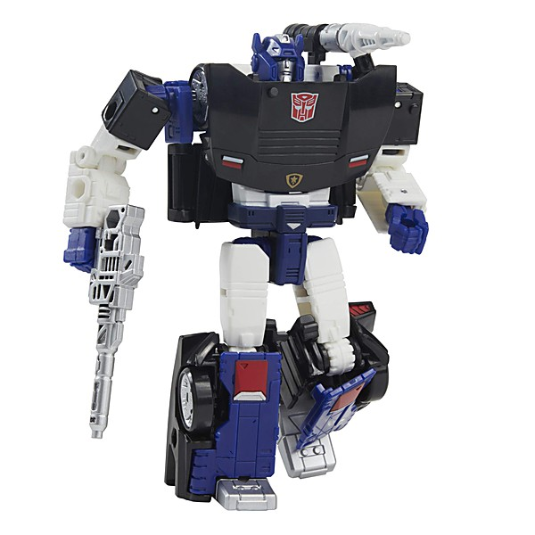

# Deep Purple (2016 reissue)

By **Deep Purple**

## Album Data

- **Catalog:** Beets
- **Format:** Digital, Album
- **Album:** Deep Purple (2016 reissue)
- **Artist:** Deep Purple
- **Albumartist:** Deep Purple
- **Genre:** Progressive Rock
- **MusicBrainz Album Artist ID:** 
- **MusicBrainz Album ID:** 
- **MusicBrainz Release Group ID:** 
- **Year:** 0000
- **Catalog #:** 
- **Label:** 
- **Total Tracks:** 00

## Album Tracks

### Track 01 - Speed King

- **Artist:** Deep Purple
- **Format:** AAC
- **Genre:** Progressive Rock
- **Length:** 6:33
- **MusicBrainz Track ID:** 
- **Title:** Speed King
- **Track:** 01
- **Year:** 1980

### Track 02 - Wring That Neck

- **Artist:** Deep Purple
- **Format:** AAC
- **Genre:** Progressive Rock
- **Length:** 18:34
- **MusicBrainz Track ID:** 
- **Title:** Wring That Neck
- **Track:** 02
- **Year:** 1980

### Track 03 - Child In Time

- **Artist:** Deep Purple
- **Format:** AAC
- **Genre:** Progressive Rock
- **Length:** 10:36
- **MusicBrainz Track ID:** 
- **Title:** Child In Time
- **Track:** 03
- **Year:** 1980

### Track 04 - Mandrake Root

- **Artist:** Deep Purple
- **Format:** AAC
- **Genre:** Psychedelic Rock
- **Length:** 17:30
- **MusicBrainz Track ID:** 
- **Title:** Mandrake Root
- **Track:** 04
- **Year:** 1980

### Track 05 - Highway Star

- **Artist:** Deep Purple
- **Format:** AAC
- **Genre:** Heavy Metal
- **Length:** 6:42
- **MusicBrainz Track ID:** 
- **Title:** Highway Star
- **Track:** 05
- **Year:** 1980

### Track 06 - Strange Kind of Woman

- **Artist:** Deep Purple
- **Format:** AAC
- **Genre:** Progressive Rock
- **Length:** 8:30
- **MusicBrainz Track ID:** 
- **Title:** Strange Kind of Woman
- **Track:** 06
- **Year:** 1980

### Track 07 - Lazy

- **Artist:** Deep Purple
- **Format:** AAC
- **Genre:** Progressive Rock
- **Length:** 8:54
- **MusicBrainz Track ID:** 
- **Title:** Lazy
- **Track:** 07
- **Year:** 1980

### Track 08 - Never Before

- **Artist:** Deep Purple
- **Format:** AAC
- **Genre:** Progressive Rock
- **Length:** 3:56
- **MusicBrainz Track ID:** 
- **Title:** Never Before
- **Track:** 08
- **Year:** 1980

### Track 09 - Space Truckin'

- **Artist:** Deep Purple
- **Format:** AAC
- **Genre:** Heavy Metal
- **Length:** 21:01
- **MusicBrainz Track ID:** 
- **Title:** Space Truckin'
- **Track:** 09
- **Year:** 1980

### Track 10 - Lucille

- **Artist:** Deep Purple
- **Format:** AAC
- **Genre:** Hard Rock
- **Length:** 7:12
- **MusicBrainz Track ID:** 
- **Title:** Lucille
- **Track:** 10
- **Year:** 1980

## See also

- [Burn](Burn.md)
- [Concerto for Group and Orchestra](Concerto_for_Group_and_Orchestra.md)
- [Deepest Purple](Deepest_Purple_2.md)
- [Deepest Purple](Deepest_Purple.md)
- [Deep Purple in Concert](Deep_Purple_in_Concert.md)
- [Deep Purple in Rock](Deep_Purple_in_Rock.md)
- [Deep Purple](Deep_Purple.md)
- [inFinite](inFinite.md)
- [Live in London](Live_in_London.md)
- [Machine Head](Machine_Head.md)
- [Made in Europe](Made_in_Europe.md)
- [Made In Japan (Deluxe Edition)](Made_In_Japan_Deluxe_Edition.md)
- [Made in Japan](Made_in_Japan.md)
- [Perfect Strangers](Perfect_Strangers.md)
- [Shades of Deep Purple](Shades_of_Deep_Purple.md)
- [The Book of Taliesyn](The_Book_of_Taliesyn.md)
- [The Deep Purple Singles A’s & B’s](The_Deep_Purple_Singles_A’s_and_B’s.md)
- [Who Do We Think We Are](Who_Do_We_Think_We_Are.md)
- [Roon: Burn](../../Roon/Deep_Purple/Burn.md)
- [Roon: Concerto for Group and Orchestra](../../Roon/Deep_Purple/Concerto_for_Group_and_Orchestra.md)
- [Roon: Deep Purple](../../Roon/Deep_Purple/Deep_Purple.md)
- [Roon: Fireball](../../Roon/Deep_Purple/Fireball.md)
- [Roon: Infinite](../../Roon/Deep_Purple/Infinite.md)
- [Roon: In Rock](../../Roon/Deep_Purple/In_Rock.md)
- [Roon: Machine Head](../../Roon/Deep_Purple/Machine_Head.md)
- [Roon: Made in Japan (2014 Remaster)](../../Roon/Deep_Purple/Made_in_Japan_2014_Remaster.md)
- [Roon: Shades of Deep Purple](../../Roon/Deep_Purple/Shades_of_Deep_Purple.md)
- [Roon: The Book of Taliesyn](../../Roon/Deep_Purple/The_Book_of_Taliesyn.md)
- [Roon: Who Do We Think We Are (Deluxe Edition)](../../Roon/Deep_Purple/Who_Do_We_Think_We_Are_Deluxe_Edition.md)
- [Vinyl: Burn](../../Vinyl/Deep_Purple/Burn.md)
- [Vinyl: ](../../Vinyl/Deep_Purple/Deep_Purple_index.md)
- [Vinyl: Deep Purple](../../Vinyl/Deep_Purple/Deep_Purple.md)
- [Vinyl: Fireball](../../Vinyl/Deep_Purple/Fireball.md)
- [Vinyl: In Concert '72](../../Vinyl/Deep_Purple/In_Concert_72.md)
- [Vinyl: In Rock](../../Vinyl/Deep_Purple/In_Rock.md)
- [Vinyl: Machine Head](../../Vinyl/Deep_Purple/Machine_Head.md)
- [Vinyl: Made In Japan](../../Vinyl/Deep_Purple/Made_In_Japan.md)
- [Vinyl: Shades Of Deep Purple](../../Vinyl/Deep_Purple/Shades_Of_Deep_Purple.md)
- [Vinyl: Who Do We Think We Are](../../Vinyl/Deep_Purple/Who_Do_We_Think_We_Are.md)
