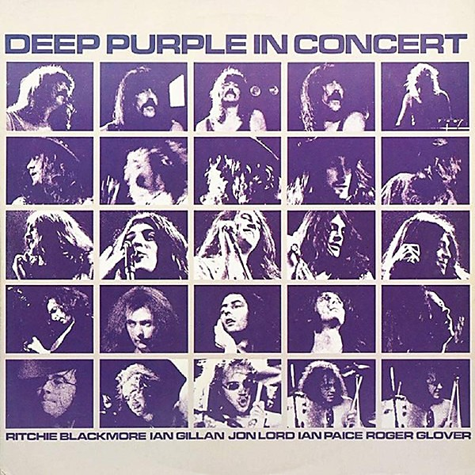

# Deep Purple in Concert

By **Deep Purple**

## Album Data

- **Catalog:** Beets
- **Format:** Digital, Album
- **Album:** Deep Purple in Concert
- **Artist:** Deep Purple
- **Albumartist:** Deep Purple
- **Genre:** Progressive Rock
- **MusicBrainz Album Artist ID:** 
- **MusicBrainz Album ID:** 
- **MusicBrainz Release Group ID:** 
- **Year:** 1980
- **Catalog #:** 1E 062 º 91442
- **Label:** Harvest
- **Total Tracks:** 07

## Album Tracks

### Track 01 - Speed King

- **Artist:** Deep Purple
- **Format:** ALAC
- **Genre:** Progressive Rock
- **Length:** 4:24
- **MusicBrainz Track ID:** [a36a6300-3a97-4db8-ab5a-8518f0800004](https://musicbrainz.org/recording/a36a6300-3a97-4db8-ab5a-8518f0800004)
- **Title:** Speed King
- **Track:** 01
- **Year:** 1970

### Track 02 - Bloodsucker

- **Artist:** Deep Purple
- **Format:** ALAC
- **Genre:** Heavy Metal
- **Length:** 4:16
- **MusicBrainz Track ID:** [6f0e6efe-e40b-4680-acc9-bddd27b99870](https://musicbrainz.org/recording/6f0e6efe-e40b-4680-acc9-bddd27b99870)
- **Title:** Bloodsucker
- **Track:** 02
- **Year:** 1970

### Track 03 - Child in Time

- **Artist:** Deep Purple
- **Format:** ALAC
- **Genre:** Progressive Rock
- **Length:** 10:20
- **MusicBrainz Track ID:** [4618eb95-0323-4f86-9c64-33dee39506d3](https://musicbrainz.org/recording/4618eb95-0323-4f86-9c64-33dee39506d3)
- **Title:** Child in Time
- **Track:** 03
- **Year:** 1970

### Track 04 - Flight of the Rat

- **Artist:** Deep Purple
- **Format:** ALAC
- **Genre:** Heavy Metal
- **Length:** 7:58
- **MusicBrainz Track ID:** [f36d22ff-18aa-4fb1-973f-41f98b7ec085](https://musicbrainz.org/recording/f36d22ff-18aa-4fb1-973f-41f98b7ec085)
- **Title:** Flight of the Rat
- **Track:** 04
- **Year:** 1970

### Track 05 - Into the Fire

- **Artist:** Deep Purple
- **Format:** ALAC
- **Genre:** Heavy Metal
- **Length:** 3:30
- **MusicBrainz Track ID:** [f59ac2a5-0bdb-4e2f-920b-647648fc9666](https://musicbrainz.org/recording/f59ac2a5-0bdb-4e2f-920b-647648fc9666)
- **Title:** Into the Fire
- **Track:** 05
- **Year:** 1970

### Track 06 - Living Wreck

- **Artist:** Deep Purple
- **Format:** ALAC
- **Genre:** Heavy Metal
- **Length:** 4:34
- **MusicBrainz Track ID:** [0c69e548-9631-4ee4-bdf5-afa91382a75f](https://musicbrainz.org/recording/0c69e548-9631-4ee4-bdf5-afa91382a75f)
- **Title:** Living Wreck
- **Track:** 06
- **Year:** 1970

### Track 07 - Hard Lovin’ Man

- **Artist:** Deep Purple
- **Format:** ALAC
- **Genre:** Progressive Rock
- **Length:** 7:11
- **MusicBrainz Track ID:** [18fad1ad-00af-4784-8c6c-eb814381edb0](https://musicbrainz.org/recording/18fad1ad-00af-4784-8c6c-eb814381edb0)
- **Title:** Hard Lovin’ Man
- **Track:** 07
- **Year:** 1970

## See also

- [Burn](Burn.md)
- [Concerto for Group and Orchestra](Concerto_for_Group_and_Orchestra.md)
- [Deepest Purple](Deepest_Purple_2.md)
- [Deepest Purple](Deepest_Purple.md)
- [Deep Purple (2016 reissue)](Deep_Purple_2016_reissue.md)
- [Deep Purple in Rock](Deep_Purple_in_Rock.md)
- [Deep Purple](Deep_Purple.md)
- [inFinite](inFinite.md)
- [Live in London](Live_in_London.md)
- [Machine Head](Machine_Head.md)
- [Made in Europe](Made_in_Europe.md)
- [Made In Japan (Deluxe Edition)](Made_In_Japan_Deluxe_Edition.md)
- [Made in Japan](Made_in_Japan.md)
- [Perfect Strangers](Perfect_Strangers.md)
- [Shades of Deep Purple](Shades_of_Deep_Purple.md)
- [The Book of Taliesyn](The_Book_of_Taliesyn.md)
- [The Deep Purple Singles A’s & B’s](The_Deep_Purple_Singles_A’s_and_B’s.md)
- [Who Do We Think We Are](Who_Do_We_Think_We_Are.md)
- [Roon: Burn](../../Roon/Deep_Purple/Burn.md)
- [Roon: Concerto for Group and Orchestra](../../Roon/Deep_Purple/Concerto_for_Group_and_Orchestra.md)
- [Roon: Deep Purple](../../Roon/Deep_Purple/Deep_Purple.md)
- [Roon: Fireball](../../Roon/Deep_Purple/Fireball.md)
- [Roon: Infinite](../../Roon/Deep_Purple/Infinite.md)
- [Roon: In Rock](../../Roon/Deep_Purple/In_Rock.md)
- [Roon: Machine Head](../../Roon/Deep_Purple/Machine_Head.md)
- [Roon: Made in Japan (2014 Remaster)](../../Roon/Deep_Purple/Made_in_Japan_2014_Remaster.md)
- [Roon: Shades of Deep Purple](../../Roon/Deep_Purple/Shades_of_Deep_Purple.md)
- [Roon: The Book of Taliesyn](../../Roon/Deep_Purple/The_Book_of_Taliesyn.md)
- [Roon: Who Do We Think We Are (Deluxe Edition)](../../Roon/Deep_Purple/Who_Do_We_Think_We_Are_Deluxe_Edition.md)
- [Vinyl: Burn](../../Vinyl/Deep_Purple/Burn.md)
- [Vinyl: ](../../Vinyl/Deep_Purple/Deep_Purple_index.md)
- [Vinyl: Deep Purple](../../Vinyl/Deep_Purple/Deep_Purple.md)
- [Vinyl: Fireball](../../Vinyl/Deep_Purple/Fireball.md)
- [Vinyl: In Concert '72](../../Vinyl/Deep_Purple/In_Concert_72.md)
- [Vinyl: In Rock](../../Vinyl/Deep_Purple/In_Rock.md)
- [Vinyl: Machine Head](../../Vinyl/Deep_Purple/Machine_Head.md)
- [Vinyl: Made In Japan](../../Vinyl/Deep_Purple/Made_In_Japan.md)
- [Vinyl: Shades Of Deep Purple](../../Vinyl/Deep_Purple/Shades_Of_Deep_Purple.md)
- [Vinyl: Who Do We Think We Are](../../Vinyl/Deep_Purple/Who_Do_We_Think_We_Are.md)
