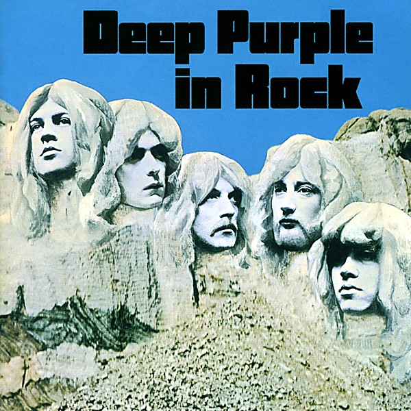

# Deep Purple in Rock

By **Deep Purple**

## Album Data

- **Catalog:** Beets
- **Format:** Digital, Album
- **Album:** Deep Purple in Rock
- **Artist:** Deep Purple
- **Albumartist:** Deep Purple
- **Genre:** Progressive Rock
- **MusicBrainz Album Artist ID:** [79491354-3d83-40e3-9d8e-7592d58d790a](https://musicbrainz.org/artist/79491354-3d83-40e3-9d8e-7592d58d790a)
- **MusicBrainz Album ID:** [5156ea9f-eb54-4258-bbf0-e3af9219de1f](https://musicbrainz.org/release/5156ea9f-eb54-4258-bbf0-e3af9219de1f)
- **MusicBrainz Release Group ID:** [ebdb53c3-fbae-34b1-81cb-f825c9a56822](https://musicbrainz.org/release-group/ebdb53c3-fbae-34b1-81cb-f825c9a56822)
- **Year:** 1970
- **Catalog #:** 
- **Label:** 
- **Total Tracks:** 17

## Album Tracks

### Track 01 - Black Night (Single Version)

- **Artist:** Deep Purple
- **Format:** MP3
- **Genre:** Heavy Metal
- **Length:** 3:24
- **MusicBrainz Track ID:** 
- **Title:** Black Night (Single Version)
- **Track:** 01
- **Year:** 1980

### Track 02 - Speed King (2010 Remix)

- **Artist:** Deep Purple
- **Format:** MP3
- **Genre:** Pop
- **Length:** 4:56
- **MusicBrainz Track ID:** 
- **Title:** Speed King (2010 Remix)
- **Track:** 02
- **Year:** 1980

### Track 03 - Fireball (1996 Remix)

- **Artist:** Deep Purple
- **Format:** MP3
- **Genre:** Pop
- **Length:** 3:20
- **MusicBrainz Track ID:** 
- **Title:** Fireball (1996 Remix)
- **Track:** 03
- **Year:** 1980

### Track 04 - Hush (1998 Remix

- **Artist:** Deep Purple
- **Format:** MP3
- **Genre:** Progressive Rock
- **Length:** 4:12
- **MusicBrainz Track ID:** 
- **Title:** Hush (1998 Remix
- **Track:** 04
- **Year:** 1980

### Track 05 - Strange Kind of Woman (2002 Remix)

- **Artist:** Deep Purple
- **Format:** MP3
- **Genre:** Pop
- **Length:** 3:47
- **MusicBrainz Track ID:** 
- **Title:** Strange Kind of Woman (2002 Remix)
- **Track:** 05
- **Year:** 1980

### Track 08 - Woman From Tokyo (2000 Remix)

- **Artist:** Deep Purple
- **Format:** MP3
- **Genre:** Pop
- **Length:** 5:44
- **MusicBrainz Track ID:** 
- **Title:** Woman From Tokyo (2000 Remix)
- **Track:** 08
- **Year:** 1980

### Track 09 - Highway Star (1997 Remix)

- **Artist:** Deep Purple
- **Format:** MP3
- **Genre:** Heavy Metal
- **Length:** 6:05
- **MusicBrainz Track ID:** 
- **Title:** Highway Star (1997 Remix)
- **Track:** 09
- **Year:** 1980

### Track 10 - Space Truckin' (1997 Remix)

- **Artist:** Deep Purple
- **Format:** MP3
- **Genre:** Heavy Metal
- **Length:** 4:30
- **MusicBrainz Track ID:** 
- **Title:** Space Truckin' (1997 Remix)
- **Track:** 10
- **Year:** 1980

### Track 11 - Burn (2004 Remix)

- **Artist:** Deep Purple
- **Format:** MP3
- **Genre:** Heavy Metal
- **Length:** 5:59
- **MusicBrainz Track ID:** 
- **Title:** Burn (2004 Remix)
- **Track:** 11
- **Year:** 1980

### Track 12 - Stormbringer (2009 Remix)

- **Artist:** Deep Purple
- **Format:** MP3
- **Genre:** Pop
- **Length:** 4:03
- **MusicBrainz Track ID:** 
- **Title:** Stormbringer (2009 Remix)
- **Track:** 12
- **Year:** 1980

### Track 13 - Soldier of Fortune (2009 Remix)

- **Artist:** Deep Purple
- **Format:** MP3
- **Genre:** Pop
- **Length:** 3:11
- **MusicBrainz Track ID:** 
- **Title:** Soldier of Fortune (2009 Remix)
- **Track:** 13
- **Year:** 1980

### Track 14 - Demon's Eye (2002 Remix)

- **Artist:** Deep Purple
- **Format:** MP3
- **Genre:** Pop
- **Length:** 5:15
- **MusicBrainz Track ID:** 
- **Title:** Demon's Eye (2002 Remix)
- **Track:** 14
- **Year:** 1980

### Track 15 - Smoke On The Water (1997 Remix)

- **Artist:** Deep Purple
- **Format:** MP3
- **Genre:** Heavy Metal
- **Length:** 5:36
- **MusicBrainz Track ID:** 
- **Title:** Smoke On The Water (1997 Remix)
- **Track:** 15
- **Year:** 1980

### Track 16 - You Keep On Moving (2010 Remix)

- **Artist:** Deep Purple
- **Format:** MP3
- **Genre:** Progressive Rock
- **Length:** 5:17
- **MusicBrainz Track ID:** 
- **Title:** You Keep On Moving (2010 Remix)
- **Track:** 16
- **Year:** 1980

### Track 17 - Gettin' Tighter (2010 Remix)

- **Artist:** Deep Purple
- **Format:** MP3
- **Genre:** Pop
- **Length:** 3:42
- **MusicBrainz Track ID:** 
- **Title:** Gettin' Tighter (2010 Remix)
- **Track:** 17
- **Year:** 1980

