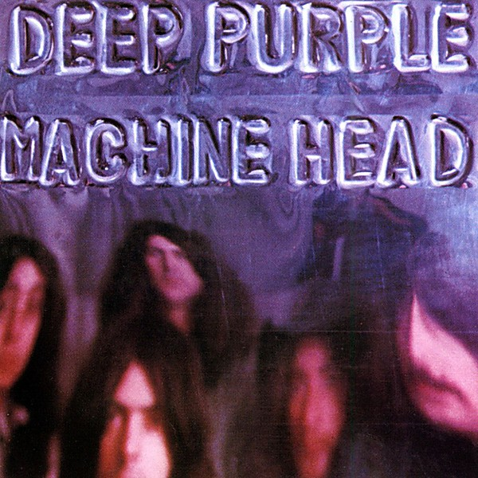

# Machine Head

By **Deep Purple**

## Album Data

- **Catalog:** Beets
- **Format:** Digital, Album
- **Album:** Machine Head
- **Artist:** Deep Purple
- **Albumartist:** Deep Purple
- **Genre:** Progressive Rock
- **MusicBrainz Album Artist ID:** [79491354-3d83-40e3-9d8e-7592d58d790a](https://musicbrainz.org/artist/79491354-3d83-40e3-9d8e-7592d58d790a)
- **MusicBrainz Album ID:** [e17f7941-2aec-3e22-bed6-ef8e7dc7b266](https://musicbrainz.org/release/e17f7941-2aec-3e22-bed6-ef8e7dc7b266)
- **MusicBrainz Release Group ID:** [d00243c5-adcf-3018-9aa7-1957d7a5a774](https://musicbrainz.org/release-group/d00243c5-adcf-3018-9aa7-1957d7a5a774)
- **Year:** 1972
- **Catalog #:** 9 26455-2
- **Label:** Metal Blade Records
- **Total Tracks:** 05

## Album Tracks

### Track 01 - Burn

- **Artist:** Deep Purple
- **Format:** AAC
- **Genre:** Heavy Metal
- **Length:** 7:26
- **MusicBrainz Track ID:** [f452f4d9-244f-426f-b822-6c3cb3e53ee8](https://musicbrainz.org/recording/f452f4d9-244f-426f-b822-6c3cb3e53ee8)
- **Title:** Burn
- **Track:** 01
- **Year:** 1990

### Track 02 - Mistreated

- **Artist:** Deep Purple
- **Format:** AAC
- **Genre:** Heavy Metal
- **Length:** 11:37
- **MusicBrainz Track ID:** [d61736b5-aa31-41a8-96b4-9e2b82e26529](https://musicbrainz.org/recording/d61736b5-aa31-41a8-96b4-9e2b82e26529)
- **Title:** Mistreated
- **Track:** 02
- **Year:** 1990

### Track 03 - Lady Double Dealer

- **Artist:** Deep Purple
- **Format:** AAC
- **Genre:** Heavy Metal
- **Length:** 4:16
- **MusicBrainz Track ID:** [8f386e4c-5e5d-41ff-b35d-6db5488015ca](https://musicbrainz.org/recording/8f386e4c-5e5d-41ff-b35d-6db5488015ca)
- **Title:** Lady Double Dealer
- **Track:** 03
- **Year:** 1990

### Track 04 - You Fool No One

- **Artist:** Deep Purple
- **Format:** AAC
- **Genre:** Heavy Metal
- **Length:** 16:35
- **MusicBrainz Track ID:** [36c46e39-d42f-4aa3-baa8-fb01dcbce633](https://musicbrainz.org/recording/36c46e39-d42f-4aa3-baa8-fb01dcbce633)
- **Title:** You Fool No One
- **Track:** 04
- **Year:** 1990

### Track 05 - Stormbringer

- **Artist:** Deep Purple
- **Format:** AAC
- **Genre:** Heavy Metal
- **Length:** 5:30
- **MusicBrainz Track ID:** [57c424f0-bf69-4f00-86d5-3da99c971c32](https://musicbrainz.org/recording/57c424f0-bf69-4f00-86d5-3da99c971c32)
- **Title:** Stormbringer
- **Track:** 05
- **Year:** 1990

## See also

- [Burn](Burn.md)
- [Concerto for Group and Orchestra](Concerto_for_Group_and_Orchestra.md)
- [Deepest Purple](Deepest_Purple_2.md)
- [Deepest Purple](Deepest_Purple.md)
- [Deep Purple (2016 reissue)](Deep_Purple_2016_reissue.md)
- [Deep Purple in Concert](Deep_Purple_in_Concert.md)
- [Deep Purple in Rock](Deep_Purple_in_Rock.md)
- [Deep Purple](Deep_Purple.md)
- [inFinite](inFinite.md)
- [Live in London](Live_in_London.md)
- [Made in Europe](Made_in_Europe.md)
- [Made In Japan (Deluxe Edition)](Made_In_Japan_Deluxe_Edition.md)
- [Made in Japan](Made_in_Japan.md)
- [Perfect Strangers](Perfect_Strangers.md)
- [Shades of Deep Purple](Shades_of_Deep_Purple.md)
- [The Book of Taliesyn](The_Book_of_Taliesyn.md)
- [The Deep Purple Singles A’s & B’s](The_Deep_Purple_Singles_A’s_and_B’s.md)
- [Who Do We Think We Are](Who_Do_We_Think_We_Are.md)
- [Roon: Burn](../../Roon/Deep_Purple/Burn.md)
- [Roon: Concerto for Group and Orchestra](../../Roon/Deep_Purple/Concerto_for_Group_and_Orchestra.md)
- [Roon: Deep Purple](../../Roon/Deep_Purple/Deep_Purple.md)
- [Roon: Fireball](../../Roon/Deep_Purple/Fireball.md)
- [Roon: Infinite](../../Roon/Deep_Purple/Infinite.md)
- [Roon: In Rock](../../Roon/Deep_Purple/In_Rock.md)
- [Roon: Machine Head](../../Roon/Deep_Purple/Machine_Head.md)
- [Roon: Made in Japan (2014 Remaster)](../../Roon/Deep_Purple/Made_in_Japan_2014_Remaster.md)
- [Roon: Shades of Deep Purple](../../Roon/Deep_Purple/Shades_of_Deep_Purple.md)
- [Roon: The Book of Taliesyn](../../Roon/Deep_Purple/The_Book_of_Taliesyn.md)
- [Roon: Who Do We Think We Are (Deluxe Edition)](../../Roon/Deep_Purple/Who_Do_We_Think_We_Are_Deluxe_Edition.md)
- [Vinyl: Burn](../../Vinyl/Deep_Purple/Burn.md)
- [Vinyl: ](../../Vinyl/Deep_Purple/Deep_Purple_index.md)
- [Vinyl: Deep Purple](../../Vinyl/Deep_Purple/Deep_Purple.md)
- [Vinyl: Fireball](../../Vinyl/Deep_Purple/Fireball.md)
- [Vinyl: In Concert '72](../../Vinyl/Deep_Purple/In_Concert_72.md)
- [Vinyl: In Rock](../../Vinyl/Deep_Purple/In_Rock.md)
- [Vinyl: Machine Head](../../Vinyl/Deep_Purple/Machine_Head.md)
- [Vinyl: Made In Japan](../../Vinyl/Deep_Purple/Made_In_Japan.md)
- [Vinyl: Shades Of Deep Purple](../../Vinyl/Deep_Purple/Shades_Of_Deep_Purple.md)
- [Vinyl: Who Do We Think We Are](../../Vinyl/Deep_Purple/Who_Do_We_Think_We_Are.md)
