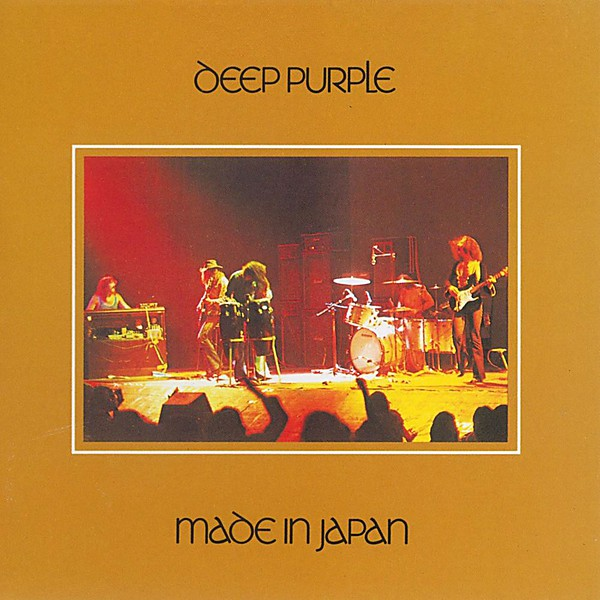

# Made in Japan

By **Deep Purple**

## Album Data

- **Catalog:** Beets
- **Format:** Digital, Album
- **Album:** Made in Japan
- **Artist:** Deep Purple
- **Albumartist:** Deep Purple
- **Genre:** Progressive Rock
- **MusicBrainz Album Artist ID:** [79491354-3d83-40e3-9d8e-7592d58d790a](https://musicbrainz.org/artist/79491354-3d83-40e3-9d8e-7592d58d790a)
- **MusicBrainz Album ID:** [fb49386f-541a-4928-a606-1f6c9aacaec5](https://musicbrainz.org/release/fb49386f-541a-4928-a606-1f6c9aacaec5)
- **MusicBrainz Release Group ID:** [afab893b-4284-37c3-bf74-0139773c8c6d](https://musicbrainz.org/release-group/afab893b-4284-37c3-bf74-0139773c8c6d)
- **Year:** 1972
- **Catalog #:** 
- **Label:** 
- **Total Tracks:** 10

## Album Tracks

### Track 01 - Highway Star (Live Version)

- **Artist:** Deep Purple
- **Format:** MP3
- **Genre:** Hard Rock
- **Length:** 6:43
- **MusicBrainz Track ID:** 
- **Title:** Highway Star (Live Version)
- **Track:** 01
- **Year:** 2005

### Track 02 - Child In Time (Live Version)

- **Artist:** Deep Purple
- **Format:** MP3
- **Genre:** Psychedelic Rock
- **Length:** 12:17
- **MusicBrainz Track ID:** 
- **Title:** Child In Time (Live Version)
- **Track:** 02
- **Year:** 2005

### Track 03 - Smoke On The Water (Live Version)

- **Artist:** Deep Purple
- **Format:** MP3
- **Genre:** Progressive Rock
- **Length:** 7:36
- **MusicBrainz Track ID:** 
- **Title:** Smoke On The Water (Live Version)
- **Track:** 03
- **Year:** 2005

### Track 04 - The Mule (Drum Solo) (Live Version)

- **Artist:** Deep Purple
- **Format:** MP3
- **Genre:** Progressive Rock
- **Length:** 9:28
- **MusicBrainz Track ID:** 
- **Title:** The Mule (Drum Solo) (Live Version)
- **Track:** 04
- **Year:** 2005

### Track 05 - Strange Kind Of Woman (Live Version)

- **Artist:** Deep Purple
- **Format:** MP3
- **Genre:** Progressive Rock
- **Length:** 9:52
- **MusicBrainz Track ID:** 
- **Title:** Strange Kind Of Woman (Live Version)
- **Track:** 05
- **Year:** 2005

### Track 06 - Lazy (Live Version)

- **Artist:** Deep Purple
- **Format:** MP3
- **Genre:** Hard Rock
- **Length:** 10:27
- **MusicBrainz Track ID:** 
- **Title:** Lazy (Live Version)
- **Track:** 06
- **Year:** 2005

### Track 07 - Space Truckin' (Live Version)

- **Artist:** Deep Purple
- **Format:** MP3
- **Genre:** Psychedelic Rock
- **Length:** 19:54
- **MusicBrainz Track ID:** 
- **Title:** Space Truckin' (Live Version)
- **Track:** 07
- **Year:** 2005

### Track 08 - Black Night (Live Version)

- **Artist:** Deep Purple
- **Format:** MP3
- **Genre:** Hard Rock
- **Length:** 6:17
- **MusicBrainz Track ID:** 
- **Title:** Black Night (Live Version)
- **Track:** 08
- **Year:** 2005

### Track 09 - Speed King (Live Version)

- **Artist:** Deep Purple
- **Format:** MP3
- **Genre:** Hard Rock
- **Length:** 7:24
- **MusicBrainz Track ID:** 
- **Title:** Speed King (Live Version)
- **Track:** 09
- **Year:** 2005

### Track 10 - Lucille (Live Version)

- **Artist:** Deep Purple
- **Format:** MP3
- **Genre:** Hard Rock
- **Length:** 8:03
- **MusicBrainz Track ID:** 
- **Title:** Lucille (Live Version)
- **Track:** 10
- **Year:** 2005

## See also

- [Burn](Burn.md)
- [Concerto for Group and Orchestra](Concerto_for_Group_and_Orchestra.md)
- [Deepest Purple](Deepest_Purple_2.md)
- [Deepest Purple](Deepest_Purple.md)
- [Deep Purple (2016 reissue)](Deep_Purple_2016_reissue.md)
- [Deep Purple in Concert](Deep_Purple_in_Concert.md)
- [Deep Purple in Rock](Deep_Purple_in_Rock.md)
- [Deep Purple](Deep_Purple.md)
- [inFinite](inFinite.md)
- [Live in London](Live_in_London.md)
- [Machine Head](Machine_Head.md)
- [Made in Europe](Made_in_Europe.md)
- [Made In Japan (Deluxe Edition)](Made_In_Japan_Deluxe_Edition.md)
- [Perfect Strangers](Perfect_Strangers.md)
- [Shades of Deep Purple](Shades_of_Deep_Purple.md)
- [The Book of Taliesyn](The_Book_of_Taliesyn.md)
- [The Deep Purple Singles A’s & B’s](The_Deep_Purple_Singles_A’s_and_B’s.md)
- [Who Do We Think We Are](Who_Do_We_Think_We_Are.md)
- [Roon: Burn](../../Roon/Deep_Purple/Burn.md)
- [Roon: Concerto for Group and Orchestra](../../Roon/Deep_Purple/Concerto_for_Group_and_Orchestra.md)
- [Roon: Deep Purple](../../Roon/Deep_Purple/Deep_Purple.md)
- [Roon: Fireball](../../Roon/Deep_Purple/Fireball.md)
- [Roon: Infinite](../../Roon/Deep_Purple/Infinite.md)
- [Roon: In Rock](../../Roon/Deep_Purple/In_Rock.md)
- [Roon: Machine Head](../../Roon/Deep_Purple/Machine_Head.md)
- [Roon: Made in Japan (2014 Remaster)](../../Roon/Deep_Purple/Made_in_Japan_2014_Remaster.md)
- [Roon: Shades of Deep Purple](../../Roon/Deep_Purple/Shades_of_Deep_Purple.md)
- [Roon: The Book of Taliesyn](../../Roon/Deep_Purple/The_Book_of_Taliesyn.md)
- [Roon: Who Do We Think We Are (Deluxe Edition)](../../Roon/Deep_Purple/Who_Do_We_Think_We_Are_Deluxe_Edition.md)
- [Vinyl: Burn](../../Vinyl/Deep_Purple/Burn.md)
- [Vinyl: ](../../Vinyl/Deep_Purple/Deep_Purple_index.md)
- [Vinyl: Deep Purple](../../Vinyl/Deep_Purple/Deep_Purple.md)
- [Vinyl: Fireball](../../Vinyl/Deep_Purple/Fireball.md)
- [Vinyl: In Concert '72](../../Vinyl/Deep_Purple/In_Concert_72.md)
- [Vinyl: In Rock](../../Vinyl/Deep_Purple/In_Rock.md)
- [Vinyl: Machine Head](../../Vinyl/Deep_Purple/Machine_Head.md)
- [Vinyl: Made In Japan](../../Vinyl/Deep_Purple/Made_In_Japan.md)
- [Vinyl: Shades Of Deep Purple](../../Vinyl/Deep_Purple/Shades_Of_Deep_Purple.md)
- [Vinyl: Who Do We Think We Are](../../Vinyl/Deep_Purple/Who_Do_We_Think_We_Are.md)
