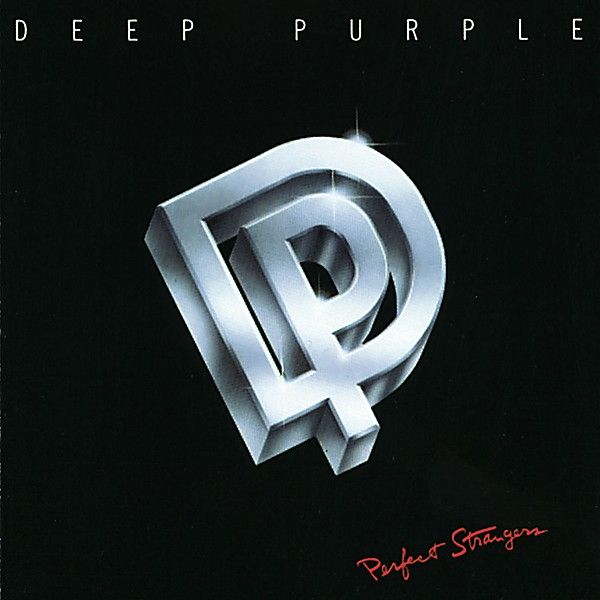

# Perfect Strangers

By **Deep Purple**

## Album Data

- **Catalog:** Beets
- **Format:** Digital, Album
- **Album:** Perfect Strangers
- **Artist:** Deep Purple
- **Albumartist:** Deep Purple
- **Genre:** Progressive Rock
- **MusicBrainz Album Artist ID:** [79491354-3d83-40e3-9d8e-7592d58d790a](https://musicbrainz.org/artist/79491354-3d83-40e3-9d8e-7592d58d790a)
- **MusicBrainz Album ID:** [6b4fef8b-912a-4724-b78f-954a8eb0a9f0](https://musicbrainz.org/release/6b4fef8b-912a-4724-b78f-954a8eb0a9f0)
- **MusicBrainz Release Group ID:** [41a276ce-ea2b-377c-9ad8-0ef0bfd1f5c2](https://musicbrainz.org/release-group/41a276ce-ea2b-377c-9ad8-0ef0bfd1f5c2)
- **Year:** 1984
- **Catalog #:** CDP 7 92407 2
- **Label:** Parlophone
- **Total Tracks:** 08

## Album Tracks

### Track 01 - And the Address

- **Artist:** Deep Purple
- **Format:** MP3
- **Genre:** Acid Rock
- **Length:** 4:40
- **MusicBrainz Track ID:** [86baab26-744f-42f3-9fb3-1f59c7a9a928](https://musicbrainz.org/recording/86baab26-744f-42f3-9fb3-1f59c7a9a928)
- **Title:** And the Address
- **Track:** 01
- **Year:** 1989

### Track 02 - Hush

- **Artist:** Deep Purple
- **Format:** MP3
- **Genre:** Progressive Rock
- **Length:** 4:12
- **MusicBrainz Track ID:** [9a1343a4-606d-4612-8fd8-e04ee6d75ad6](https://musicbrainz.org/recording/9a1343a4-606d-4612-8fd8-e04ee6d75ad6)
- **Title:** Hush
- **Track:** 02
- **Year:** 1989

### Track 03 - One More Rainy Day

- **Artist:** Deep Purple
- **Format:** MP3
- **Genre:** Psychedelic Rock
- **Length:** 3:36
- **MusicBrainz Track ID:** [39374b95-f8f9-429a-8fec-1790eb1d8022](https://musicbrainz.org/recording/39374b95-f8f9-429a-8fec-1790eb1d8022)
- **Title:** One More Rainy Day
- **Track:** 03
- **Year:** 1989

### Track 04 - Prelude

- **Artist:** Deep Purple
- **Format:** MP3
- **Genre:** Psychedelic Rock
- **Length:** 7:12
- **MusicBrainz Track ID:** [6735daf5-ed33-431c-8240-04b2fee1ca0a](https://musicbrainz.org/recording/6735daf5-ed33-431c-8240-04b2fee1ca0a)
- **Title:** Prelude
- **Track:** 04
- **Year:** 1989

### Track 05 - Mandrake Root

- **Artist:** Deep Purple
- **Format:** MP3
- **Genre:** Psychedelic Rock
- **Length:** 6:02
- **MusicBrainz Track ID:** [ecf065a8-fc82-4448-8d8d-5a5b3c0d189a](https://musicbrainz.org/recording/ecf065a8-fc82-4448-8d8d-5a5b3c0d189a)
- **Title:** Mandrake Root
- **Track:** 05
- **Year:** 1989

### Track 06 - Help

- **Artist:** Deep Purple
- **Format:** MP3
- **Genre:** Psychedelic Rock
- **Length:** 5:53
- **MusicBrainz Track ID:** [c19fdc22-88e1-41a4-9a6f-cf5b5b12fa4c](https://musicbrainz.org/recording/c19fdc22-88e1-41a4-9a6f-cf5b5b12fa4c)
- **Title:** Help
- **Track:** 06
- **Year:** 1989

### Track 07 - Love Help Me

- **Artist:** Deep Purple
- **Format:** MP3
- **Genre:** Acid Rock
- **Length:** 3:45
- **MusicBrainz Track ID:** [a02c4a40-e694-4490-aeeb-e68850977099](https://musicbrainz.org/recording/a02c4a40-e694-4490-aeeb-e68850977099)
- **Title:** Love Help Me
- **Track:** 07
- **Year:** 1989

### Track 08 - Hey Joe

- **Artist:** Deep Purple
- **Format:** MP3
- **Genre:** Progressive Rock
- **Length:** 6:56
- **MusicBrainz Track ID:** [b1cf1478-4467-4251-9558-77d26dacf081](https://musicbrainz.org/recording/b1cf1478-4467-4251-9558-77d26dacf081)
- **Title:** Hey Joe
- **Track:** 08
- **Year:** 1989

## See also

- [Burn](Burn.md)
- [Concerto for Group and Orchestra](Concerto_for_Group_and_Orchestra.md)
- [Deepest Purple](Deepest_Purple_2.md)
- [Deepest Purple](Deepest_Purple.md)
- [Deep Purple (2016 reissue)](Deep_Purple_2016_reissue.md)
- [Deep Purple in Concert](Deep_Purple_in_Concert.md)
- [Deep Purple in Rock](Deep_Purple_in_Rock.md)
- [Deep Purple](Deep_Purple.md)
- [inFinite](inFinite.md)
- [Live in London](Live_in_London.md)
- [Machine Head](Machine_Head.md)
- [Made in Europe](Made_in_Europe.md)
- [Made In Japan (Deluxe Edition)](Made_In_Japan_Deluxe_Edition.md)
- [Made in Japan](Made_in_Japan.md)
- [Shades of Deep Purple](Shades_of_Deep_Purple.md)
- [The Book of Taliesyn](The_Book_of_Taliesyn.md)
- [The Deep Purple Singles A’s & B’s](The_Deep_Purple_Singles_A’s_and_B’s.md)
- [Who Do We Think We Are](Who_Do_We_Think_We_Are.md)
- [Roon: Burn](../../Roon/Deep_Purple/Burn.md)
- [Roon: Concerto for Group and Orchestra](../../Roon/Deep_Purple/Concerto_for_Group_and_Orchestra.md)
- [Roon: Deep Purple](../../Roon/Deep_Purple/Deep_Purple.md)
- [Roon: Fireball](../../Roon/Deep_Purple/Fireball.md)
- [Roon: Infinite](../../Roon/Deep_Purple/Infinite.md)
- [Roon: In Rock](../../Roon/Deep_Purple/In_Rock.md)
- [Roon: Machine Head](../../Roon/Deep_Purple/Machine_Head.md)
- [Roon: Made in Japan (2014 Remaster)](../../Roon/Deep_Purple/Made_in_Japan_2014_Remaster.md)
- [Roon: Shades of Deep Purple](../../Roon/Deep_Purple/Shades_of_Deep_Purple.md)
- [Roon: The Book of Taliesyn](../../Roon/Deep_Purple/The_Book_of_Taliesyn.md)
- [Roon: Who Do We Think We Are (Deluxe Edition)](../../Roon/Deep_Purple/Who_Do_We_Think_We_Are_Deluxe_Edition.md)
- [Vinyl: Burn](../../Vinyl/Deep_Purple/Burn.md)
- [Vinyl: ](../../Vinyl/Deep_Purple/Deep_Purple_index.md)
- [Vinyl: Deep Purple](../../Vinyl/Deep_Purple/Deep_Purple.md)
- [Vinyl: Fireball](../../Vinyl/Deep_Purple/Fireball.md)
- [Vinyl: In Concert '72](../../Vinyl/Deep_Purple/In_Concert_72.md)
- [Vinyl: In Rock](../../Vinyl/Deep_Purple/In_Rock.md)
- [Vinyl: Machine Head](../../Vinyl/Deep_Purple/Machine_Head.md)
- [Vinyl: Made In Japan](../../Vinyl/Deep_Purple/Made_In_Japan.md)
- [Vinyl: Shades Of Deep Purple](../../Vinyl/Deep_Purple/Shades_Of_Deep_Purple.md)
- [Vinyl: Who Do We Think We Are](../../Vinyl/Deep_Purple/Who_Do_We_Think_We_Are.md)
