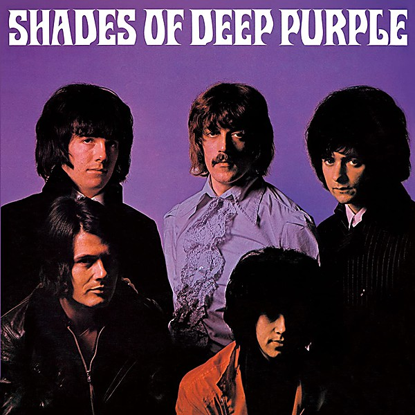

# Shades of Deep Purple

By Deep Purple

## Album Data

- Catalog: Beets
- Format: Digital, Album
- Album: Shades of Deep Purple
- Artist: Deep Purple
- Albumartist: Deep Purple
- Genre: Psychedelic Rock
- MusicBrainz Album Artist ID: 79491354-3d83-40e3-9d8e-7592d58d790a
- MusicBrainz Album ID: 6cf516b4-71d1-39f4-ad5b-47c7a400fbde
- MusicBrainz Release Group ID: bdb083d6-be5e-32b3-97df-3d899a8ff858
- Year: 1989

