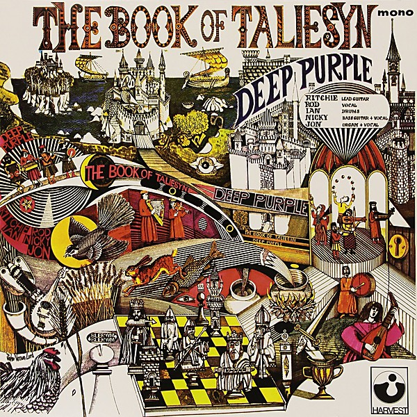

# The Book of Taliesyn

By **Deep Purple**

## Album Data

- **Catalog:** Beets
- **Format:** Digital, Album
- **Album:** The Book of Taliesyn
- **Artist:** Deep Purple
- **Albumartist:** Deep Purple
- **Genre:** Psychedelic Rock
- **MusicBrainz Album Artist ID:** [79491354-3d83-40e3-9d8e-7592d58d790a](https://musicbrainz.org/artist/79491354-3d83-40e3-9d8e-7592d58d790a)
- **MusicBrainz Album ID:** [16f2ef56-40fc-37fb-8176-6f88fa6b1dc6](https://musicbrainz.org/release/16f2ef56-40fc-37fb-8176-6f88fa6b1dc6)
- **MusicBrainz Release Group ID:** [3a2bbe30-d2c7-367b-9326-f0082adad661](https://musicbrainz.org/release-group/3a2bbe30-d2c7-367b-9326-f0082adad661)
- **Year:** 2000
- **Catalog #:** CD-FA 3212
- **Label:** 
- **Total Tracks:** 12

## Album Tracks

### Track 01 - Hush

- **Artist:** Deep Purple
- **Format:** AAC
- **Genre:** Progressive Rock
- **Length:** 4:20
- **MusicBrainz Track ID:** [9a1343a4-606d-4612-8fd8-e04ee6d75ad6](https://musicbrainz.org/recording/9a1343a4-606d-4612-8fd8-e04ee6d75ad6)
- **Title:** Hush
- **Track:** 01
- **Year:** 1988

### Track 02 - One More Rainy Day

- **Artist:** Deep Purple
- **Format:** AAC
- **Genre:** Psychedelic Rock
- **Length:** 3:34
- **MusicBrainz Track ID:** [39374b95-f8f9-429a-8fec-1790eb1d8022](https://musicbrainz.org/recording/39374b95-f8f9-429a-8fec-1790eb1d8022)
- **Title:** One More Rainy Day
- **Track:** 02
- **Year:** 1988

### Track 03 - Emmaretta

- **Artist:** Deep Purple
- **Format:** AAC
- **Genre:** Acid Rock
- **Length:** 2:55
- **MusicBrainz Track ID:** [0e7606ec-f1b6-44aa-a6e7-f265ad41001f](https://musicbrainz.org/recording/0e7606ec-f1b6-44aa-a6e7-f265ad41001f)
- **Title:** Emmaretta
- **Track:** 03
- **Year:** 1988

### Track 04 - Wring That Neck

- **Artist:** Deep Purple
- **Format:** AAC
- **Genre:** Progressive Rock
- **Length:** 5:07
- **MusicBrainz Track ID:** [73f8f0c2-7fb5-4360-9ece-b8caa18bc513](https://musicbrainz.org/recording/73f8f0c2-7fb5-4360-9ece-b8caa18bc513)
- **Title:** Wring That Neck
- **Track:** 04
- **Year:** 1988

### Track 05 - Hallelujah

- **Artist:** Deep Purple
- **Format:** AAC
- **Genre:** Psychedelic Rock
- **Length:** 3:37
- **MusicBrainz Track ID:** [a6afa1d0-fa15-4c4c-85d0-253a57c49bab](https://musicbrainz.org/recording/a6afa1d0-fa15-4c4c-85d0-253a57c49bab)
- **Title:** Hallelujah
- **Track:** 05
- **Year:** 1988

### Track 06 - April, Part I

- **Artist:** Deep Purple
- **Format:** AAC
- **Genre:** Progressive Rock
- **Length:** 3:50
- **MusicBrainz Track ID:** [f386ee3f-1f3c-463a-b8da-ff55503e29cd](https://musicbrainz.org/recording/f386ee3f-1f3c-463a-b8da-ff55503e29cd)
- **Title:** April, Part I
- **Track:** 06
- **Year:** 1988

### Track 07 - Black Night

- **Artist:** Deep Purple
- **Format:** AAC
- **Genre:** Progressive Rock
- **Length:** 3:22
- **MusicBrainz Track ID:** [408bf803-fc99-4a2d-8894-ca81543b17eb](https://musicbrainz.org/recording/408bf803-fc99-4a2d-8894-ca81543b17eb)
- **Title:** Black Night
- **Track:** 07
- **Year:** 1988

### Track 08 - Speed King

- **Artist:** Deep Purple
- **Format:** AAC
- **Genre:** Progressive Rock
- **Length:** 4:20
- **MusicBrainz Track ID:** [468d966c-4a2a-42b8-81c0-74afc6cc2314](https://musicbrainz.org/recording/468d966c-4a2a-42b8-81c0-74afc6cc2314)
- **Title:** Speed King
- **Track:** 08
- **Year:** 1988

### Track 09 - Strange Kind of Woman

- **Artist:** Deep Purple
- **Format:** AAC
- **Genre:** Progressive Rock
- **Length:** 3:46
- **MusicBrainz Track ID:** [e3494913-215e-4c91-8feb-eb47a46731c7](https://musicbrainz.org/recording/e3494913-215e-4c91-8feb-eb47a46731c7)
- **Title:** Strange Kind of Woman
- **Track:** 09
- **Year:** 1988

### Track 10 - I’m Alone

- **Artist:** Deep Purple
- **Format:** AAC
- **Genre:** Progressive Rock
- **Length:** 3:01
- **MusicBrainz Track ID:** [d35ce9ae-2b08-4a78-8ff9-47edfc91e7c2](https://musicbrainz.org/recording/d35ce9ae-2b08-4a78-8ff9-47edfc91e7c2)
- **Title:** I’m Alone
- **Track:** 10
- **Year:** 1988

### Track 11 - Demon’s Eye

- **Artist:** Deep Purple
- **Format:** AAC
- **Genre:** Progressive Rock
- **Length:** 5:13
- **MusicBrainz Track ID:** [78a4ce00-5f39-4037-a88a-ea5e84c2d9e0](https://musicbrainz.org/recording/78a4ce00-5f39-4037-a88a-ea5e84c2d9e0)
- **Title:** Demon’s Eye
- **Track:** 11
- **Year:** 1988

### Track 12 - Fireball

- **Artist:** Deep Purple
- **Format:** AAC
- **Genre:** Progressive Rock
- **Length:** 3:19
- **MusicBrainz Track ID:** [338bf4f1-71a3-465c-bc7d-6ffacd63e224](https://musicbrainz.org/recording/338bf4f1-71a3-465c-bc7d-6ffacd63e224)
- **Title:** Fireball
- **Track:** 12
- **Year:** 1988

## See also

- [Burn](Burn.md)
- [Concerto for Group and Orchestra](Concerto_for_Group_and_Orchestra.md)
- [Deepest Purple](Deepest_Purple_2.md)
- [Deepest Purple](Deepest_Purple.md)
- [Deep Purple (2016 reissue)](Deep_Purple_2016_reissue.md)
- [Deep Purple in Concert](Deep_Purple_in_Concert.md)
- [Deep Purple in Rock](Deep_Purple_in_Rock.md)
- [Deep Purple](Deep_Purple.md)
- [inFinite](inFinite.md)
- [Live in London](Live_in_London.md)
- [Machine Head](Machine_Head.md)
- [Made in Europe](Made_in_Europe.md)
- [Made In Japan (Deluxe Edition)](Made_In_Japan_Deluxe_Edition.md)
- [Made in Japan](Made_in_Japan.md)
- [Perfect Strangers](Perfect_Strangers.md)
- [Shades of Deep Purple](Shades_of_Deep_Purple.md)
- [The Deep Purple Singles A’s & B’s](The_Deep_Purple_Singles_A’s_and_B’s.md)
- [Who Do We Think We Are](Who_Do_We_Think_We_Are.md)
- [Roon: Burn](../../Roon/Deep_Purple/Burn.md)
- [Roon: Concerto for Group and Orchestra](../../Roon/Deep_Purple/Concerto_for_Group_and_Orchestra.md)
- [Roon: Deep Purple](../../Roon/Deep_Purple/Deep_Purple.md)
- [Roon: Fireball](../../Roon/Deep_Purple/Fireball.md)
- [Roon: Infinite](../../Roon/Deep_Purple/Infinite.md)
- [Roon: In Rock](../../Roon/Deep_Purple/In_Rock.md)
- [Roon: Machine Head](../../Roon/Deep_Purple/Machine_Head.md)
- [Roon: Made in Japan (2014 Remaster)](../../Roon/Deep_Purple/Made_in_Japan_2014_Remaster.md)
- [Roon: Shades of Deep Purple](../../Roon/Deep_Purple/Shades_of_Deep_Purple.md)
- [Roon: The Book of Taliesyn](../../Roon/Deep_Purple/The_Book_of_Taliesyn.md)
- [Roon: Who Do We Think We Are (Deluxe Edition)](../../Roon/Deep_Purple/Who_Do_We_Think_We_Are_Deluxe_Edition.md)
- [Vinyl: Burn](../../Vinyl/Deep_Purple/Burn.md)
- [Vinyl: ](../../Vinyl/Deep_Purple/Deep_Purple_index.md)
- [Vinyl: Deep Purple](../../Vinyl/Deep_Purple/Deep_Purple.md)
- [Vinyl: Fireball](../../Vinyl/Deep_Purple/Fireball.md)
- [Vinyl: In Concert '72](../../Vinyl/Deep_Purple/In_Concert_72.md)
- [Vinyl: In Rock](../../Vinyl/Deep_Purple/In_Rock.md)
- [Vinyl: Machine Head](../../Vinyl/Deep_Purple/Machine_Head.md)
- [Vinyl: Made In Japan](../../Vinyl/Deep_Purple/Made_In_Japan.md)
- [Vinyl: Shades Of Deep Purple](../../Vinyl/Deep_Purple/Shades_Of_Deep_Purple.md)
- [Vinyl: Who Do We Think We Are](../../Vinyl/Deep_Purple/Who_Do_We_Think_We_Are.md)
