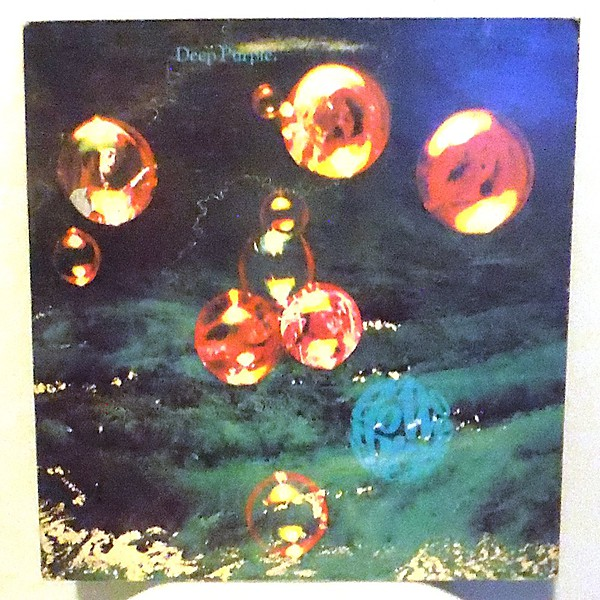

# Who Do We Think We Are

By **Deep Purple**

## Album Data

- **Catalog:** Beets
- **Format:** Digital, Album
- **Album:** Who Do We Think We Are
- **Artist:** Deep Purple
- **Albumartist:** Deep Purple
- **Genre:** Progressive Rock
- **MusicBrainz Album Artist ID:** [79491354-3d83-40e3-9d8e-7592d58d790a](https://musicbrainz.org/artist/79491354-3d83-40e3-9d8e-7592d58d790a)
- **MusicBrainz Album ID:** [582ddca4-4bf1-3fa7-994b-727229ba872d](https://musicbrainz.org/release/582ddca4-4bf1-3fa7-994b-727229ba872d)
- **MusicBrainz Release Group ID:** [edba2b6f-8f50-3bc9-b2ac-1df8bdb51daa](https://musicbrainz.org/release-group/edba2b6f-8f50-3bc9-b2ac-1df8bdb51daa)
- **Year:** 1973
- **Catalog #:** BS-2678
- **Label:** Warner Bros. Records
- **Total Tracks:** 07

## Album Tracks

### Track 01 - Woman From Tokyo

- **Artist:** Deep Purple
- **Format:** AAC
- **Genre:** Heavy Metal
- **Length:** 5:51
- **MusicBrainz Track ID:** [7e4a1c4a-fa09-4fcc-8891-4c497e16b08c](https://musicbrainz.org/recording/7e4a1c4a-fa09-4fcc-8891-4c497e16b08c)
- **Title:** Woman From Tokyo
- **Track:** 01
- **Year:** 1973

### Track 02 - Mary Long

- **Artist:** Deep Purple
- **Format:** AAC
- **Genre:** Heavy Metal
- **Length:** 4:21
- **MusicBrainz Track ID:** [b86ac184-43ec-408e-904f-df3100ef44e4](https://musicbrainz.org/recording/b86ac184-43ec-408e-904f-df3100ef44e4)
- **Title:** Mary Long
- **Track:** 02
- **Year:** 1973

### Track 03 - Super Trouper

- **Artist:** Deep Purple
- **Format:** AAC
- **Genre:** Heavy Metal
- **Length:** 2:54
- **MusicBrainz Track ID:** [bca753a5-8587-4d20-a7ba-a8b5cf813b71](https://musicbrainz.org/recording/bca753a5-8587-4d20-a7ba-a8b5cf813b71)
- **Title:** Super Trouper
- **Track:** 03
- **Year:** 1973

### Track 04 - Smooth Dancer

- **Artist:** Deep Purple
- **Format:** AAC
- **Genre:** Heavy Metal
- **Length:** 4:06
- **MusicBrainz Track ID:** [fd089020-c43b-4136-a5ff-2797cfb3239a](https://musicbrainz.org/recording/fd089020-c43b-4136-a5ff-2797cfb3239a)
- **Title:** Smooth Dancer
- **Track:** 04
- **Year:** 1973

### Track 05 - Rat Bat Blue

- **Artist:** Deep Purple
- **Format:** AAC
- **Genre:** Heavy Metal
- **Length:** 5:23
- **MusicBrainz Track ID:** [2defee0b-0486-4d77-bb38-228db3c022b3](https://musicbrainz.org/recording/2defee0b-0486-4d77-bb38-228db3c022b3)
- **Title:** Rat Bat Blue
- **Track:** 05
- **Year:** 1973

### Track 06 - Place in Line

- **Artist:** Deep Purple
- **Format:** AAC
- **Genre:** Heavy Metal
- **Length:** 6:31
- **MusicBrainz Track ID:** [688562f1-59da-4b8d-99b8-9087e45e89fc](https://musicbrainz.org/recording/688562f1-59da-4b8d-99b8-9087e45e89fc)
- **Title:** Place in Line
- **Track:** 06
- **Year:** 1973

### Track 07 - Our Lady

- **Artist:** Deep Purple
- **Format:** AAC
- **Genre:** Heavy Metal
- **Length:** 5:01
- **MusicBrainz Track ID:** [546a1873-0e6b-459c-8754-d98cb78f8773](https://musicbrainz.org/recording/546a1873-0e6b-459c-8754-d98cb78f8773)
- **Title:** Our Lady
- **Track:** 07
- **Year:** 1973

## See also

- [Burn](Burn.md)
- [Concerto for Group and Orchestra](Concerto_for_Group_and_Orchestra.md)
- [Deepest Purple](Deepest_Purple_2.md)
- [Deepest Purple](Deepest_Purple.md)
- [Deep Purple (2016 reissue)](Deep_Purple_2016_reissue.md)
- [Deep Purple in Concert](Deep_Purple_in_Concert.md)
- [Deep Purple in Rock](Deep_Purple_in_Rock.md)
- [Deep Purple](Deep_Purple.md)
- [inFinite](inFinite.md)
- [Live in London](Live_in_London.md)
- [Machine Head](Machine_Head.md)
- [Made in Europe](Made_in_Europe.md)
- [Made In Japan (Deluxe Edition)](Made_In_Japan_Deluxe_Edition.md)
- [Made in Japan](Made_in_Japan.md)
- [Perfect Strangers](Perfect_Strangers.md)
- [Shades of Deep Purple](Shades_of_Deep_Purple.md)
- [The Book of Taliesyn](The_Book_of_Taliesyn.md)
- [The Deep Purple Singles A’s & B’s](The_Deep_Purple_Singles_A’s_and_B’s.md)
- [Roon: Burn](../../Roon/Deep_Purple/Burn.md)
- [Roon: Concerto for Group and Orchestra](../../Roon/Deep_Purple/Concerto_for_Group_and_Orchestra.md)
- [Roon: Deep Purple](../../Roon/Deep_Purple/Deep_Purple.md)
- [Roon: Fireball](../../Roon/Deep_Purple/Fireball.md)
- [Roon: Infinite](../../Roon/Deep_Purple/Infinite.md)
- [Roon: In Rock](../../Roon/Deep_Purple/In_Rock.md)
- [Roon: Machine Head](../../Roon/Deep_Purple/Machine_Head.md)
- [Roon: Made in Japan (2014 Remaster)](../../Roon/Deep_Purple/Made_in_Japan_2014_Remaster.md)
- [Roon: Shades of Deep Purple](../../Roon/Deep_Purple/Shades_of_Deep_Purple.md)
- [Roon: The Book of Taliesyn](../../Roon/Deep_Purple/The_Book_of_Taliesyn.md)
- [Roon: Who Do We Think We Are (Deluxe Edition)](../../Roon/Deep_Purple/Who_Do_We_Think_We_Are_Deluxe_Edition.md)
- [Vinyl: Burn](../../Vinyl/Deep_Purple/Burn.md)
- [Vinyl: ](../../Vinyl/Deep_Purple/Deep_Purple_index.md)
- [Vinyl: Deep Purple](../../Vinyl/Deep_Purple/Deep_Purple.md)
- [Vinyl: Fireball](../../Vinyl/Deep_Purple/Fireball.md)
- [Vinyl: In Concert '72](../../Vinyl/Deep_Purple/In_Concert_72.md)
- [Vinyl: In Rock](../../Vinyl/Deep_Purple/In_Rock.md)
- [Vinyl: Machine Head](../../Vinyl/Deep_Purple/Machine_Head.md)
- [Vinyl: Made In Japan](../../Vinyl/Deep_Purple/Made_In_Japan.md)
- [Vinyl: Shades Of Deep Purple](../../Vinyl/Deep_Purple/Shades_Of_Deep_Purple.md)
- [Vinyl: Who Do We Think We Are](../../Vinyl/Deep_Purple/Who_Do_We_Think_We_Are.md)
