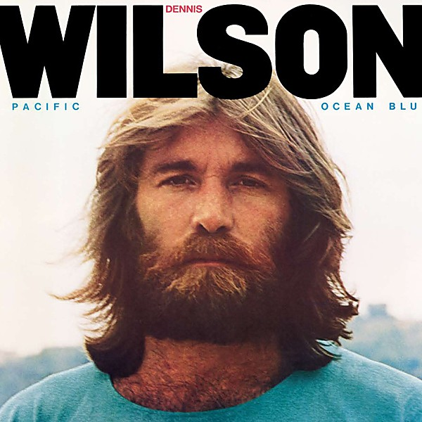

# Pacific Ocean Blue

By **Dennis Wilson**

## Album Data

- **Catalog:** Beets
- **Format:** Digital, Album
- **Album:** Pacific Ocean Blue
- **Artist:** Dennis Wilson
- **Albumartist:** Dennis Wilson
- **Genre:** Soft Rock
- **MusicBrainz Album Artist ID:** [4051f6bf-6a59-4d23-bd8b-2fddb1389dc0](https://musicbrainz.org/artist/4051f6bf-6a59-4d23-bd8b-2fddb1389dc0)
- **MusicBrainz Album ID:** [f574b3d1-d5f7-3206-bd47-ec1d1dc41734](https://musicbrainz.org/release/f574b3d1-d5f7-3206-bd47-ec1d1dc41734)
- **MusicBrainz Release Group ID:** [9aa1dc17-d89c-3969-8453-defec8fe0361](https://musicbrainz.org/release-group/9aa1dc17-d89c-3969-8453-defec8fe0361)
- **Year:** 1991
- **Catalog #:** 
- **Label:** 
- **Total Tracks:** 12

## Album Tracks

### Track 01 - River Song

- **Artist:** Dennis Wilson
- **Format:** MP3
- **Genre:** Sunshine Pop
- **Length:** 3:41
- **MusicBrainz Track ID:** [3909179a-3fac-460b-8b96-7bbf9a5b4d4e](https://musicbrainz.org/recording/3909179a-3fac-460b-8b96-7bbf9a5b4d4e)
- **Title:** River Song
- **Track:** 01
- **Year:** 1991

### Track 02 - What's Wrong

- **Artist:** Dennis Wilson
- **Format:** MP3
- **Genre:** Sunshine Pop
- **Length:** 2:19
- **MusicBrainz Track ID:** [39604958-ffcc-4c15-b26c-45ee7af836a6](https://musicbrainz.org/recording/39604958-ffcc-4c15-b26c-45ee7af836a6)
- **Title:** What's Wrong
- **Track:** 02
- **Year:** 1991

### Track 03 - Moonshine

- **Artist:** Dennis Wilson
- **Format:** MP3
- **Genre:** Sunshine Pop
- **Length:** 2:25
- **MusicBrainz Track ID:** [a50f2979-82fc-4763-bad9-b48fe2035e89](https://musicbrainz.org/recording/a50f2979-82fc-4763-bad9-b48fe2035e89)
- **Title:** Moonshine
- **Track:** 03
- **Year:** 1991

### Track 04 - Friday Night

- **Artist:** Dennis Wilson
- **Format:** MP3
- **Genre:** Sunshine Pop
- **Length:** 3:07
- **MusicBrainz Track ID:** [52764f8d-fe8d-4b93-845c-6e2b5835d9fb](https://musicbrainz.org/recording/52764f8d-fe8d-4b93-845c-6e2b5835d9fb)
- **Title:** Friday Night
- **Track:** 04
- **Year:** 1991

### Track 05 - Dreamer

- **Artist:** Dennis Wilson
- **Format:** MP3
- **Genre:** Sunshine Pop
- **Length:** 4:18
- **MusicBrainz Track ID:** [22eebb53-90a4-427b-9366-7e901155ecb0](https://musicbrainz.org/recording/22eebb53-90a4-427b-9366-7e901155ecb0)
- **Title:** Dreamer
- **Track:** 05
- **Year:** 1991

### Track 06 - Thoughts of You

- **Artist:** Dennis Wilson
- **Format:** MP3
- **Genre:** Sunshine Pop
- **Length:** 3:03
- **MusicBrainz Track ID:** [f91bbd7b-1e16-4f43-b341-63f14e844a6a](https://musicbrainz.org/recording/f91bbd7b-1e16-4f43-b341-63f14e844a6a)
- **Title:** Thoughts of You
- **Track:** 06
- **Year:** 1991

### Track 07 - Time

- **Artist:** Dennis Wilson
- **Format:** MP3
- **Genre:** Sunshine Pop
- **Length:** 3:28
- **MusicBrainz Track ID:** [1bc59e73-c0d3-4819-a03e-85263e129c63](https://musicbrainz.org/recording/1bc59e73-c0d3-4819-a03e-85263e129c63)
- **Title:** Time
- **Track:** 07
- **Year:** 1991

### Track 08 - You and I

- **Artist:** Dennis Wilson
- **Format:** MP3
- **Genre:** Sunshine Pop
- **Length:** 3:21
- **MusicBrainz Track ID:** [a2d5300f-8454-4aa0-becd-fb41938ca2f7](https://musicbrainz.org/recording/a2d5300f-8454-4aa0-becd-fb41938ca2f7)
- **Title:** You and I
- **Track:** 08
- **Year:** 1991

### Track 09 - Pacific Ocean Blues

- **Artist:** Dennis Wilson
- **Format:** MP3
- **Genre:** Uk Garage
- **Length:** 2:37
- **MusicBrainz Track ID:** [124b7adf-08e3-47b2-ac61-033c2647eb31](https://musicbrainz.org/recording/124b7adf-08e3-47b2-ac61-033c2647eb31)
- **Title:** Pacific Ocean Blues
- **Track:** 09
- **Year:** 1991

### Track 10 - Farewell My Friend

- **Artist:** Dennis Wilson
- **Format:** MP3
- **Genre:** Sunshine Pop
- **Length:** 2:22
- **MusicBrainz Track ID:** [8561362f-5024-4f73-93ec-c09a829d0e2b](https://musicbrainz.org/recording/8561362f-5024-4f73-93ec-c09a829d0e2b)
- **Title:** Farewell My Friend
- **Track:** 10
- **Year:** 1991

### Track 11 - Rainbows

- **Artist:** Dennis Wilson
- **Format:** MP3
- **Genre:** Sunshine Pop
- **Length:** 2:45
- **MusicBrainz Track ID:** [0b889042-5e57-47f1-982f-e274c93268af](https://musicbrainz.org/recording/0b889042-5e57-47f1-982f-e274c93268af)
- **Title:** Rainbows
- **Track:** 11
- **Year:** 1991

### Track 12 - End of the Show

- **Artist:** Dennis Wilson
- **Format:** MP3
- **Genre:** Rock
- **Length:** 2:51
- **MusicBrainz Track ID:** [ab07e35e-66aa-463d-833f-1c77c0906cae](https://musicbrainz.org/recording/ab07e35e-66aa-463d-833f-1c77c0906cae)
- **Title:** End of the Show
- **Track:** 12
- **Year:** 1991

## See also

- [Roon: Pacific Ocean Blue & Bambu - 2 CD Deluxe Legacy Edition](../../Roon/Dennis_Wilson/Pacific_Ocean_Blue_and_Bambu_-_2_CD_Deluxe_Legacy_Edition.md)
