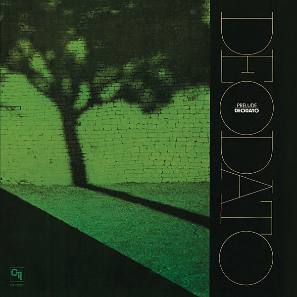

# Prelude

By **Deodato**

## Album Data

- **Catalog:** Beets
- **Format:** Digital, Album
- **Album:** Prelude
- **Artist:** Deodato
- **Albumartist:** Deodato
- **Genre:** Smooth Jazz
- **MusicBrainz Album Artist ID:** 
- **MusicBrainz Album ID:** 
- **MusicBrainz Release Group ID:** 
- **Year:** 1972
- **Catalog #:** 
- **Label:** 
- **Total Tracks:** 00

## Album Tracks

### Track 01 - Also Sprach Zarathustra (2001)

- **Artist:** Deodato
- **Format:** MP3
- **Genre:** Jazz
- **Length:** 9:04
- **MusicBrainz Track ID:** 
- **Title:** Also Sprach Zarathustra (2001)
- **Track:** 01
- **Year:** 1972

### Track 02 - Spirit of Summer

- **Artist:** Deodato
- **Format:** MP3
- **Genre:** Bossa Nova
- **Length:** 4:08
- **MusicBrainz Track ID:** 
- **Title:** Spirit of Summer
- **Track:** 02
- **Year:** 1972

### Track 03 - Carly & Carole

- **Artist:** Deodato
- **Format:** MP3
- **Genre:** Jazz
- **Length:** 3:47
- **MusicBrainz Track ID:** 
- **Title:** Carly & Carole
- **Track:** 03
- **Year:** 1972

### Track 04 - Baubles, Bangles and Beads

- **Artist:** Deodato
- **Format:** MP3
- **Genre:** Uk Garage
- **Length:** 5:22
- **MusicBrainz Track ID:** 
- **Title:** Baubles, Bangles and Beads
- **Track:** 04
- **Year:** 1972

### Track 05 - Prelude to Afternoon of a Faun

- **Artist:** Deodato
- **Format:** MP3
- **Genre:** Latin Jazz
- **Length:** 5:16
- **MusicBrainz Track ID:** 
- **Title:** Prelude to Afternoon of a Faun
- **Track:** 05
- **Year:** 1972

### Track 06 - September 13

- **Artist:** Deodato
- **Format:** MP3
- **Genre:** Deep Funk
- **Length:** 5:18
- **MusicBrainz Track ID:** 
- **Title:** September 13
- **Track:** 06
- **Year:** 1972

