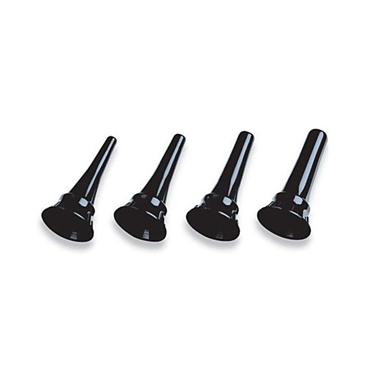

# Killing Machines

By **Deth Specula**

## Album Data

- **Catalog:** Beets
- **Format:** Digital, Album
- **Album:** Killing Machines
- **Artist:** Deth Specula
- **Albumartist:** Deth Specula
- **Genre:** Rock
- **MusicBrainz Album Artist ID:** 
- **MusicBrainz Album ID:** 
- **MusicBrainz Release Group ID:** 
- **Year:** 2016
- **Catalog #:** 
- **Label:** 
- **Total Tracks:** 18

## Album Tracks

### Track 01 - Anarchy At SCO

- **Artist:** Deth Specula
- **Format:** ALAC
- **Genre:** Unknown
- **Length:** 4:08
- **MusicBrainz Track ID:** 
- **Title:** Anarchy At SCO
- **Track:** 01
- **Year:** 0000

### Track 02 - Surfbowl

- **Artist:** Deth Specula
- **Format:** ALAC
- **Genre:** Unknown
- **Length:** 4:58
- **MusicBrainz Track ID:** 
- **Title:** Surfbowl
- **Track:** 02
- **Year:** 0000

### Track 03 - Updated

- **Artist:** Deth Specula
- **Format:** ALAC
- **Genre:** Unknown
- **Length:** 3:09
- **MusicBrainz Track ID:** 
- **Title:** Updated
- **Track:** 03
- **Year:** 0000

### Track 04 - Even More

- **Artist:** Deth Specula
- **Format:** ALAC
- **Genre:** Unknown
- **Length:** 3:46
- **MusicBrainz Track ID:** 
- **Title:** Even More
- **Track:** 04
- **Year:** 0000

### Track 05 - Gutterslut

- **Artist:** Deth Specula
- **Format:** ALAC
- **Genre:** Unknown
- **Length:** 4:05
- **MusicBrainz Track ID:** 
- **Title:** Gutterslut
- **Track:** 05
- **Year:** 0000

### Track 06 - Santa Claus Is Coming

- **Artist:** Deth Specula
- **Format:** ALAC
- **Genre:** Unknown
- **Length:** 2:55
- **MusicBrainz Track ID:** 
- **Title:** Santa Claus Is Coming
- **Track:** 06
- **Year:** 0000

### Track 07 - Very Own Language

- **Artist:** Deth Specula
- **Format:** ALAC
- **Genre:** Unknown
- **Length:** 3:24
- **MusicBrainz Track ID:** 
- **Title:** Very Own Language
- **Track:** 07
- **Year:** 0000

### Track 08 - Reagan Mask

- **Artist:** Deth Specula
- **Format:** ALAC
- **Genre:** Unknown
- **Length:** 3:04
- **MusicBrainz Track ID:** 
- **Title:** Reagan Mask
- **Track:** 08
- **Year:** 0000

### Track 09 - Lili Demita

- **Artist:** Deth Specula
- **Format:** ALAC
- **Genre:** Unknown
- **Length:** 2:43
- **MusicBrainz Track ID:** 
- **Title:** Lili Demita
- **Track:** 09
- **Year:** 0000

### Track 10 - Killing Machine

- **Artist:** Deth Specula
- **Format:** ALAC
- **Genre:** Unknown
- **Length:** 3:01
- **MusicBrainz Track ID:** 
- **Title:** Killing Machine
- **Track:** 10
- **Year:** 0000

### Track 11 - Hungry Like The Wolf

- **Artist:** Deth Specula
- **Format:** ALAC
- **Genre:** Unknown
- **Length:** 2:44
- **MusicBrainz Track ID:** 
- **Title:** Hungry Like The Wolf
- **Track:** 11
- **Year:** 0000

### Track 12 - Careening Continental

- **Artist:** Deth Specula
- **Format:** ALAC
- **Genre:** Unknown
- **Length:** 3:59
- **MusicBrainz Track ID:** 
- **Title:** Careening Continental
- **Track:** 12
- **Year:** 0000

### Track 13 - Stranger On Sunday

- **Artist:** Deth Specula
- **Format:** ALAC
- **Genre:** Unknown
- **Length:** 3:45
- **MusicBrainz Track ID:** 
- **Title:** Stranger On Sunday
- **Track:** 13
- **Year:** 0000

### Track 14 - Myself

- **Artist:** Deth Specula
- **Format:** ALAC
- **Genre:** Unknown
- **Length:** 4:13
- **MusicBrainz Track ID:** 
- **Title:** Myself
- **Track:** 14
- **Year:** 0000

### Track 15 - Minor Discomfort

- **Artist:** Deth Specula
- **Format:** ALAC
- **Genre:** Unknown
- **Length:** 3:55
- **MusicBrainz Track ID:** 
- **Title:** Minor Discomfort
- **Track:** 15
- **Year:** 0000

### Track 16 - Even More

- **Artist:** Deth Specula
- **Format:** ALAC
- **Genre:** Unknown
- **Length:** 3:35
- **MusicBrainz Track ID:** 
- **Title:** Even More
- **Track:** 16
- **Year:** 0000

### Track 17 - Baboon Liver

- **Artist:** Deth Specula
- **Format:** ALAC
- **Genre:** Unknown
- **Length:** 3:19
- **MusicBrainz Track ID:** 
- **Title:** Baboon Liver
- **Track:** 17
- **Year:** 0000

### Track 18 - Through The Night

- **Artist:** Deth Specula
- **Format:** ALAC
- **Genre:** Unknown
- **Length:** 4:37
- **MusicBrainz Track ID:** 
- **Title:** Through The Night
- **Track:** 18
- **Year:** 0000

### Track 01 - Yummy Yummy Yummy

- **Artist:** Deth Specula
- **Format:** ALAC
- **Genre:** Unknown
- **Length:** 2:41
- **MusicBrainz Track ID:** 
- **Title:** Yummy Yummy Yummy
- **Track:** 01
- **Year:** 0000

### Track 02 - Internet Band

- **Artist:** Deth Specula
- **Format:** ALAC
- **Genre:** Unknown
- **Length:** 2:50
- **MusicBrainz Track ID:** 
- **Title:** Internet Band
- **Track:** 02
- **Year:** 0000

### Track 03 - Sweet Gilligan

- **Artist:** Deth Specula
- **Format:** ALAC
- **Genre:** Unknown
- **Length:** 3:37
- **MusicBrainz Track ID:** 
- **Title:** Sweet Gilligan
- **Track:** 03
- **Year:** 0000

### Track 04 - Reagan Mask

- **Artist:** Deth Specula
- **Format:** ALAC
- **Genre:** Unknown
- **Length:** 3:47
- **MusicBrainz Track ID:** 
- **Title:** Reagan Mask
- **Track:** 04
- **Year:** 0000

### Track 05 - Very Own Language

- **Artist:** Deth Specula
- **Format:** ALAC
- **Genre:** Unknown
- **Length:** 3:05
- **MusicBrainz Track ID:** 
- **Title:** Very Own Language
- **Track:** 05
- **Year:** 0000

## See also

- [Compilation Video](Compilation_Video.md)
- [Top Sekret Mix](Top_Sekret_Mix.md)
- [Weasels and Cream](Weasels_and_Cream.md)
- [Roon: Killing Machines](../../Roon/Deth_Specula/Killing_Machines.md)
- [Roon: Top Sekret Mix](../../Roon/Deth_Specula/Top_Sekret_Mix.md)
- [Roon: Weasels and Cream](../../Roon/Deth_Specula/Weasels_and_Cream.md)
