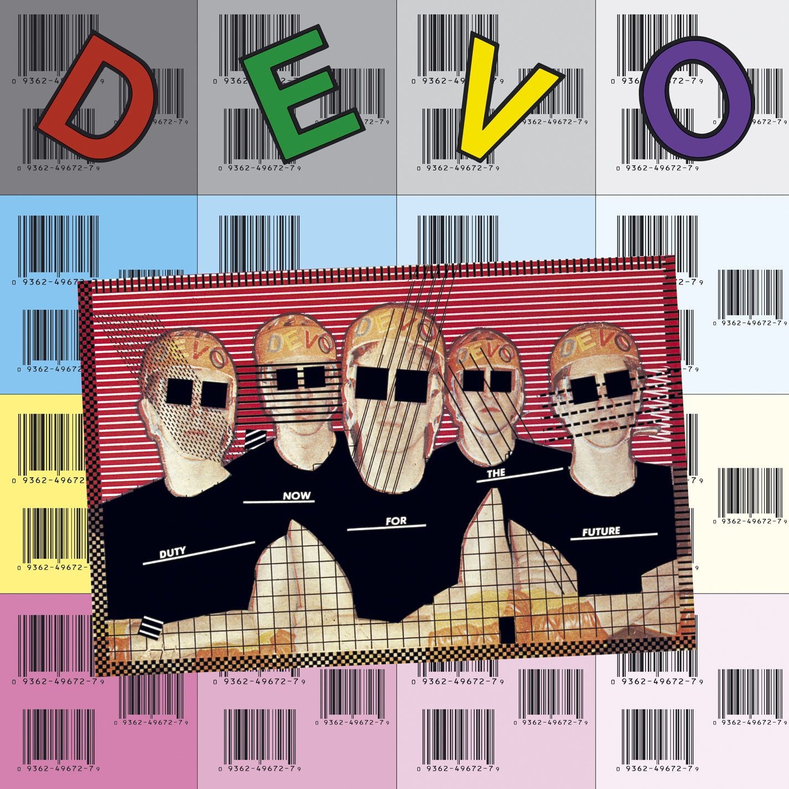

# Duty Now for the Future

By **DEVO**

## Album Data

- **Catalog:** Beets
- **Format:** Digital, Album
- **Album:** Duty Now for the Future
- **Artist:** Devo
- **Albumartist:** DEVO
- **Genre:** Art Punk
- **MusicBrainz Album Artist ID:** [d2db1078-c170-4e22-b261-14f3ad60a690](https://musicbrainz.org/artist/d2db1078-c170-4e22-b261-14f3ad60a690)
- **MusicBrainz Album ID:** [624d7026-12bc-46fe-ab0a-b7e579038685](https://musicbrainz.org/release/624d7026-12bc-46fe-ab0a-b7e579038685)
- **MusicBrainz Release Group ID:** [ae44cba8-7d73-3814-9dd4-fc30e1b6fb9c](https://musicbrainz.org/release-group/ae44cba8-7d73-3814-9dd4-fc30e1b6fb9c)
- **Year:** 1979
- **Catalog #:** 521442-2
- **Label:** Warner Bros. Records
- **Total Tracks:** 18

## Album Tracks

### Track 01 - Girl U Want

- **Artist:** DEVO
- **Format:** MP3
- **Genre:** Synthpop
- **Length:** 2:56
- **MusicBrainz Track ID:** [d93f5d49-cc76-4b4d-b2f0-bc71646e5ede](https://musicbrainz.org/recording/d93f5d49-cc76-4b4d-b2f0-bc71646e5ede)
- **Title:** Girl U Want
- **Track:** 01
- **Year:** 2009

### Track 02 - It's Not Right

- **Artist:** DEVO
- **Format:** MP3
- **Genre:** Surf Rock
- **Length:** 2:23
- **MusicBrainz Track ID:** [542f997d-bb9e-4411-9a09-8295cfe19bcf](https://musicbrainz.org/recording/542f997d-bb9e-4411-9a09-8295cfe19bcf)
- **Title:** It's Not Right
- **Track:** 02
- **Year:** 2009

### Track 03 - Whip It

- **Artist:** DEVO
- **Format:** MP3
- **Genre:** Post-Punk
- **Length:** 2:40
- **MusicBrainz Track ID:** [428cba13-082c-46c5-bddb-a2cb1b7819b9](https://musicbrainz.org/recording/428cba13-082c-46c5-bddb-a2cb1b7819b9)
- **Title:** Whip It
- **Track:** 03
- **Year:** 2009

### Track 04 - Snowball

- **Artist:** DEVO
- **Format:** MP3
- **Genre:** Post-Punk
- **Length:** 2:29
- **MusicBrainz Track ID:** [c07b330c-b6bd-47fd-8140-73af3b21c249](https://musicbrainz.org/recording/c07b330c-b6bd-47fd-8140-73af3b21c249)
- **Title:** Snowball
- **Track:** 04
- **Year:** 2009

### Track 05 - Ton o' Luv

- **Artist:** DEVO
- **Format:** MP3
- **Genre:** Post-Punk
- **Length:** 2:30
- **MusicBrainz Track ID:** [e7ef5403-3573-4ea8-b824-656ea0f5f7ee](https://musicbrainz.org/recording/e7ef5403-3573-4ea8-b824-656ea0f5f7ee)
- **Title:** Ton o' Luv
- **Track:** 05
- **Year:** 2009

### Track 06 - Freedom of Choice

- **Artist:** DEVO
- **Format:** MP3
- **Genre:** Post-Punk
- **Length:** 3:28
- **MusicBrainz Track ID:** [4d32efe7-dd41-4bec-b13d-108db3e09411](https://musicbrainz.org/recording/4d32efe7-dd41-4bec-b13d-108db3e09411)
- **Title:** Freedom of Choice
- **Track:** 06
- **Year:** 2009

### Track 07 - Gates of Steel

- **Artist:** DEVO
- **Format:** MP3
- **Genre:** Punk Rock
- **Length:** 3:29
- **MusicBrainz Track ID:** [d88f65da-8031-48b5-9986-81a6d7904776](https://musicbrainz.org/recording/d88f65da-8031-48b5-9986-81a6d7904776)
- **Title:** Gates of Steel
- **Track:** 07
- **Year:** 2009

### Track 08 - Cold War

- **Artist:** DEVO
- **Format:** MP3
- **Genre:** Technopop
- **Length:** 2:31
- **MusicBrainz Track ID:** [189a4299-f02f-41f3-8c56-b54b0c1b848b](https://musicbrainz.org/recording/189a4299-f02f-41f3-8c56-b54b0c1b848b)
- **Title:** Cold War
- **Track:** 08
- **Year:** 2009

### Track 09 - Don't You Know

- **Artist:** DEVO
- **Format:** MP3
- **Genre:** Punk Rock
- **Length:** 2:15
- **MusicBrainz Track ID:** [1ca10381-1052-4dc1-a7bb-dac48b0d6f94](https://musicbrainz.org/recording/1ca10381-1052-4dc1-a7bb-dac48b0d6f94)
- **Title:** Don't You Know
- **Track:** 09
- **Year:** 2009

### Track 10 - That's Pep!

- **Artist:** DEVO
- **Format:** MP3
- **Genre:** Uk Garage
- **Length:** 2:18
- **MusicBrainz Track ID:** [c4f61074-73ea-4824-95b4-bbbc4eba72c4](https://musicbrainz.org/recording/c4f61074-73ea-4824-95b4-bbbc4eba72c4)
- **Title:** That's Pep!
- **Track:** 10
- **Year:** 2009

### Track 11 - Mr. B's Ballroom

- **Artist:** DEVO
- **Format:** MP3
- **Genre:** Synthpop
- **Length:** 2:48
- **MusicBrainz Track ID:** [7e573aa5-5a40-4541-b767-8eec3480a758](https://musicbrainz.org/recording/7e573aa5-5a40-4541-b767-8eec3480a758)
- **Title:** Mr. B's Ballroom
- **Track:** 11
- **Year:** 2009

### Track 12 - Planet Earth

- **Artist:** DEVO
- **Format:** MP3
- **Genre:** Synthpop
- **Length:** 2:46
- **MusicBrainz Track ID:** [be773436-ec83-4fb9-88dd-1170444e03ac](https://musicbrainz.org/recording/be773436-ec83-4fb9-88dd-1170444e03ac)
- **Title:** Planet Earth
- **Track:** 12
- **Year:** 2009

### Track 13 - Freedom of Choice Theme Song (live)

- **Artist:** DEVO
- **Format:** MP3
- **Genre:** Synthpop
- **Length:** 2:45
- **MusicBrainz Track ID:** [a1a98d1c-56ee-4148-b4dd-2d2ab198f7d7](https://musicbrainz.org/recording/a1a98d1c-56ee-4148-b4dd-2d2ab198f7d7)
- **Title:** Freedom of Choice Theme Song (live)
- **Track:** 13
- **Year:** 2009

### Track 14 - Whip It (live)

- **Artist:** DEVO
- **Format:** MP3
- **Genre:** New Wave
- **Length:** 2:46
- **MusicBrainz Track ID:** [46f486c6-a4b6-4cef-bcdb-fd750316690f](https://musicbrainz.org/recording/46f486c6-a4b6-4cef-bcdb-fd750316690f)
- **Title:** Whip It (live)
- **Track:** 14
- **Year:** 2009

### Track 15 - Girl U Want (live)

- **Artist:** DEVO
- **Format:** MP3
- **Genre:** New Wave
- **Length:** 3:00
- **MusicBrainz Track ID:** [b6cedb44-dbc6-4486-80f0-56ce8fd69278](https://musicbrainz.org/recording/b6cedb44-dbc6-4486-80f0-56ce8fd69278)
- **Title:** Girl U Want (live)
- **Track:** 15
- **Year:** 2009

### Track 16 - Gates of Steel (live)

- **Artist:** DEVO
- **Format:** MP3
- **Genre:** New Wave
- **Length:** 3:38
- **MusicBrainz Track ID:** [41a8f3d3-d68e-48c9-ab86-42af3da10be3](https://musicbrainz.org/recording/41a8f3d3-d68e-48c9-ab86-42af3da10be3)
- **Title:** Gates of Steel (live)
- **Track:** 16
- **Year:** 2009

### Track 17 - Be Stiff (live)

- **Artist:** DEVO
- **Format:** MP3
- **Genre:** Post-Punk
- **Length:** 2:55
- **MusicBrainz Track ID:** [6333aeb1-7bcf-4d95-baf2-72aafb4d012e](https://musicbrainz.org/recording/6333aeb1-7bcf-4d95-baf2-72aafb4d012e)
- **Title:** Be Stiff (live)
- **Track:** 17
- **Year:** 2009

### Track 18 - Planet Earth (live)

- **Artist:** DEVO
- **Format:** MP3
- **Genre:** Synthpop
- **Length:** 2:36
- **MusicBrainz Track ID:** [98c6d02c-536a-440b-96ee-2fbb40515eb6](https://musicbrainz.org/recording/98c6d02c-536a-440b-96ee-2fbb40515eb6)
- **Title:** Planet Earth (live)
- **Track:** 18
- **Year:** 2009

## See also

- [Freedom of Choice](Freedom_of_Choice.md)
- [Q](Q.md)
- [Shout](Shout.md)
- [Something for Everybody](Something_for_Everybody.md)
