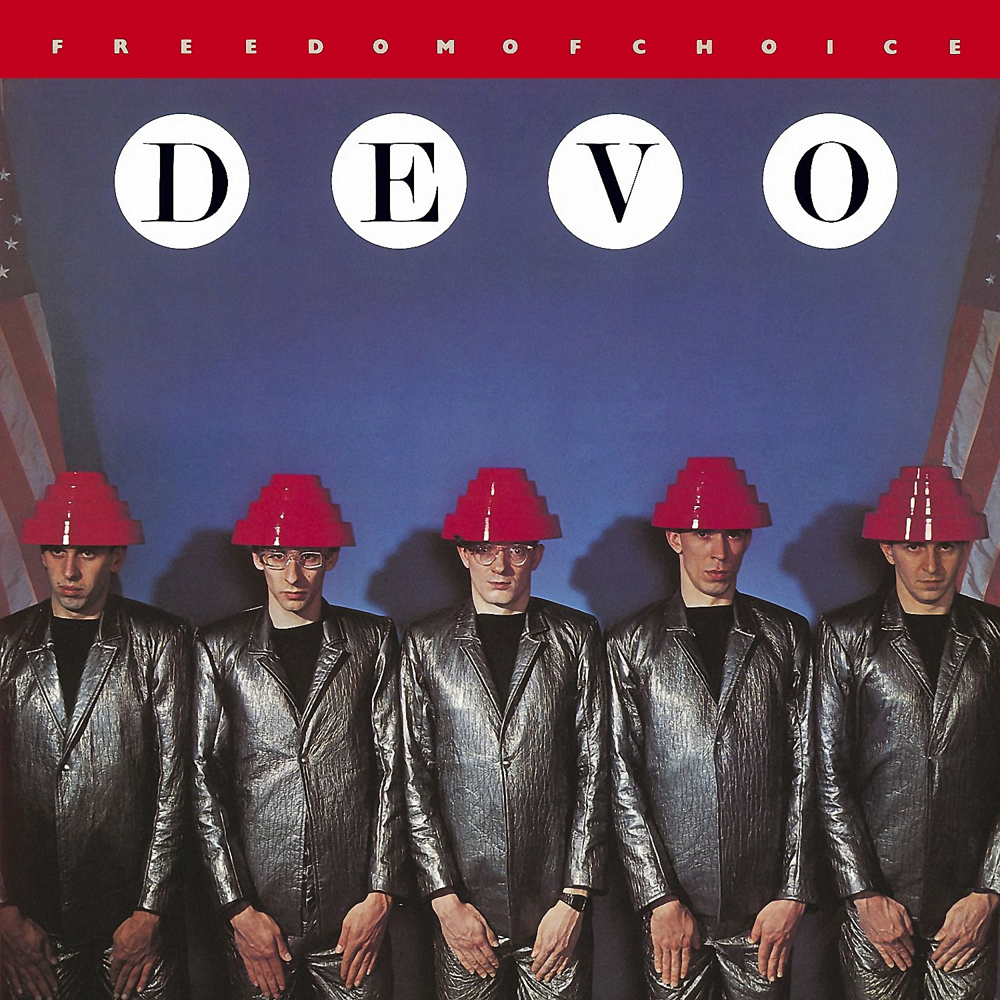

# Freedom of Choice

By **DEVO**

## Album Data

- **Catalog:** Beets
- **Format:** Digital, Album
- **Album:** Freedom of Choice
- **Artist:** Devo
- **Albumartist:** DEVO
- **Genre:** Synthpop
- **MusicBrainz Album Artist ID:** [d2db1078-c170-4e22-b261-14f3ad60a690](https://musicbrainz.org/artist/d2db1078-c170-4e22-b261-14f3ad60a690)
- **MusicBrainz Album ID:** [55c2562e-d564-43f3-a3c5-d79003ec91bb](https://musicbrainz.org/release/55c2562e-d564-43f3-a3c5-d79003ec91bb)
- **MusicBrainz Release Group ID:** [bb889709-d775-3cb1-84c2-1daf4884e165](https://musicbrainz.org/release-group/bb889709-d775-3cb1-84c2-1daf4884e165)
- **Year:** 2009
- **Catalog #:** 521441-2
- **Label:** Warner Bros. Records
- **Total Tracks:** 22

## Album Tracks

### Track 01 - Uncontrollable Urge

- **Artist:** DEVO
- **Format:** MP3
- **Genre:** Punk Rock
- **Length:** 3:09
- **MusicBrainz Track ID:** [b3ed4110-5514-4862-bc24-cdfad3e1f462](https://musicbrainz.org/recording/b3ed4110-5514-4862-bc24-cdfad3e1f462)
- **Title:** Uncontrollable Urge
- **Track:** 01
- **Year:** 2009

### Track 02 - (I Can’t Get No) Satisfaction

- **Artist:** DEVO
- **Format:** MP3
- **Genre:** Art Punk
- **Length:** 2:39
- **MusicBrainz Track ID:** [ddb269cb-ccb5-4f03-87b2-cb5179bc6403](https://musicbrainz.org/recording/ddb269cb-ccb5-4f03-87b2-cb5179bc6403)
- **Title:** (I Can’t Get No) Satisfaction
- **Track:** 02
- **Year:** 2009

### Track 03 - Praying Hands

- **Artist:** DEVO
- **Format:** MP3
- **Genre:** Post-Punk
- **Length:** 2:48
- **MusicBrainz Track ID:** [3ef59f93-7612-43f9-998a-57609d4cf2d5](https://musicbrainz.org/recording/3ef59f93-7612-43f9-998a-57609d4cf2d5)
- **Title:** Praying Hands
- **Track:** 03
- **Year:** 2009

### Track 04 - Space Junk

- **Artist:** DEVO
- **Format:** MP3
- **Genre:** Post-Punk
- **Length:** 2:14
- **MusicBrainz Track ID:** [11270039-bc03-4fa7-bca1-845cfd7848b3](https://musicbrainz.org/recording/11270039-bc03-4fa7-bca1-845cfd7848b3)
- **Title:** Space Junk
- **Track:** 04
- **Year:** 2009

### Track 05 - Mongoloid

- **Artist:** DEVO
- **Format:** MP3
- **Genre:** Post-Punk
- **Length:** 3:44
- **MusicBrainz Track ID:** [3b8d47c3-e99e-471a-8a34-1410377a1a70](https://musicbrainz.org/recording/3b8d47c3-e99e-471a-8a34-1410377a1a70)
- **Title:** Mongoloid
- **Track:** 05
- **Year:** 2009

### Track 06 - Jocko Homo

- **Artist:** DEVO
- **Format:** MP3
- **Genre:** Post-Punk
- **Length:** 3:38
- **MusicBrainz Track ID:** [0116281b-93a8-49e3-95fa-30210c34d54b](https://musicbrainz.org/recording/0116281b-93a8-49e3-95fa-30210c34d54b)
- **Title:** Jocko Homo
- **Track:** 06
- **Year:** 2009

### Track 07 - Too Much Paranoias

- **Artist:** DEVO
- **Format:** MP3
- **Genre:** New Wave
- **Length:** 1:57
- **MusicBrainz Track ID:** [063cdd7b-5fff-4070-bd55-51652c287f58](https://musicbrainz.org/recording/063cdd7b-5fff-4070-bd55-51652c287f58)
- **Title:** Too Much Paranoias
- **Track:** 07
- **Year:** 2009

### Track 08 - Gut Feeling / (Slap Your Mammy)

- **Artist:** DEVO
- **Format:** MP3
- **Genre:** Surf Rock
- **Length:** 4:56
- **MusicBrainz Track ID:** [89f4fc99-07a2-400c-9498-180af6944771](https://musicbrainz.org/recording/89f4fc99-07a2-400c-9498-180af6944771)
- **Title:** Gut Feeling / (Slap Your Mammy)
- **Track:** 08
- **Year:** 2009

### Track 09 - Come Back Jonee

- **Artist:** DEVO
- **Format:** MP3
- **Genre:** Post-Punk
- **Length:** 3:46
- **MusicBrainz Track ID:** [40b5615d-30a4-40a3-b547-bf9586cac153](https://musicbrainz.org/recording/40b5615d-30a4-40a3-b547-bf9586cac153)
- **Title:** Come Back Jonee
- **Track:** 09
- **Year:** 2009

### Track 10 - Sloppy (I Saw My Babby Gettin’)

- **Artist:** DEVO
- **Format:** MP3
- **Genre:** Art Punk
- **Length:** 2:37
- **MusicBrainz Track ID:** [e353e04b-7e7e-4516-bea5-2e7378b06238](https://musicbrainz.org/recording/e353e04b-7e7e-4516-bea5-2e7378b06238)
- **Title:** Sloppy (I Saw My Babby Gettin’)
- **Track:** 10
- **Year:** 2009

### Track 11 - Shrivel‐Up

- **Artist:** DEVO
- **Format:** MP3
- **Genre:** Post-Punk
- **Length:** 3:03
- **MusicBrainz Track ID:** [dd4dc014-218e-492b-bb14-108945188590](https://musicbrainz.org/recording/dd4dc014-218e-492b-bb14-108945188590)
- **Title:** Shrivel‐Up
- **Track:** 11
- **Year:** 2009

### Track 12 - Uncontrollable Urge (live)

- **Artist:** DEVO
- **Format:** MP3
- **Genre:** Art Punk
- **Length:** 3:32
- **MusicBrainz Track ID:** [92f3399e-0d24-49cb-8a01-551094740054](https://musicbrainz.org/recording/92f3399e-0d24-49cb-8a01-551094740054)
- **Title:** Uncontrollable Urge (live)
- **Track:** 12
- **Year:** 2009

### Track 13 - (I Can’t Get No) Satisfaction (live)

- **Artist:** DEVO
- **Format:** MP3
- **Genre:** Art Punk
- **Length:** 3:15
- **MusicBrainz Track ID:** [d06330f0-90f6-4d0d-87c9-cfdb49d0491d](https://musicbrainz.org/recording/d06330f0-90f6-4d0d-87c9-cfdb49d0491d)
- **Title:** (I Can’t Get No) Satisfaction (live)
- **Track:** 13
- **Year:** 2009

### Track 14 - Praying Hands (live)

- **Artist:** DEVO
- **Format:** MP3
- **Genre:** Art Punk
- **Length:** 3:30
- **MusicBrainz Track ID:** [29d7f77e-1811-4cba-a844-62c619de0370](https://musicbrainz.org/recording/29d7f77e-1811-4cba-a844-62c619de0370)
- **Title:** Praying Hands (live)
- **Track:** 14
- **Year:** 2009

### Track 15 - Space Junk (live)

- **Artist:** DEVO
- **Format:** MP3
- **Genre:** Art Punk
- **Length:** 2:35
- **MusicBrainz Track ID:** [9a298ff7-7cd1-414e-b486-5285adb231e8](https://musicbrainz.org/recording/9a298ff7-7cd1-414e-b486-5285adb231e8)
- **Title:** Space Junk (live)
- **Track:** 15
- **Year:** 2009

### Track 16 - Mongoloid (live)

- **Artist:** DEVO
- **Format:** MP3
- **Genre:** New Wave
- **Length:** 4:44
- **MusicBrainz Track ID:** [1dfb5784-6f5b-40a7-b5e4-7953d3479568](https://musicbrainz.org/recording/1dfb5784-6f5b-40a7-b5e4-7953d3479568)
- **Title:** Mongoloid (live)
- **Track:** 16
- **Year:** 2009

### Track 17 - Jocko Homo (live)

- **Artist:** DEVO
- **Format:** MP3
- **Genre:** Art Punk
- **Length:** 4:53
- **MusicBrainz Track ID:** [2010ad0b-1bdc-4f96-911b-73c043f66b67](https://musicbrainz.org/recording/2010ad0b-1bdc-4f96-911b-73c043f66b67)
- **Title:** Jocko Homo (live)
- **Track:** 17
- **Year:** 2009

### Track 18 - Too Much Paranoias (live)

- **Artist:** DEVO
- **Format:** MP3
- **Genre:** Art Punk
- **Length:** 2:34
- **MusicBrainz Track ID:** [2bf6aa1c-17e8-4707-97bd-2cfc094e525d](https://musicbrainz.org/recording/2bf6aa1c-17e8-4707-97bd-2cfc094e525d)
- **Title:** Too Much Paranoias (live)
- **Track:** 18
- **Year:** 2009

### Track 19 - Gut Feeling / (Slap Your Mammy) (live)

- **Artist:** DEVO
- **Format:** MP3
- **Genre:** Art Punk
- **Length:** 4:24
- **MusicBrainz Track ID:** [e99d191a-8330-47df-ae74-b8eda7b37f65](https://musicbrainz.org/recording/e99d191a-8330-47df-ae74-b8eda7b37f65)
- **Title:** Gut Feeling / (Slap Your Mammy) (live)
- **Track:** 19
- **Year:** 2009

### Track 20 - Come Back Jonee (live)

- **Artist:** DEVO
- **Format:** MP3
- **Genre:** Art Punk
- **Length:** 4:27
- **MusicBrainz Track ID:** [2faa03fa-33b5-4fc2-8e36-1ccd366646fe](https://musicbrainz.org/recording/2faa03fa-33b5-4fc2-8e36-1ccd366646fe)
- **Title:** Come Back Jonee (live)
- **Track:** 20
- **Year:** 2009

### Track 21 - Sloppy (I Saw My Baby Gettin’) (live)

- **Artist:** DEVO
- **Format:** MP3
- **Genre:** Art Punk
- **Length:** 2:31
- **MusicBrainz Track ID:** [3fd5c990-aa13-4ec4-a7f4-7af72700be06](https://musicbrainz.org/recording/3fd5c990-aa13-4ec4-a7f4-7af72700be06)
- **Title:** Sloppy (I Saw My Baby Gettin’) (live)
- **Track:** 21
- **Year:** 2009

### Track 22 - Shrivel‐Up (live)

- **Artist:** DEVO
- **Format:** MP3
- **Genre:** Art Punk
- **Length:** 3:16
- **MusicBrainz Track ID:** [18624ef3-10c7-4019-ae67-d9157ebe9e5c](https://musicbrainz.org/recording/18624ef3-10c7-4019-ae67-d9157ebe9e5c)
- **Title:** Shrivel‐Up (live)
- **Track:** 22
- **Year:** 2009

## See also

- [Duty Now for the Future](Duty_Now_for_the_Future.md)
- [Q](Q.md)
- [Shout](Shout.md)
- [Something for Everybody](Something_for_Everybody.md)
