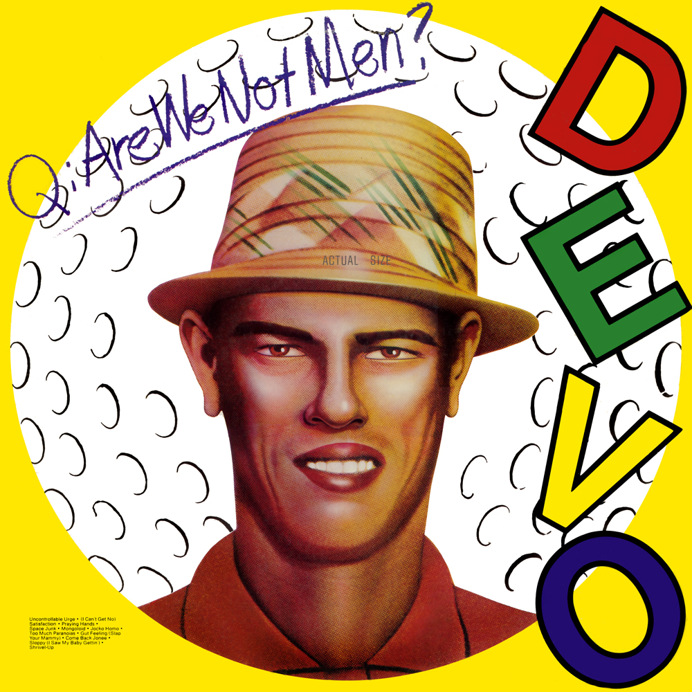

# Q

By **DEVO**

## Album Data

- **Catalog:** Beets
- **Format:** Digital, Album
- **Album:** Q
- **Artist:** Devo
- **Albumartist:** DEVO
- **Genre:** Art Punk
- **MusicBrainz Album Artist ID:** [d2db1078-c170-4e22-b261-14f3ad60a690](https://musicbrainz.org/artist/d2db1078-c170-4e22-b261-14f3ad60a690)
- **MusicBrainz Album ID:** [7f4056d0-b3d1-45e1-bd5a-a9bb603aff09](https://musicbrainz.org/release/7f4056d0-b3d1-45e1-bd5a-a9bb603aff09)
- **MusicBrainz Release Group ID:** [60a754f9-50e1-346a-97db-925a1e2ad7e0](https://musicbrainz.org/release-group/60a754f9-50e1-346a-97db-925a1e2ad7e0)
- **Year:** 2009
- **Catalog #:** COL-CD-6553
- **Label:** Collectables
- **Total Tracks:** 10

## Album Tracks

### Track 01 - Shout

- **Artist:** DEVO
- **Format:** AAC
- **Genre:** New Wave
- **Length:** 3:12
- **MusicBrainz Track ID:** [79289fb1-4aee-46c5-9139-b3010b0a2bf5](https://musicbrainz.org/recording/79289fb1-4aee-46c5-9139-b3010b0a2bf5)
- **Title:** Shout
- **Track:** 01
- **Year:** 2006

### Track 02 - The Satisfied Mind

- **Artist:** DEVO
- **Format:** AAC
- **Genre:** Synthpop
- **Length:** 3:05
- **MusicBrainz Track ID:** [987aaaa1-057e-46af-8b9f-dc5c3e97672b](https://musicbrainz.org/recording/987aaaa1-057e-46af-8b9f-dc5c3e97672b)
- **Title:** The Satisfied Mind
- **Track:** 02
- **Year:** 2006

### Track 03 - Don't Rescue Me

- **Artist:** DEVO
- **Format:** AAC
- **Genre:** Synthpop
- **Length:** 3:05
- **MusicBrainz Track ID:** [3d9c8f3f-8d11-4a50-8344-ed77e972a8ce](https://musicbrainz.org/recording/3d9c8f3f-8d11-4a50-8344-ed77e972a8ce)
- **Title:** Don't Rescue Me
- **Track:** 03
- **Year:** 2006

### Track 04 - The 4th Dimension

- **Artist:** DEVO
- **Format:** AAC
- **Genre:** Synthpop
- **Length:** 4:19
- **MusicBrainz Track ID:** [de5fac7a-6849-4511-b9ae-cf2ced4b71dd](https://musicbrainz.org/recording/de5fac7a-6849-4511-b9ae-cf2ced4b71dd)
- **Title:** The 4th Dimension
- **Track:** 04
- **Year:** 2006

### Track 05 - C'mon

- **Artist:** DEVO
- **Format:** AAC
- **Genre:** Synthpop
- **Length:** 3:18
- **MusicBrainz Track ID:** [cb10f997-5d57-46d4-8d5a-927a192c0d6c](https://musicbrainz.org/recording/cb10f997-5d57-46d4-8d5a-927a192c0d6c)
- **Title:** C'mon
- **Track:** 05
- **Year:** 2006

### Track 06 - Here to Go

- **Artist:** DEVO
- **Format:** AAC
- **Genre:** New Wave
- **Length:** 3:25
- **MusicBrainz Track ID:** [5a54f049-0966-4e29-a2be-13b46e487fd4](https://musicbrainz.org/recording/5a54f049-0966-4e29-a2be-13b46e487fd4)
- **Title:** Here to Go
- **Track:** 06
- **Year:** 2006

### Track 07 - Jurisdiction of Love

- **Artist:** DEVO
- **Format:** AAC
- **Genre:** Synthpop
- **Length:** 3:03
- **MusicBrainz Track ID:** [aa6013d0-c687-491e-8368-03fc94ae6bbf](https://musicbrainz.org/recording/aa6013d0-c687-491e-8368-03fc94ae6bbf)
- **Title:** Jurisdiction of Love
- **Track:** 07
- **Year:** 2006

### Track 08 - Puppet Boy

- **Artist:** DEVO
- **Format:** AAC
- **Genre:** Synthpop
- **Length:** 3:12
- **MusicBrainz Track ID:** [2090d684-ac4b-43b0-8545-ddc4413b79d9](https://musicbrainz.org/recording/2090d684-ac4b-43b0-8545-ddc4413b79d9)
- **Title:** Puppet Boy
- **Track:** 08
- **Year:** 2006

### Track 09 - Please Please

- **Artist:** DEVO
- **Format:** AAC
- **Genre:** Synthpop
- **Length:** 3:06
- **MusicBrainz Track ID:** [a8e699ff-1ef1-4dbc-892b-165cc41f7343](https://musicbrainz.org/recording/a8e699ff-1ef1-4dbc-892b-165cc41f7343)
- **Title:** Please Please
- **Track:** 09
- **Year:** 2006

### Track 10 - Are You Experienced?

- **Artist:** DEVO
- **Format:** AAC
- **Genre:** New Wave
- **Length:** 3:11
- **MusicBrainz Track ID:** [a39aa5f1-a7d6-49df-9082-a03bdfa15aaf](https://musicbrainz.org/recording/a39aa5f1-a7d6-49df-9082-a03bdfa15aaf)
- **Title:** Are You Experienced?
- **Track:** 10
- **Year:** 2006

## See also

- [Duty Now for the Future](Duty_Now_for_the_Future.md)
- [Freedom of Choice](Freedom_of_Choice.md)
- [Shout](Shout.md)
- [Something for Everybody](Something_for_Everybody.md)
