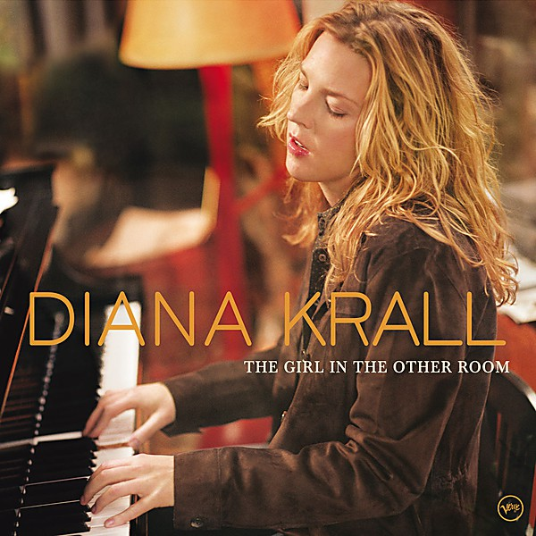

# The Girl in the Other Room

By **Diana Krall**

## Album Data

- **Catalog:** Beets
- **Format:** Digital, Album
- **Album:** The Girl in the Other Room
- **Artist:** Diana Krall
- **Albumartist:** Diana Krall
- **Genre:** Vocal Jazz
- **MusicBrainz Album Artist ID:** [67d2cb7a-9ddb-4a7f-82bf-5a2d1a038e98](https://musicbrainz.org/artist/67d2cb7a-9ddb-4a7f-82bf-5a2d1a038e98)
- **MusicBrainz Album ID:** [967003a3-d385-4f2f-bb50-f769666d0af8](https://musicbrainz.org/release/967003a3-d385-4f2f-bb50-f769666d0af8)
- **MusicBrainz Release Group ID:** [6dfdcee4-e97c-3485-80e0-3f54b6e54991](https://musicbrainz.org/release-group/6dfdcee4-e97c-3485-80e0-3f54b6e54991)
- **Year:** 2004
- **Catalog #:** B0001826-12
- **Label:** Verve
- **Total Tracks:** 12

## Album Tracks

### Track 01 - Stop This World

- **Artist:** Diana Krall
- **Format:** MP3
- **Genre:** Vocal Jazz
- **Length:** 3:58
- **MusicBrainz Track ID:** [367a4540-6afa-48c8-928a-fffc1954d73b](https://musicbrainz.org/recording/367a4540-6afa-48c8-928a-fffc1954d73b)
- **Title:** Stop This World
- **Track:** 01
- **Year:** 2004

### Track 02 - The Girl in the Other Room

- **Artist:** Diana Krall
- **Format:** MP3
- **Genre:** Vocal Jazz
- **Length:** 4:04
- **MusicBrainz Track ID:** [8f60ce32-8970-40cf-964a-96f766b354a1](https://musicbrainz.org/recording/8f60ce32-8970-40cf-964a-96f766b354a1)
- **Title:** The Girl in the Other Room
- **Track:** 02
- **Year:** 2004

### Track 03 - Temptation

- **Artist:** Diana Krall
- **Format:** MP3
- **Genre:** Vocal Jazz
- **Length:** 4:27
- **MusicBrainz Track ID:** [e015a013-5083-4701-9331-4afbdf9f9ceb](https://musicbrainz.org/recording/e015a013-5083-4701-9331-4afbdf9f9ceb)
- **Title:** Temptation
- **Track:** 03
- **Year:** 2004

### Track 04 - Almost Blue

- **Artist:** Diana Krall
- **Format:** MP3
- **Genre:** Vocal Jazz
- **Length:** 4:03
- **MusicBrainz Track ID:** [d6d28813-0bc1-4806-a424-119f69fe1c7a](https://musicbrainz.org/recording/d6d28813-0bc1-4806-a424-119f69fe1c7a)
- **Title:** Almost Blue
- **Track:** 04
- **Year:** 2004

### Track 05 - I've Changed My Address

- **Artist:** Diana Krall
- **Format:** MP3
- **Genre:** Vocal Jazz
- **Length:** 4:46
- **MusicBrainz Track ID:** [2cc702c4-8c6f-480e-9686-dff7bb765535](https://musicbrainz.org/recording/2cc702c4-8c6f-480e-9686-dff7bb765535)
- **Title:** I've Changed My Address
- **Track:** 05
- **Year:** 2004

### Track 06 - Love Me Like a Man

- **Artist:** Diana Krall
- **Format:** MP3
- **Genre:** Vocal Jazz
- **Length:** 5:48
- **MusicBrainz Track ID:** [f0aac136-5aa0-4f27-9517-7206d5383151](https://musicbrainz.org/recording/f0aac136-5aa0-4f27-9517-7206d5383151)
- **Title:** Love Me Like a Man
- **Track:** 06
- **Year:** 2004

### Track 07 - I'm Pulling Through

- **Artist:** Diana Krall
- **Format:** MP3
- **Genre:** Vocal Jazz
- **Length:** 4:02
- **MusicBrainz Track ID:** [55b61ca6-ea0d-47df-ab6a-9027fed221df](https://musicbrainz.org/recording/55b61ca6-ea0d-47df-ab6a-9027fed221df)
- **Title:** I'm Pulling Through
- **Track:** 07
- **Year:** 2004

### Track 08 - Black Crow

- **Artist:** Diana Krall
- **Format:** MP3
- **Genre:** Vocal Jazz
- **Length:** 4:48
- **MusicBrainz Track ID:** [da451a11-6a3f-4960-806e-e342eea264ae](https://musicbrainz.org/recording/da451a11-6a3f-4960-806e-e342eea264ae)
- **Title:** Black Crow
- **Track:** 08
- **Year:** 2004

### Track 09 - Narrow Daylight

- **Artist:** Diana Krall
- **Format:** MP3
- **Genre:** Vocal Jazz
- **Length:** 3:31
- **MusicBrainz Track ID:** [deab08ae-4605-48b1-b808-f110c14cf4f0](https://musicbrainz.org/recording/deab08ae-4605-48b1-b808-f110c14cf4f0)
- **Title:** Narrow Daylight
- **Track:** 09
- **Year:** 2004

### Track 10 - Abandoned Masquerade

- **Artist:** Diana Krall
- **Format:** MP3
- **Genre:** Vocal Jazz
- **Length:** 5:10
- **MusicBrainz Track ID:** [f1530f18-920a-4ac6-99b6-bb7851814e46](https://musicbrainz.org/recording/f1530f18-920a-4ac6-99b6-bb7851814e46)
- **Title:** Abandoned Masquerade
- **Track:** 10
- **Year:** 2004

### Track 11 - I'm Coming Through

- **Artist:** Diana Krall
- **Format:** MP3
- **Genre:** Vocal Jazz
- **Length:** 5:06
- **MusicBrainz Track ID:** [11aaaa00-bb97-4554-8a72-505c577acc7f](https://musicbrainz.org/recording/11aaaa00-bb97-4554-8a72-505c577acc7f)
- **Title:** I'm Coming Through
- **Track:** 11
- **Year:** 2004

### Track 12 - Departure Bay

- **Artist:** Diana Krall
- **Format:** MP3
- **Genre:** Vocal Jazz
- **Length:** 5:39
- **MusicBrainz Track ID:** [6c6d6edd-6556-4230-a165-81dfbc91f1d2](https://musicbrainz.org/recording/6c6d6edd-6556-4230-a165-81dfbc91f1d2)
- **Title:** Departure Bay
- **Track:** 12
- **Year:** 2004

## See also

- [Roon: The Girl In The Other Room](../../Roon/Diana_Krall/The_Girl_In_The_Other_Room.md)
- [Vinyl: ](../../Vinyl/Diana_Krall/Diana_Krall.md)
- [Vinyl: The Girl In The Other Room](../../Vinyl/Diana_Krall/The_Girl_In_The_Other_Room.md)
