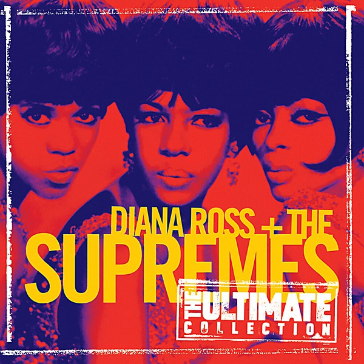

# The Ultimate Collection

By **Diana Ross & Supremes**

## Album Data

- **Catalog:** Beets
- **Format:** Digital, Album
- **Album:** The Ultimate Collection
- **Artist:** Diana Ross & Supremes
- **Albumartist:** Diana Ross & Supremes
- **Genre:** Soul
- **MusicBrainz Album Artist ID:** 
- **MusicBrainz Album ID:** 
- **MusicBrainz Release Group ID:** 
- **Year:** 1997
- **Catalog #:** 
- **Label:** 
- **Total Tracks:** 00

## Album Tracks

### Track 04 - Come See About Me

- **Artist:** Diana Ross & the Supremes
- **Format:** AAC
- **Genre:** Soul
- **Length:** 2:42
- **MusicBrainz Track ID:** 
- **Title:** Come See About Me
- **Track:** 04
- **Year:** 1997

### Track 21 - I'm Gonna Make You Love Me

- **Artist:** Diana Ross & the Supremes/The Temptations
- **Format:** AAC
- **Genre:** Northern Soul
- **Length:** 3:08
- **MusicBrainz Track ID:** 
- **Title:** I'm Gonna Make You Love Me
- **Track:** 21
- **Year:** 1997

