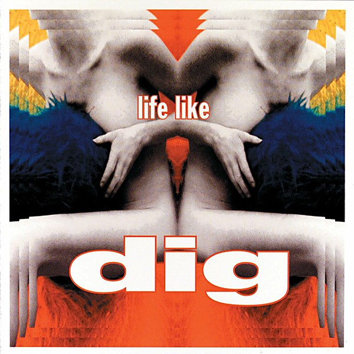

# Life Like

By **Dig**

## Album Data

- **Catalog:** Beets
- **Format:** Digital, Album
- **Album:** Life Like
- **Artist:** Dig
- **Albumartist:** Dig
- **Genre:** Indie Rock
- **MusicBrainz Album Artist ID:** [1b76132a-b0bb-4954-a69b-3b7cd9cc9dd6](https://musicbrainz.org/artist/1b76132a-b0bb-4954-a69b-3b7cd9cc9dd6)
- **MusicBrainz Album ID:** [b6311ada-cdf1-40ea-b840-a6bbfb18d1c3](https://musicbrainz.org/release/b6311ada-cdf1-40ea-b840-a6bbfb18d1c3)
- **MusicBrainz Release Group ID:** [6f8dbd23-a610-349d-af0f-5baa2533ace7](https://musicbrainz.org/release-group/6f8dbd23-a610-349d-af0f-5baa2533ace7)
- **Year:** 1998
- **Catalog #:** 
- **Label:** Uptown/Universal
- **Total Tracks:** 12

## Album Tracks

### Track 01 - Live in Sound

- **Artist:** Dig
- **Format:** MP3
- **Genre:** Indie Rock
- **Length:** 3:56
- **MusicBrainz Track ID:** [13de4c83-48ac-4fc5-abee-5f27e5455537](https://musicbrainz.org/recording/13de4c83-48ac-4fc5-abee-5f27e5455537)
- **Title:** Live in Sound
- **Track:** 01
- **Year:** 1998

### Track 02 - Coming Down

- **Artist:** Dig
- **Format:** MP3
- **Genre:** Indie Rock
- **Length:** 3:35
- **MusicBrainz Track ID:** [cdd97410-c557-4fbe-b41d-21d0caba6bf8](https://musicbrainz.org/recording/cdd97410-c557-4fbe-b41d-21d0caba6bf8)
- **Title:** Coming Down
- **Track:** 02
- **Year:** 1998

### Track 03 - The Fuzz

- **Artist:** Dig
- **Format:** MP3
- **Genre:** Indie Rock
- **Length:** 2:57
- **MusicBrainz Track ID:** [c67160c6-f3f8-45a4-97dc-6f05fcae9ea7](https://musicbrainz.org/recording/c67160c6-f3f8-45a4-97dc-6f05fcae9ea7)
- **Title:** The Fuzz
- **Track:** 03
- **Year:** 1998

### Track 04 - Life Like

- **Artist:** Dig
- **Format:** MP3
- **Genre:** Indie Rock
- **Length:** 3:43
- **MusicBrainz Track ID:** [c0861127-0388-4b5a-8f6b-27ddf58f6498](https://musicbrainz.org/recording/c0861127-0388-4b5a-8f6b-27ddf58f6498)
- **Title:** Life Like
- **Track:** 04
- **Year:** 1998

### Track 05 - Stay on the Grass

- **Artist:** Dig
- **Format:** MP3
- **Genre:** Indie Rock
- **Length:** 3:08
- **MusicBrainz Track ID:** [d92b5c8c-3f9b-4ee8-959a-20f63e1857a2](https://musicbrainz.org/recording/d92b5c8c-3f9b-4ee8-959a-20f63e1857a2)
- **Title:** Stay on the Grass
- **Track:** 05
- **Year:** 1998

### Track 06 - Bumpkin

- **Artist:** Dig
- **Format:** MP3
- **Genre:** Indie Rock
- **Length:** 3:04
- **MusicBrainz Track ID:** [43531a1e-9878-431d-9b75-f27b79803220](https://musicbrainz.org/recording/43531a1e-9878-431d-9b75-f27b79803220)
- **Title:** Bumpkin
- **Track:** 06
- **Year:** 1998

### Track 07 - All Over You

- **Artist:** Dig
- **Format:** MP3
- **Genre:** Indie Rock
- **Length:** 3:24
- **MusicBrainz Track ID:** [4adb78e4-b150-4109-a457-43fc89e505ff](https://musicbrainz.org/recording/4adb78e4-b150-4109-a457-43fc89e505ff)
- **Title:** All Over You
- **Track:** 07
- **Year:** 1998

### Track 08 - Busstopping

- **Artist:** Dig
- **Format:** MP3
- **Genre:** Indie Rock
- **Length:** 2:46
- **MusicBrainz Track ID:** [eab31ea2-e6c1-4720-aa52-5dd3d823e6e8](https://musicbrainz.org/recording/eab31ea2-e6c1-4720-aa52-5dd3d823e6e8)
- **Title:** Busstopping
- **Track:** 08
- **Year:** 1998

### Track 09 - Situation

- **Artist:** Dig
- **Format:** MP3
- **Genre:** Indie Rock
- **Length:** 3:02
- **MusicBrainz Track ID:** [2a0f35a2-070a-4435-86c6-450f03bd2db6](https://musicbrainz.org/recording/2a0f35a2-070a-4435-86c6-450f03bd2db6)
- **Title:** Situation
- **Track:** 09
- **Year:** 1998

### Track 10 - I Don't Mind

- **Artist:** Dig
- **Format:** MP3
- **Genre:** Indie Rock
- **Length:** 4:04
- **MusicBrainz Track ID:** [a10a5cba-bdab-4aee-9772-c330829d3f44](https://musicbrainz.org/recording/a10a5cba-bdab-4aee-9772-c330829d3f44)
- **Title:** I Don't Mind
- **Track:** 10
- **Year:** 1998

### Track 11 - Possibilities

- **Artist:** Dig
- **Format:** MP3
- **Genre:** Indie Rock
- **Length:** 3:03
- **MusicBrainz Track ID:** [8d2e09fa-3ca3-4f68-a860-a88711788e45](https://musicbrainz.org/recording/8d2e09fa-3ca3-4f68-a860-a88711788e45)
- **Title:** Possibilities
- **Track:** 11
- **Year:** 1998

### Track 12 - Comfortable

- **Artist:** Dig
- **Format:** MP3
- **Genre:** Indie Rock
- **Length:** 2:55
- **MusicBrainz Track ID:** [33017bea-424b-46a0-8e10-47d5075ebeab](https://musicbrainz.org/recording/33017bea-424b-46a0-8e10-47d5075ebeab)
- **Title:** Comfortable
- **Track:** 12
- **Year:** 1998

