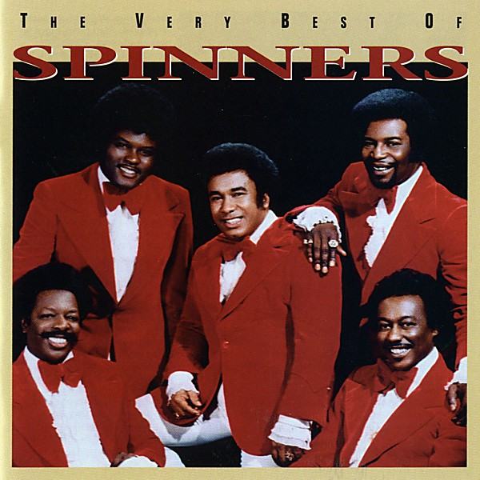

# The Very Best of Dionne Warwick [Rhino]

By **Dionne Warwick**

## Album Data

- **Catalog:** Beets
- **Format:** Digital, Album
- **Album:** The Very Best of Dionne Warwick [Rhino]
- **Artist:** Dionne Warwick
- **Albumartist:** Dionne Warwick
- **Genre:** Soul
- **MusicBrainz Album Artist ID:** 
- **MusicBrainz Album ID:** 
- **MusicBrainz Release Group ID:** 
- **Year:** 1968
- **Catalog #:** 
- **Label:** 
- **Total Tracks:** 00

## Album Tracks

### Track 01 - (Theme From) Valley Of The Dolls

- **Artist:** Dionne Warwick
- **Format:** AAC
- **Genre:** Pop
- **Length:** 3:38
- **MusicBrainz Track ID:** 
- **Title:** (Theme From) Valley Of The Dolls
- **Track:** 01
- **Year:** 1968

