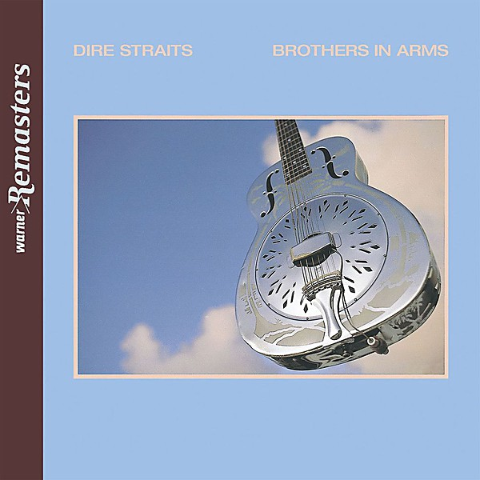

# Brothers in Arms

By **Dire Straits**

## Album Data

- **Catalog:** Beets
- **Format:** Digital, Album
- **Album:** Brothers in Arms
- **Artist:** Dire Straits
- **Albumartist:** Dire Straits
- **Genre:** Rock
- **MusicBrainz Album Artist ID:** [614e3804-7d34-41ba-857f-811bad7c2b7a](https://musicbrainz.org/artist/614e3804-7d34-41ba-857f-811bad7c2b7a)
- **MusicBrainz Album ID:** [00dac2ff-f4d1-433b-a196-89b888591a99](https://musicbrainz.org/release/00dac2ff-f4d1-433b-a196-89b888591a99)
- **MusicBrainz Release Group ID:** [b02f651e-32a1-30ae-bc23-070b59170278](https://musicbrainz.org/release-group/b02f651e-32a1-30ae-bc23-070b59170278)
- **Year:** 1985
- **Catalog #:** 9 25264-2
- **Label:** Warner Bros. Records
- **Total Tracks:** 09

## Album Tracks

### Track 01 - So Far Away

- **Artist:** Dire Straits
- **Format:** ALAC
- **Genre:** Soft Rock
- **Length:** 5:12
- **MusicBrainz Track ID:** [0854f0dc-fde5-4272-9ab7-a7be136f4449](https://musicbrainz.org/recording/0854f0dc-fde5-4272-9ab7-a7be136f4449)
- **Title:** So Far Away
- **Track:** 01
- **Year:** 1985

### Track 02 - Money for Nothing

- **Artist:** Dire Straits
- **Format:** ALAC
- **Genre:** Rock
- **Length:** 8:26
- **MusicBrainz Track ID:** [e6c7f0d6-2b44-435c-b321-2fb6bff9a555](https://musicbrainz.org/recording/e6c7f0d6-2b44-435c-b321-2fb6bff9a555)
- **Title:** Money for Nothing
- **Track:** 02
- **Year:** 1985

### Track 03 - Walk of Life

- **Artist:** Dire Straits
- **Format:** ALAC
- **Genre:** Rock
- **Length:** 4:12
- **MusicBrainz Track ID:** [14aa051a-051f-4faf-8a08-ed46dc32c65b](https://musicbrainz.org/recording/14aa051a-051f-4faf-8a08-ed46dc32c65b)
- **Title:** Walk of Life
- **Track:** 03
- **Year:** 1985

### Track 04 - Your Latest Trick

- **Artist:** Dire Straits
- **Format:** ALAC
- **Genre:** Soft Rock
- **Length:** 6:33
- **MusicBrainz Track ID:** [eb3ba8c5-2059-45b1-889a-7b4887a32f5f](https://musicbrainz.org/recording/eb3ba8c5-2059-45b1-889a-7b4887a32f5f)
- **Title:** Your Latest Trick
- **Track:** 04
- **Year:** 1985

### Track 05 - Why Worry

- **Artist:** Dire Straits
- **Format:** ALAC
- **Genre:** Soft Rock
- **Length:** 8:31
- **MusicBrainz Track ID:** [fab46371-c922-4d5a-bc3b-0079016d2e9a](https://musicbrainz.org/recording/fab46371-c922-4d5a-bc3b-0079016d2e9a)
- **Title:** Why Worry
- **Track:** 05
- **Year:** 1985

### Track 06 - Ride Across the River

- **Artist:** Dire Straits
- **Format:** ALAC
- **Genre:** Soft Rock
- **Length:** 6:58
- **MusicBrainz Track ID:** [7cc60ca4-6ea2-4074-a592-eb505e88a81d](https://musicbrainz.org/recording/7cc60ca4-6ea2-4074-a592-eb505e88a81d)
- **Title:** Ride Across the River
- **Track:** 06
- **Year:** 1985

### Track 07 - The Man’s Too Strong

- **Artist:** Dire Straits
- **Format:** ALAC
- **Genre:** Rock
- **Length:** 4:40
- **MusicBrainz Track ID:** [3ed0c827-3374-44b6-b0f1-774677f52e5b](https://musicbrainz.org/recording/3ed0c827-3374-44b6-b0f1-774677f52e5b)
- **Title:** The Man’s Too Strong
- **Track:** 07
- **Year:** 1985

### Track 08 - One World

- **Artist:** Dire Straits
- **Format:** ALAC
- **Genre:** Rock
- **Length:** 3:40
- **MusicBrainz Track ID:** [7af824c4-bb34-4c1b-a2dd-9d3ae016e7a4](https://musicbrainz.org/recording/7af824c4-bb34-4c1b-a2dd-9d3ae016e7a4)
- **Title:** One World
- **Track:** 08
- **Year:** 1985

### Track 09 - Brothers in Arms

- **Artist:** Dire Straits
- **Format:** ALAC
- **Genre:** Rock
- **Length:** 6:55
- **MusicBrainz Track ID:** [00e80381-2362-485c-aa47-942ff63f0ac0](https://musicbrainz.org/recording/00e80381-2362-485c-aa47-942ff63f0ac0)
- **Title:** Brothers in Arms
- **Track:** 09
- **Year:** 1985

## See also

- [Roon: Brothers in Arms](../../Roon/Dire_Straits/Brothers_in_Arms.md)
- [Roon: Dire Straits](../../Roon/Dire_Straits/Dire_Straits.md)
- [Roon: Love Over Gold](../../Roon/Dire_Straits/Love_Over_Gold.md)
- [Vinyl: Brothers In Arms](../../Vinyl/Dire_Straits/Brothers_In_Arms.md)
- [Vinyl: ](../../Vinyl/Dire_Straits/Dire_Straits.md)
- [Vinyl: ExtendeDancEPlay](../../Vinyl/Dire_Straits/ExtendeDancEPlay.md)
- [Vinyl: Love Over Gold](../../Vinyl/Dire_Straits/Love_Over_Gold.md)
- [Vinyl: Making Movies](../../Vinyl/Dire_Straits/Making_Movies.md)
- [Vinyl: Money For Nothing](../../Vinyl/Dire_Straits/Money_For_Nothing.md)
