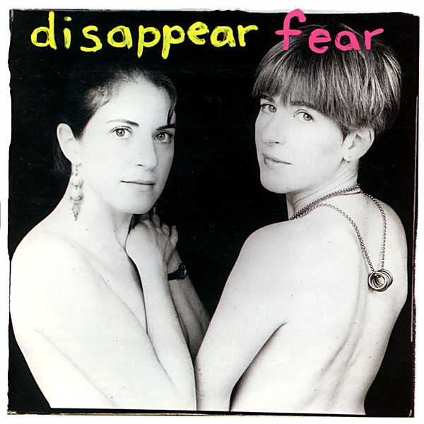

# Disappear Fear

By **Disappear Fear**

## Album Data

- **Catalog:** Beets
- **Format:** Digital, Album
- **Album:** Disappear Fear
- **Artist:** Disappear Fear
- **Albumartist:** Disappear Fear
- **Genre:** Unknown
- **MusicBrainz Album Artist ID:** [be8d6886-0a2d-4312-a174-de192ee77eb2](https://musicbrainz.org/artist/be8d6886-0a2d-4312-a174-de192ee77eb2)
- **MusicBrainz Album ID:** [2dde37d8-46a6-461b-ae60-9fffd62f60c4](https://musicbrainz.org/release/2dde37d8-46a6-461b-ae60-9fffd62f60c4)
- **MusicBrainz Release Group ID:** [56ffb10b-0920-3228-bd11-4d3604784843](https://musicbrainz.org/release-group/56ffb10b-0920-3228-bd11-4d3604784843)
- **Year:** 1994
- **Catalog #:** CD PH 1171
- **Label:** Philo
- **Total Tracks:** 11

## Album Tracks

### Track 01 - Washington Work Song

- **Artist:** Disappear Fear
- **Format:** ALAC
- **Genre:** Unknown
- **Length:** 5:18
- **MusicBrainz Track ID:** [d153055b-c0c9-4aee-977a-fd492d741edb](https://musicbrainz.org/recording/d153055b-c0c9-4aee-977a-fd492d741edb)
- **Title:** Washington Work Song
- **Track:** 01
- **Year:** 1994

### Track 02 - Who's So Scared

- **Artist:** Disappear Fear
- **Format:** ALAC
- **Genre:** Progressive Rock
- **Length:** 6:12
- **MusicBrainz Track ID:** [82c962cb-2a74-4a57-8780-f0559056ecdf](https://musicbrainz.org/recording/82c962cb-2a74-4a57-8780-f0559056ecdf)
- **Title:** Who's So Scared
- **Track:** 02
- **Year:** 1994

### Track 03 - Priceless

- **Artist:** Disappear Fear
- **Format:** ALAC
- **Genre:** Unknown
- **Length:** 3:50
- **MusicBrainz Track ID:** [455ed06f-40fb-4aa7-8730-01ff57bd3d2a](https://musicbrainz.org/recording/455ed06f-40fb-4aa7-8730-01ff57bd3d2a)
- **Title:** Priceless
- **Track:** 03
- **Year:** 1994

### Track 04 - Fix My Life

- **Artist:** Disappear Fear
- **Format:** ALAC
- **Genre:** Unknown
- **Length:** 4:58
- **MusicBrainz Track ID:** [deaef984-fc1f-4859-ba22-b47e138cb225](https://musicbrainz.org/recording/deaef984-fc1f-4859-ba22-b47e138cb225)
- **Title:** Fix My Life
- **Track:** 04
- **Year:** 1994

### Track 05 - Be the One

- **Artist:** Disappear Fear
- **Format:** ALAC
- **Genre:** Unknown
- **Length:** 4:38
- **MusicBrainz Track ID:** [b0575cd3-877c-420f-9d67-56a4f361c749](https://musicbrainz.org/recording/b0575cd3-877c-420f-9d67-56a4f361c749)
- **Title:** Be the One
- **Track:** 05
- **Year:** 1994

### Track 06 - Is There Anybody Here

- **Artist:** Disappear Fear
- **Format:** ALAC
- **Genre:** Unknown
- **Length:** 5:10
- **MusicBrainz Track ID:** [61751824-9813-4000-acc3-4f003b9fff07](https://musicbrainz.org/recording/61751824-9813-4000-acc3-4f003b9fff07)
- **Title:** Is There Anybody Here
- **Track:** 06
- **Year:** 1994

### Track 07 - Moment of Glory

- **Artist:** Disappear Fear
- **Format:** ALAC
- **Genre:** Unknown
- **Length:** 4:00
- **MusicBrainz Track ID:** [3ebf2149-a30b-4342-ac4b-3007917a644c](https://musicbrainz.org/recording/3ebf2149-a30b-4342-ac4b-3007917a644c)
- **Title:** Moment of Glory
- **Track:** 07
- **Year:** 1994

### Track 08 - Play the Music

- **Artist:** Disappear Fear
- **Format:** ALAC
- **Genre:** Soft Rock
- **Length:** 6:39
- **MusicBrainz Track ID:** [1088fff4-f7b6-4b28-b043-05d436814eae](https://musicbrainz.org/recording/1088fff4-f7b6-4b28-b043-05d436814eae)
- **Title:** Play the Music
- **Track:** 08
- **Year:** 1994

### Track 09 - Dance All Night

- **Artist:** Disappear Fear
- **Format:** ALAC
- **Genre:** Unknown
- **Length:** 2:47
- **MusicBrainz Track ID:** [712e2ce5-d0c5-4e27-8a04-b3bd9f492576](https://musicbrainz.org/recording/712e2ce5-d0c5-4e27-8a04-b3bd9f492576)
- **Title:** Dance All Night
- **Track:** 09
- **Year:** 1994

### Track 10 - The Missing Song

- **Artist:** Disappear Fear
- **Format:** ALAC
- **Genre:** Easy Listening
- **Length:** 4:32
- **MusicBrainz Track ID:** [5ba8715b-8128-4f9c-a889-b19cc9c71c26](https://musicbrainz.org/recording/5ba8715b-8128-4f9c-a889-b19cc9c71c26)
- **Title:** The Missing Song
- **Track:** 10
- **Year:** 1994

### Track 11 - Kiss the World

- **Artist:** Disappear Fear
- **Format:** ALAC
- **Genre:** Unknown
- **Length:** 5:07
- **MusicBrainz Track ID:** [6afee36a-7f17-49ba-87cd-438c1fcdc962](https://musicbrainz.org/recording/6afee36a-7f17-49ba-87cd-438c1fcdc962)
- **Title:** Kiss the World
- **Track:** 11
- **Year:** 1994

