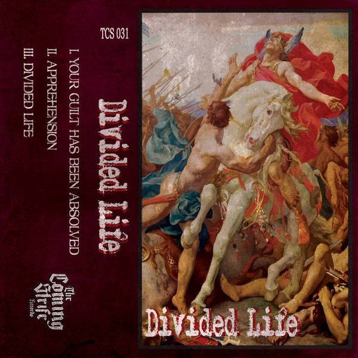

# Divided

By **Divided**

## Album Data

- **Catalog:** Beets
- **Format:** Digital, Album
- **Album:** Divided
- **Artist:** Divided
- **Albumartist:** Divided
- **Genre:** Technical Death Metal
- **MusicBrainz Album Artist ID:** 
- **MusicBrainz Album ID:** 
- **MusicBrainz Release Group ID:** 
- **Year:** 0000
- **Catalog #:** 
- **Label:** 
- **Total Tracks:** 00

## Album Tracks

### Track 01 - Track 1a

- **Artist:** Divided
- **Format:** MP3
- **Genre:** Technical Death Metal
- **Length:** 2:10
- **MusicBrainz Track ID:** 
- **Title:** Track 1a
- **Track:** 01
- **Year:** 0000

### Track 02 - Track 2a

- **Artist:** Divided
- **Format:** MP3
- **Genre:** Technical Death Metal
- **Length:** 1:46
- **MusicBrainz Track ID:** 
- **Title:** Track 2a
- **Track:** 02
- **Year:** 0000

### Track 03 - Track 3a

- **Artist:** Divided
- **Format:** MP3
- **Genre:** Technical Death Metal
- **Length:** 2:20
- **MusicBrainz Track ID:** 
- **Title:** Track 3a
- **Track:** 03
- **Year:** 0000

### Track 04 - Track 4a

- **Artist:** Divided
- **Format:** MP3
- **Genre:** Technical Death Metal
- **Length:** 1:19
- **MusicBrainz Track ID:** 
- **Title:** Track 4a
- **Track:** 04
- **Year:** 0000

### Track 05 - Track 5a

- **Artist:** Divided
- **Format:** MP3
- **Genre:** Technical Death Metal
- **Length:** 1:49
- **MusicBrainz Track ID:** 
- **Title:** Track 5a
- **Track:** 05
- **Year:** 0000

### Track 06 - Track 6a

- **Artist:** Divided
- **Format:** MP3
- **Genre:** Technical Death Metal
- **Length:** 2:05
- **MusicBrainz Track ID:** 
- **Title:** Track 6a
- **Track:** 06
- **Year:** 0000

### Track 07 - Track 7a

- **Artist:** Divided
- **Format:** MP3
- **Genre:** Technical Death Metal
- **Length:** 2:25
- **MusicBrainz Track ID:** 
- **Title:** Track 7a
- **Track:** 07
- **Year:** 0000

### Track 08 - Track 1b

- **Artist:** Divided
- **Format:** MP3
- **Genre:** Technical Death Metal
- **Length:** 2:11
- **MusicBrainz Track ID:** 
- **Title:** Track 1b
- **Track:** 08
- **Year:** 0000

### Track 09 - Track 2b

- **Artist:** Divided
- **Format:** MP3
- **Genre:** Technical Death Metal
- **Length:** 1:46
- **MusicBrainz Track ID:** 
- **Title:** Track 2b
- **Track:** 09
- **Year:** 0000

### Track 10 - Track 3b

- **Artist:** Divided
- **Format:** MP3
- **Genre:** Technical Death Metal
- **Length:** 2:20
- **MusicBrainz Track ID:** 
- **Title:** Track 3b
- **Track:** 10
- **Year:** 0000

### Track 11 - Track 4b

- **Artist:** Divided
- **Format:** MP3
- **Genre:** Technical Death Metal
- **Length:** 1:19
- **MusicBrainz Track ID:** 
- **Title:** Track 4b
- **Track:** 11
- **Year:** 0000

### Track 12 - Track 5b

- **Artist:** Divided
- **Format:** MP3
- **Genre:** Technical Death Metal
- **Length:** 1:49
- **MusicBrainz Track ID:** 
- **Title:** Track 5b
- **Track:** 12
- **Year:** 0000

### Track 13 - Track 6b

- **Artist:** Divided
- **Format:** MP3
- **Genre:** Technical Death Metal
- **Length:** 2:05
- **MusicBrainz Track ID:** 
- **Title:** Track 6b
- **Track:** 13
- **Year:** 0000

### Track 14 - Track 7b

- **Artist:** Divided
- **Format:** MP3
- **Genre:** Technical Death Metal
- **Length:** 2:23
- **MusicBrainz Track ID:** 
- **Title:** Track 7b
- **Track:** 14
- **Year:** 0000

## See also

- [Divided II](Divided_II.md)
- [Master Tape](Master_Tape.md)
