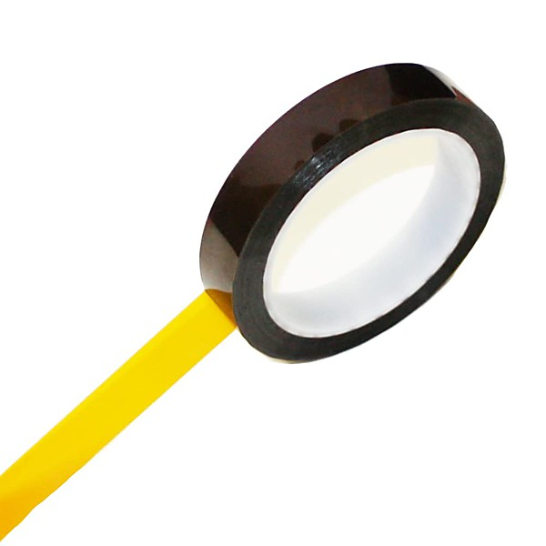

# Master Tape

By **Divided**

## Album Data

- **Catalog:** Beets
- **Format:** Digital, Album
- **Album:** Master Tape
- **Artist:** Divided
- **Albumartist:** Divided
- **Genre:** Technical Death Metal
- **MusicBrainz Album Artist ID:** 
- **MusicBrainz Album ID:** 
- **MusicBrainz Release Group ID:** 
- **Year:** 0000
- **Catalog #:** 
- **Label:** 
- **Total Tracks:** 06

## Album Tracks

### Track 01 - Track 1

- **Artist:** Divided
- **Format:** MP3
- **Genre:** Technical Death Metal
- **Length:** 1:57
- **MusicBrainz Track ID:** 
- **Title:** Track 1
- **Track:** 01
- **Year:** 0000

### Track 02 - Track 2

- **Artist:** Divided
- **Format:** MP3
- **Genre:** Technical Death Metal
- **Length:** 2:39
- **MusicBrainz Track ID:** 
- **Title:** Track 2
- **Track:** 02
- **Year:** 0000

### Track 03 - Track 3

- **Artist:** Divided
- **Format:** MP3
- **Genre:** Technical Death Metal
- **Length:** 2:43
- **MusicBrainz Track ID:** 
- **Title:** Track 3
- **Track:** 03
- **Year:** 0000

### Track 04 - Track 4

- **Artist:** Divided
- **Format:** MP3
- **Genre:** Technical Death Metal
- **Length:** 1:45
- **MusicBrainz Track ID:** 
- **Title:** Track 4
- **Track:** 04
- **Year:** 0000

### Track 05 - Track 5

- **Artist:** Divided
- **Format:** MP3
- **Genre:** Technical Death Metal
- **Length:** 2:57
- **MusicBrainz Track ID:** 
- **Title:** Track 5
- **Track:** 05
- **Year:** 0000

### Track 06 - Track 6

- **Artist:** Divided
- **Format:** MP3
- **Genre:** Technical Death Metal
- **Length:** 2:28
- **MusicBrainz Track ID:** 
- **Title:** Track 6
- **Track:** 06
- **Year:** 0000

## See also

- [Divided II](Divided_II.md)
- [Divided](Divided.md)
