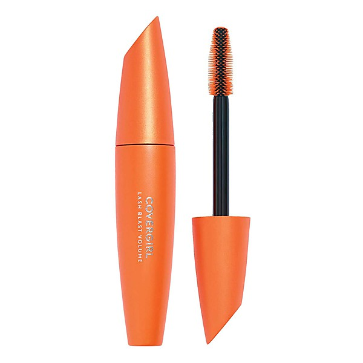

# Paris and London

By **Django Reinhardt**

## Album Data

- **Catalog:** Beets
- **Format:** Digital, Album
- **Album:** Paris and London
- **Artist:** Django Reinhardt
- **Albumartist:** Django Reinhardt
- **Genre:** Swing
- **MusicBrainz Album Artist ID:** 
- **MusicBrainz Album ID:** 
- **MusicBrainz Release Group ID:** 
- **Year:** 2001
- **Catalog #:** 
- **Label:** JSP
- **Total Tracks:** 00

## Album Tracks

### Track 01 - Stockholm

- **Artist:** Django Reinhardt
- **Format:** MP3
- **Genre:** Swing
- **Length:** 2:48
- **MusicBrainz Track ID:** 
- **Title:** Stockholm
- **Track:** 01
- **Year:** 2001

### Track 02 - The Younger Generation

- **Artist:** Django Reinhardt
- **Format:** MP3
- **Genre:** Swing
- **Length:** 2:24
- **MusicBrainz Track ID:** 
- **Title:** The Younger Generation
- **Track:** 02
- **Year:** 2001

### Track 03 - I'll See You in My Dreams

- **Artist:** Django Reinhardt
- **Format:** MP3
- **Genre:** Swing
- **Length:** 2:31
- **MusicBrainz Track ID:** 
- **Title:** I'll See You in My Dreams
- **Track:** 03
- **Year:** 2001

### Track 04 - Echoes of Spain

- **Artist:** Django Reinhardt
- **Format:** MP3
- **Genre:** Swing
- **Length:** 3:07
- **MusicBrainz Track ID:** 
- **Title:** Echoes of Spain
- **Track:** 04
- **Year:** 2001

### Track 05 - Out of Nowhere

- **Artist:** Django Reinhardt
- **Format:** MP3
- **Genre:** Swing
- **Length:** 3:15
- **MusicBrainz Track ID:** 
- **Title:** Out of Nowhere
- **Track:** 05
- **Year:** 2001

### Track 06 - I Can't Give You Anything But Love

- **Artist:** Django Reinhardt
- **Format:** MP3
- **Genre:** Swing
- **Length:** 2:38
- **MusicBrainz Track ID:** 
- **Title:** I Can't Give You Anything But Love
- **Track:** 06
- **Year:** 2001

### Track 07 - Naguine

- **Artist:** Django Reinhardt
- **Format:** MP3
- **Genre:** Swing
- **Length:** 2:27
- **MusicBrainz Track ID:** 
- **Title:** Naguine
- **Track:** 07
- **Year:** 2001

### Track 08 - Nuages

- **Artist:** Django Reinhardt
- **Format:** MP3
- **Genre:** Swing
- **Length:** 3:19
- **MusicBrainz Track ID:** 
- **Title:** Nuages
- **Track:** 08
- **Year:** 2001

### Track 09 - Rhythme Futur

- **Artist:** Django Reinhardt
- **Format:** MP3
- **Genre:** Swing
- **Length:** 2:39
- **MusicBrainz Track ID:** 
- **Title:** Rhythme Futur
- **Track:** 09
- **Year:** 2001

### Track 10 - Begin the Beguine

- **Artist:** Django Reinhardt
- **Format:** MP3
- **Genre:** Swing
- **Length:** 2:52
- **MusicBrainz Track ID:** 
- **Title:** Begin the Beguine
- **Track:** 10
- **Year:** 2001

### Track 11 - Blues

- **Artist:** Django Reinhardt
- **Format:** MP3
- **Genre:** Swing
- **Length:** 3:08
- **MusicBrainz Track ID:** 
- **Title:** Blues
- **Track:** 11
- **Year:** 2001

### Track 12 - Coucou

- **Artist:** Django Reinhardt
- **Format:** MP3
- **Genre:** French Pop
- **Length:** 2:41
- **MusicBrainz Track ID:** 
- **Title:** Coucou
- **Track:** 12
- **Year:** 2001

### Track 13 - Undecided

- **Artist:** Django Reinhardt
- **Format:** MP3
- **Genre:** Gypsy Jazz
- **Length:** 3:03
- **MusicBrainz Track ID:** 
- **Title:** Undecided
- **Track:** 13
- **Year:** 2001

### Track 14 - Swing '41

- **Artist:** Django Reinhardt
- **Format:** MP3
- **Genre:** Swing
- **Length:** 3:07
- **MusicBrainz Track ID:** 
- **Title:** Swing '41
- **Track:** 14
- **Year:** 2001

### Track 15 - Nuages

- **Artist:** Django Reinhardt
- **Format:** MP3
- **Genre:** Swing
- **Length:** 3:16
- **MusicBrainz Track ID:** 
- **Title:** Nuages
- **Track:** 15
- **Year:** 2001

### Track 16 - Pour Vous (Exactly Like You)

- **Artist:** Django Reinhardt
- **Format:** MP3
- **Genre:** Swing
- **Length:** 3:07
- **MusicBrainz Track ID:** 
- **Title:** Pour Vous (Exactly Like You)
- **Track:** 16
- **Year:** 2001

### Track 17 - Fantaisie Sur une Danse Norvégienne

- **Artist:** Django Reinhardt
- **Format:** MP3
- **Genre:** Swing
- **Length:** 2:33
- **MusicBrainz Track ID:** 
- **Title:** Fantaisie Sur une Danse Norvégienne
- **Track:** 17
- **Year:** 2001

### Track 18 - Vendredi

- **Artist:** Django Reinhardt
- **Format:** MP3
- **Genre:** Swing
- **Length:** 3:02
- **MusicBrainz Track ID:** 
- **Title:** Vendredi
- **Track:** 18
- **Year:** 2001

### Track 19 - Liebesfreud

- **Artist:** Django Reinhardt
- **Format:** MP3
- **Genre:** Swing
- **Length:** 2:39
- **MusicBrainz Track ID:** 
- **Title:** Liebesfreud
- **Track:** 19
- **Year:** 2001

### Track 20 - Mabel

- **Artist:** Django Reinhardt
- **Format:** MP3
- **Genre:** Swing
- **Length:** 3:17
- **MusicBrainz Track ID:** 
- **Title:** Mabel
- **Track:** 20
- **Year:** 2001

### Track 21 - Petits Mensonges (Little White Lies)

- **Artist:** Django Reinhardt
- **Format:** MP3
- **Genre:** Swing
- **Length:** 3:16
- **MusicBrainz Track ID:** 
- **Title:** Petits Mensonges (Little White Lies)
- **Track:** 21
- **Year:** 2001

### Track 22 - Les Yeux Noirs

- **Artist:** Django Reinhardt
- **Format:** MP3
- **Genre:** Swing
- **Length:** 2:14
- **MusicBrainz Track ID:** 
- **Title:** Les Yeux Noirs
- **Track:** 22
- **Year:** 2001

### Track 23 - Sweet Sue, Just You

- **Artist:** Django Reinhardt
- **Format:** MP3
- **Genre:** Swing
- **Length:** 2:49
- **MusicBrainz Track ID:** 
- **Title:** Sweet Sue, Just You
- **Track:** 23
- **Year:** 2001

## See also

- [Paris and London](Paris_and_London_2_3_4.md)
- [Paris and London](Paris_and_London_2_3.md)
- [Paris and London](Paris_and_London_2.md)
- [Un Geant Sur Son Nuage Vol. 3](Un_Geant_Sur_Son_Nuage_Vol_3.md)
