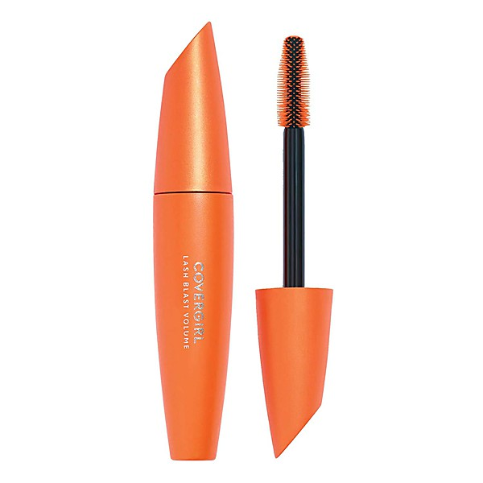

# Paris and London

By **Django Reinhardt**

## Album Data

- **Catalog:** Beets
- **Format:** Digital, Album
- **Album:** Paris and London
- **Artist:** Django Reinhardt
- **Albumartist:** Django Reinhardt
- **Genre:** Swing
- **MusicBrainz Album Artist ID:** 
- **MusicBrainz Album ID:** 
- **MusicBrainz Release Group ID:** 
- **Year:** 2001
- **Catalog #:** 
- **Label:** JSP
- **Total Tracks:** 00

## Album Tracks

### Track 01 - Swing de Paris

- **Artist:** Django Reinhardt
- **Format:** MP3
- **Genre:** Swing
- **Length:** 3:02
- **MusicBrainz Track ID:** 
- **Title:** Swing de Paris
- **Track:** 01
- **Year:** 2001

### Track 02 - Oiseaux des Lles

- **Artist:** Django Reinhardt
- **Format:** MP3
- **Genre:** Swing
- **Length:** 2:49
- **MusicBrainz Track ID:** 
- **Title:** Oiseaux des Lles
- **Track:** 02
- **Year:** 2001

### Track 03 - All of Me

- **Artist:** Django Reinhardt
- **Format:** MP3
- **Genre:** Swing
- **Length:** 2:48
- **MusicBrainz Track ID:** 
- **Title:** All of Me
- **Track:** 03
- **Year:** 2001

### Track 04 - Festival Swing

- **Artist:** Django Reinhardt
- **Format:** MP3
- **Genre:** Swing
- **Length:** 4:10
- **MusicBrainz Track ID:** 
- **Title:** Festival Swing
- **Track:** 04
- **Year:** 2001

### Track 05 - Dinette

- **Artist:** Django Reinhardt
- **Format:** MP3
- **Genre:** Swing
- **Length:** 2:50
- **MusicBrainz Track ID:** 
- **Title:** Dinette
- **Track:** 05
- **Year:** 2001

### Track 06 - Crépuscule

- **Artist:** Django Reinhardt
- **Format:** MP3
- **Genre:** Swing
- **Length:** 3:00
- **MusicBrainz Track ID:** 
- **Title:** Crépuscule
- **Track:** 06
- **Year:** 2001

### Track 07 - Swing '42

- **Artist:** Django Reinhardt
- **Format:** MP3
- **Genre:** Swing
- **Length:** 2:47
- **MusicBrainz Track ID:** 
- **Title:** Swing '42
- **Track:** 07
- **Year:** 2001

### Track 08 - Festival Swing 1942, Pt. 2

- **Artist:** Django Reinhardt
- **Format:** MP3
- **Genre:** Swing
- **Length:** 3:40
- **MusicBrainz Track ID:** 
- **Title:** Festival Swing 1942, Pt. 2
- **Track:** 08
- **Year:** 2001

### Track 09 - Belleville

- **Artist:** Django Reinhardt
- **Format:** MP3
- **Genre:** Swing
- **Length:** 2:31
- **MusicBrainz Track ID:** 
- **Title:** Belleville
- **Track:** 09
- **Year:** 2001

### Track 10 - Lentement Mademoiselle

- **Artist:** Django Reinhardt
- **Format:** MP3
- **Genre:** Swing
- **Length:** 3:17
- **MusicBrainz Track ID:** 
- **Title:** Lentement Mademoiselle
- **Track:** 10
- **Year:** 2001

### Track 11 - Douce Ambiance

- **Artist:** Django Reinhardt
- **Format:** MP3
- **Genre:** Swing
- **Length:** 2:19
- **MusicBrainz Track ID:** 
- **Title:** Douce Ambiance
- **Track:** 11
- **Year:** 2001

### Track 12 - Manoir de Mes Rêves

- **Artist:** Django Reinhardt
- **Format:** MP3
- **Genre:** Gypsy Jazz
- **Length:** 3:19
- **MusicBrainz Track ID:** 
- **Title:** Manoir de Mes Rêves
- **Track:** 12
- **Year:** 2001

### Track 13 - Oui

- **Artist:** Django Reinhardt
- **Format:** MP3
- **Genre:** Swing
- **Length:** 2:08
- **MusicBrainz Track ID:** 
- **Title:** Oui
- **Track:** 13
- **Year:** 2001

### Track 14 - Cavalerie

- **Artist:** Django Reinhardt
- **Format:** MP3
- **Genre:** Gypsy Jazz
- **Length:** 2:34
- **MusicBrainz Track ID:** 
- **Title:** Cavalerie
- **Track:** 14
- **Year:** 2001

### Track 15 - Fleur d'Ennui

- **Artist:** Django Reinhardt
- **Format:** MP3
- **Genre:** Stoner Rock
- **Length:** 2:32
- **MusicBrainz Track ID:** 
- **Title:** Fleur d'Ennui
- **Track:** 15
- **Year:** 2001

### Track 16 - Blues Clair

- **Artist:** Django Reinhardt
- **Format:** MP3
- **Genre:** Swing
- **Length:** 3:02
- **MusicBrainz Track ID:** 
- **Title:** Blues Clair
- **Track:** 16
- **Year:** 2001

### Track 17 - Improvisation No. 3, Pt. 1

- **Artist:** Django Reinhardt
- **Format:** MP3
- **Genre:** Swing
- **Length:** 3:02
- **MusicBrainz Track ID:** 
- **Title:** Improvisation No. 3, Pt. 1
- **Track:** 17
- **Year:** 2001

### Track 18 - Improvisation No. 3, Pt. 2

- **Artist:** Django Reinhardt
- **Format:** MP3
- **Genre:** Swing
- **Length:** 2:46
- **MusicBrainz Track ID:** 
- **Title:** Improvisation No. 3, Pt. 2
- **Track:** 18
- **Year:** 2001

### Track 19 - Coquette

- **Artist:** Django Reinhardt
- **Format:** MP3
- **Genre:** Swing
- **Length:** 3:02
- **MusicBrainz Track ID:** 
- **Title:** Coquette
- **Track:** 19
- **Year:** 2001

### Track 20 - Django's Tiger

- **Artist:** Django Reinhardt
- **Format:** MP3
- **Genre:** Swing
- **Length:** 2:38
- **MusicBrainz Track ID:** 
- **Title:** Django's Tiger
- **Track:** 20
- **Year:** 2001

### Track 21 - Embraceable You

- **Artist:** Django Reinhardt
- **Format:** MP3
- **Genre:** Jazz
- **Length:** 3:08
- **MusicBrainz Track ID:** 
- **Title:** Embraceable You
- **Track:** 21
- **Year:** 2001

### Track 22 - Echoes of France

- **Artist:** Django Reinhardt
- **Format:** MP3
- **Genre:** Gypsy Jazz
- **Length:** 2:45
- **MusicBrainz Track ID:** 
- **Title:** Echoes of France
- **Track:** 22
- **Year:** 2001

## See also

- [Paris and London](Paris_and_London_2_3_4.md)
- [Paris and London](Paris_and_London_2_3.md)
- [Paris and London](Paris_and_London.md)
- [Un Geant Sur Son Nuage Vol. 3](Un_Geant_Sur_Son_Nuage_Vol_3.md)
