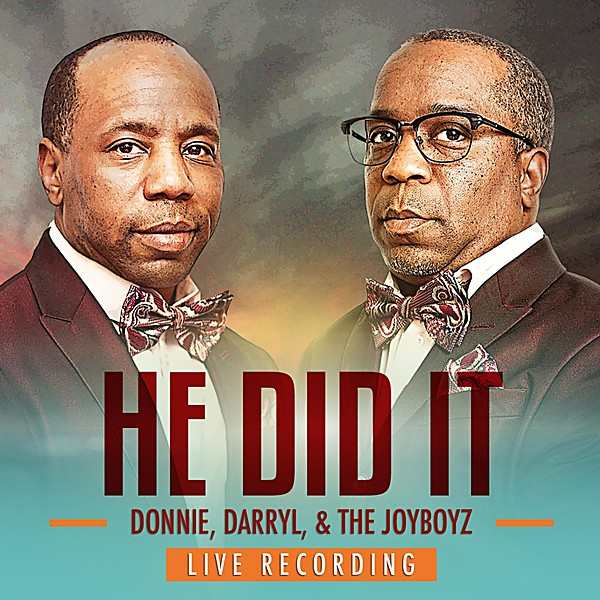

# Donnie Record

By **Donnie Record**

## Album Data

- **Catalog:** Beets
- **Format:** Digital, Album
- **Album:** Donnie Record
- **Artist:** Donnie Record
- **Albumartist:** Donnie Record
- **Genre:** Country
- **MusicBrainz Album Artist ID:** 
- **MusicBrainz Album ID:** 
- **MusicBrainz Release Group ID:** 
- **Year:** 1978
- **Catalog #:** 
- **Label:** 
- **Total Tracks:** 00

## Album Tracks

### Track 01 - One More Goodbye, One More Hello

- **Artist:** Donnie Record
- **Format:** MP3
- **Genre:** Country
- **Length:** 2:45
- **MusicBrainz Track ID:** 
- **Title:** One More Goodbye, One More Hello
- **Track:** 01
- **Year:** 1978

### Track 02 - By the Time the Evening's Over

- **Artist:** Donnie Record
- **Format:** ALAC
- **Genre:** Country
- **Length:** 4:17
- **MusicBrainz Track ID:** 
- **Title:** By the Time the Evening's Over
- **Track:** 02
- **Year:** 0000

### Track 03 - 03 - British Invasion Sunny Afternoon

- **Artist:** Donnie Record
- **Format:** MP3
- **Genre:** Country
- **Length:** 3:37
- **MusicBrainz Track ID:** 
- **Title:** 03 - British Invasion Sunny Afternoon
- **Track:** 03
- **Year:** 0000

## See also

- [Camp David Demos](Camp_David_Demos.md)
- [Roon: Camp David Demos](../../Roon/Donnie_Record/Camp_David_Demos.md)
- [Roon: Donnie Record](../../Roon/Donnie_Record/Donnie_Record.md)
- [Vinyl: ](../../Vinyl/Donnie_Record/Donnie_Record.md)
- [Vinyl: "One More Goodbye, One More Hello"](../../Vinyl/Donnie_Record/One_More_Goodbye__One_More_Hello.md)
