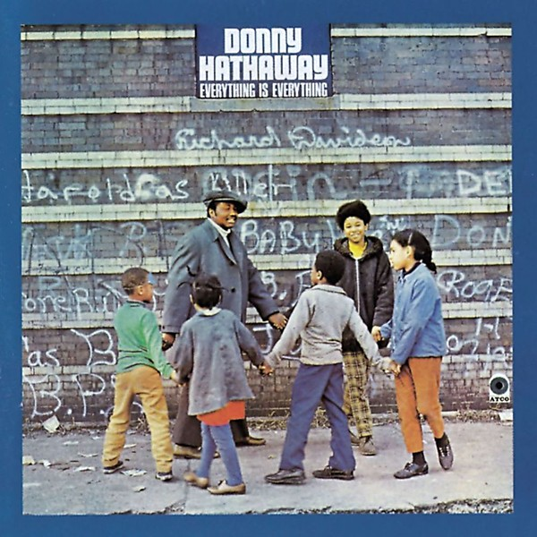

# Everything Is Everything

By **Donny Hathaway**

## Album Data

- **Catalog:** Beets
- **Format:** Digital, Album
- **Album:** Everything Is Everything
- **Artist:** Donny Hathaway
- **Albumartist:** Donny Hathaway
- **Genre:** Soul
- **MusicBrainz Album Artist ID:** [3f6ae36d-ffdb-40cf-98e6-8023cb1c41c9](https://musicbrainz.org/artist/3f6ae36d-ffdb-40cf-98e6-8023cb1c41c9)
- **MusicBrainz Album ID:** [3af49b22-2c4e-46a3-98b2-39681ce6381e](https://musicbrainz.org/release/3af49b22-2c4e-46a3-98b2-39681ce6381e)
- **MusicBrainz Release Group ID:** [726cc401-7ef8-32bc-b482-fe8030d5283f](https://musicbrainz.org/release-group/726cc401-7ef8-32bc-b482-fe8030d5283f)
- **Year:** 1995
- **Catalog #:** R2 72216
- **Label:** Rhino
- **Total Tracks:** 10

## Album Tracks

### Track 01 - Voices Inside (Everything Is Everything)

- **Artist:** Donny Hathaway
- **Format:** ALAC
- **Genre:** Soul
- **Length:** 3:29
- **MusicBrainz Track ID:** [d0bd0796-4323-4cc9-943c-bc09289adafe](https://musicbrainz.org/recording/d0bd0796-4323-4cc9-943c-bc09289adafe)
- **Title:** Voices Inside (Everything Is Everything)
- **Track:** 01
- **Year:** 1995

### Track 02 - Je vous aime (I Love You)

- **Artist:** Donny Hathaway
- **Format:** ALAC
- **Genre:** Soul
- **Length:** 3:31
- **MusicBrainz Track ID:** [a2e71a60-7e31-479e-868c-37e41d414ff2](https://musicbrainz.org/recording/a2e71a60-7e31-479e-868c-37e41d414ff2)
- **Title:** Je vous aime (I Love You)
- **Track:** 02
- **Year:** 1995

### Track 03 - I Believe to My Soul

- **Artist:** Donny Hathaway
- **Format:** ALAC
- **Genre:** Uk Garage
- **Length:** 3:51
- **MusicBrainz Track ID:** [9bb0b8dc-2dc6-4826-b66a-59ec81a75d10](https://musicbrainz.org/recording/9bb0b8dc-2dc6-4826-b66a-59ec81a75d10)
- **Title:** I Believe to My Soul
- **Track:** 03
- **Year:** 1995

### Track 04 - Misty

- **Artist:** Donny Hathaway
- **Format:** ALAC
- **Genre:** Soul
- **Length:** 3:38
- **MusicBrainz Track ID:** [138350d6-fc6a-40f4-9bd6-d262f4c8390d](https://musicbrainz.org/recording/138350d6-fc6a-40f4-9bd6-d262f4c8390d)
- **Title:** Misty
- **Track:** 04
- **Year:** 1995

### Track 05 - Sugar Lee

- **Artist:** Donny Hathaway
- **Format:** ALAC
- **Genre:** Uk Garage
- **Length:** 4:05
- **MusicBrainz Track ID:** [ba75dc33-d787-4138-b5cc-06309dfaf39b](https://musicbrainz.org/recording/ba75dc33-d787-4138-b5cc-06309dfaf39b)
- **Title:** Sugar Lee
- **Track:** 05
- **Year:** 1995

### Track 06 - Tryin’ Times

- **Artist:** Donny Hathaway
- **Format:** ALAC
- **Genre:** Soul
- **Length:** 3:15
- **MusicBrainz Track ID:** [9dad8306-2d63-4614-84a1-12fdd899d429](https://musicbrainz.org/recording/9dad8306-2d63-4614-84a1-12fdd899d429)
- **Title:** Tryin’ Times
- **Track:** 06
- **Year:** 1995

### Track 07 - Thank You Master (For My Soul)

- **Artist:** Donny Hathaway
- **Format:** ALAC
- **Genre:** Soul
- **Length:** 5:50
- **MusicBrainz Track ID:** [e726b410-3dd5-444e-a6e9-cc6d3060e026](https://musicbrainz.org/recording/e726b410-3dd5-444e-a6e9-cc6d3060e026)
- **Title:** Thank You Master (For My Soul)
- **Track:** 07
- **Year:** 1995

### Track 08 - The Ghetto

- **Artist:** Donny Hathaway
- **Format:** ALAC
- **Genre:** Soul
- **Length:** 6:53
- **MusicBrainz Track ID:** [853687a7-1b5d-4dd3-a05d-43f775840d86](https://musicbrainz.org/recording/853687a7-1b5d-4dd3-a05d-43f775840d86)
- **Title:** The Ghetto
- **Track:** 08
- **Year:** 1995

### Track 09 - To Be Young, Gifted and Black

- **Artist:** Donny Hathaway
- **Format:** ALAC
- **Genre:** Soul
- **Length:** 6:44
- **MusicBrainz Track ID:** [d79ec20e-dbee-4e37-9281-017a6e2bd599](https://musicbrainz.org/recording/d79ec20e-dbee-4e37-9281-017a6e2bd599)
- **Title:** To Be Young, Gifted and Black
- **Track:** 09
- **Year:** 1995

### Track 10 - A Dream

- **Artist:** Donny Hathaway
- **Format:** ALAC
- **Genre:** Soul
- **Length:** 4:13
- **MusicBrainz Track ID:** [09b8669e-93aa-4589-a36d-9c5a0d46aef1](https://musicbrainz.org/recording/09b8669e-93aa-4589-a36d-9c5a0d46aef1)
- **Title:** A Dream
- **Track:** 10
- **Year:** 1995

