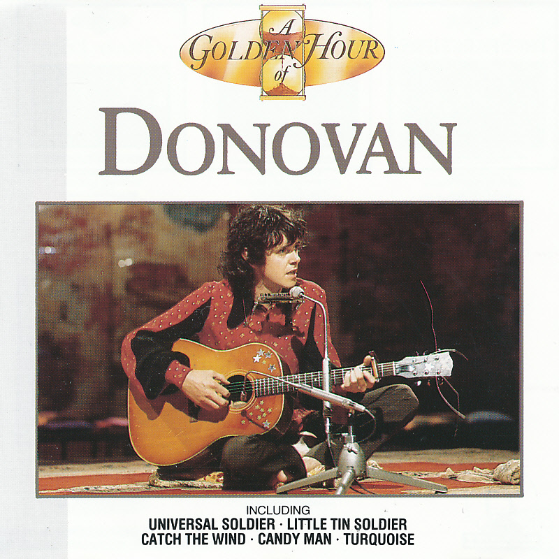

# A Golden Hour of Donovan

By **Donovan**

## Album Data

- **Catalog:** Beets
- **Format:** Digital, Album
- **Album:** A Golden Hour of Donovan
- **Artist:** Donovan
- **Albumartist:** Donovan
- **Genre:** Folk Rock
- **MusicBrainz Album Artist ID:** [72d7d717-0837-4f2a-9641-d0f9fdd3acf7](https://musicbrainz.org/artist/72d7d717-0837-4f2a-9641-d0f9fdd3acf7)
- **MusicBrainz Album ID:** [8436d6b5-2bc6-4b16-a022-1a450eef5721](https://musicbrainz.org/release/8436d6b5-2bc6-4b16-a022-1a450eef5721)
- **MusicBrainz Release Group ID:** [8e0d8d08-98f5-4d11-bbb1-d0d46b0caf87](https://musicbrainz.org/release-group/8e0d8d08-98f5-4d11-bbb1-d0d46b0caf87)
- **Year:** 1990
- **Catalog #:** 
- **Label:** 
- **Total Tracks:** 00

## Album Tracks

### Track 01 - Mellow Yellow

- **Artist:** Donovan
- **Format:** MP3
- **Genre:** Folk Rock
- **Length:** 3:40
- **MusicBrainz Track ID:** 
- **Title:** Mellow Yellow
- **Track:** 01
- **Year:** 0000

### Track 02 - Colours

- **Artist:** Donovan
- **Format:** MP3
- **Genre:** Folk Rock
- **Length:** 2:44
- **MusicBrainz Track ID:** 
- **Title:** Colours
- **Track:** 02
- **Year:** 0000

### Track 03 - Hurdy Gurdy Man

- **Artist:** Donovan
- **Format:** MP3
- **Genre:** Psychedelic Rock
- **Length:** 3:19
- **MusicBrainz Track ID:** 
- **Title:** Hurdy Gurdy Man
- **Track:** 03
- **Year:** 0000

### Track 04 - Catch the Wind

- **Artist:** Donovan
- **Format:** MP3
- **Genre:** Folk Rock
- **Length:** 2:54
- **MusicBrainz Track ID:** 
- **Title:** Catch the Wind
- **Track:** 04
- **Year:** 0000

### Track 05 - Lalena

- **Artist:** Donovan
- **Format:** MP3
- **Genre:** Folk Rock
- **Length:** 2:55
- **MusicBrainz Track ID:** 
- **Title:** Lalena
- **Track:** 05
- **Year:** 0000

### Track 06 - Epistle To Dippy

- **Artist:** Donovan
- **Format:** MP3
- **Genre:** Psychedelic Rock
- **Length:** 3:10
- **MusicBrainz Track ID:** 
- **Title:** Epistle To Dippy
- **Track:** 06
- **Year:** 0000

### Track 07 - Sunshine Superman

- **Artist:** Donovan
- **Format:** MP3
- **Genre:** Psychedelic Rock
- **Length:** 4:31
- **MusicBrainz Track ID:** 
- **Title:** Sunshine Superman
- **Track:** 07
- **Year:** 0000

### Track 08 - There Is a Mountain

- **Artist:** Donovan
- **Format:** MP3
- **Genre:** Folk Rock
- **Length:** 2:35
- **MusicBrainz Track ID:** 
- **Title:** There Is a Mountain
- **Track:** 08
- **Year:** 0000

### Track 09 - Jennifer Juniper

- **Artist:** Donovan
- **Format:** MP3
- **Genre:** Folk Rock
- **Length:** 2:42
- **MusicBrainz Track ID:** 
- **Title:** Jennifer Juniper
- **Track:** 09
- **Year:** 0000

### Track 10 - Wear Your Love Like Heaven

- **Artist:** Donovan
- **Format:** MP3
- **Genre:** Psychedelic Rock
- **Length:** 2:25
- **MusicBrainz Track ID:** 
- **Title:** Wear Your Love Like Heaven
- **Track:** 10
- **Year:** 0000

### Track 11 - Season of the Witch

- **Artist:** Donovan
- **Format:** MP3
- **Genre:** Folk Rock
- **Length:** 4:56
- **MusicBrainz Track ID:** 
- **Title:** Season of the Witch
- **Track:** 11
- **Year:** 0000

## See also

- [a gift from a flower to a garden](a_gift_from_a_flower_to_a_garden.md)
- [Donovan's Greatest Hits](Donovans_Greatest_Hits.md)
- [Sunshine Superman](Sunshine_Superman.md)
- [Super Hits](Super_Hits.md)
- [Try For The Sun](Try_For_The_Sun_2_3.md)
- [Try For The Sun](Try_For_The_Sun_2.md)
- [Try For The Sun](Try_For_The_Sun.md)
- [CD: ](../../CD/Donovan/Donovan.md)
- [CD: Try For The Sun](../../CD/Donovan/Try_For_The_Sun-_The_Journey_Of_Donovan_Disc_1.md)
- [CD: Try For The Sun](../../CD/Donovan/Try_For_The_Sun-_The_Journey_Of_Donovan_Disc_2.md)
- [CD: Try For The Sun](../../CD/Donovan/Try_For_The_Sun-_The_Journey_Of_Donovan_Disc_3.md)
- [Roon: A Gift From A Flower To A Garden](../../Roon/Donovan/A_Gift_From_A_Flower_To_A_Garden.md)
- [Roon: Barabajagal](../../Roon/Donovan/Barabajagal.md)
- [Roon: Catch the Wind](../../Roon/Donovan/Catch_the_Wind.md)
- [Roon: Donovan's Greatest Hits](../../Roon/Donovan/Donovans_Greatest_Hits.md)
- [Roon: Fairytale (Deluxe Expanded Edition)](../../Roon/Donovan/Fairytale_Deluxe_Expanded_Edition.md)
- [Roon: Fairytales and Colours](../../Roon/Donovan/Fairytales_and_Colours.md)
- [Roon: Mellow Yellow](../../Roon/Donovan/Mellow_Yellow.md)
- [Roon: Open Road](../../Roon/Donovan/Open_Road.md)
- [Roon: Sunshine Superman](../../Roon/Donovan/Sunshine_Superman.md)
- [Roon: The Hurdy Gurdy Man](../../Roon/Donovan/The_Hurdy_Gurdy_Man.md)
- [Vinyl: A Gift From A Flower To A Garden](../../Vinyl/Donovan/A_Gift_From_A_Flower_To_A_Garden.md)
- [Vinyl: Cosmic Wheels](../../Vinyl/Donovan/Cosmic_Wheels.md)
- [Vinyl: ](../../Vinyl/Donovan/Donovan.md)
- [Vinyl: Sunshine Superman](../../Vinyl/Donovan/Sunshine_Superman.md)
- [Vinyl: To Susan On The West Coast Waiting / Atlantis](../../Vinyl/Donovan/To_Susan_On_The_West_Coast_Waiting_-_Atlantis.md)
