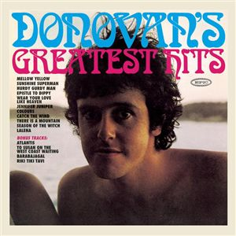

# Donovan's Greatest Hits

By **Donovan**

## Album Data

- **Catalog:** Beets
- **Format:** Digital, Album
- **Album:** Donovan's Greatest Hits
- **Artist:** Donovan
- **Albumartist:** Donovan
- **Genre:** Folk Rock
- **MusicBrainz Album Artist ID:** 
- **MusicBrainz Album ID:** 
- **MusicBrainz Release Group ID:** 
- **Year:** 0000
- **Catalog #:** EK 26217
- **Label:** Epic
- **Total Tracks:** 10

## Album Tracks

### Track 01 - Sunshine Superman

- **Artist:** Donovan
- **Format:** MP3
- **Genre:** Psychedelic Rock
- **Length:** 3:15
- **MusicBrainz Track ID:** [5c9a63d1-26c5-454a-be19-2ce54683b8a3](https://musicbrainz.org/recording/5c9a63d1-26c5-454a-be19-2ce54683b8a3)
- **Title:** Sunshine Superman
- **Track:** 01
- **Year:** 1990

### Track 02 - Legend of a Girl Child Linda

- **Artist:** Donovan
- **Format:** MP3
- **Genre:** Psychedelic Rock
- **Length:** 6:50
- **MusicBrainz Track ID:** [1fa55966-a4d2-405d-abe4-2ebe3c2d7647](https://musicbrainz.org/recording/1fa55966-a4d2-405d-abe4-2ebe3c2d7647)
- **Title:** Legend of a Girl Child Linda
- **Track:** 02
- **Year:** 1990

### Track 03 - Three King Fishers

- **Artist:** Donovan
- **Format:** MP3
- **Genre:** Psychedelic Pop
- **Length:** 3:15
- **MusicBrainz Track ID:** [ad2750a7-0cb4-42f8-8014-8e1f65d90e18](https://musicbrainz.org/recording/ad2750a7-0cb4-42f8-8014-8e1f65d90e18)
- **Title:** Three King Fishers
- **Track:** 03
- **Year:** 1990

### Track 04 - Ferris Wheel

- **Artist:** Donovan
- **Format:** MP3
- **Genre:** Psychedelic Pop
- **Length:** 4:12
- **MusicBrainz Track ID:** [e34436dc-b333-4cb3-b494-f73840437ab0](https://musicbrainz.org/recording/e34436dc-b333-4cb3-b494-f73840437ab0)
- **Title:** Ferris Wheel
- **Track:** 04
- **Year:** 1990

### Track 05 - Bert's Blues

- **Artist:** Donovan
- **Format:** MP3
- **Genre:** Swing
- **Length:** 3:56
- **MusicBrainz Track ID:** [27dae82c-8513-4401-8c8e-b0956fbb769e](https://musicbrainz.org/recording/27dae82c-8513-4401-8c8e-b0956fbb769e)
- **Title:** Bert's Blues
- **Track:** 05
- **Year:** 1990

### Track 06 - Season of the Witch

- **Artist:** Donovan
- **Format:** MP3
- **Genre:** Folk Rock
- **Length:** 4:53
- **MusicBrainz Track ID:** [6023330f-96b9-43c7-bc8e-7cc4ca128110](https://musicbrainz.org/recording/6023330f-96b9-43c7-bc8e-7cc4ca128110)
- **Title:** Season of the Witch
- **Track:** 06
- **Year:** 1990

### Track 07 - The Trip

- **Artist:** Donovan
- **Format:** MP3
- **Genre:** Psychedelic Rock
- **Length:** 4:34
- **MusicBrainz Track ID:** [0b84c9dd-22dc-434a-9c63-a34d2979f3c7](https://musicbrainz.org/recording/0b84c9dd-22dc-434a-9c63-a34d2979f3c7)
- **Title:** The Trip
- **Track:** 07
- **Year:** 1990

### Track 08 - Guinevere

- **Artist:** Donovan
- **Format:** MP3
- **Genre:** Rock
- **Length:** 3:40
- **MusicBrainz Track ID:** [ba348720-6074-4ad4-9b4a-e8e036b776a7](https://musicbrainz.org/recording/ba348720-6074-4ad4-9b4a-e8e036b776a7)
- **Title:** Guinevere
- **Track:** 08
- **Year:** 1990

### Track 09 - The Fat Angel

- **Artist:** Donovan
- **Format:** MP3
- **Genre:** Psychedelic Pop
- **Length:** 4:10
- **MusicBrainz Track ID:** [9ac0c434-0308-4b27-b68d-24af0bdc9400](https://musicbrainz.org/recording/9ac0c434-0308-4b27-b68d-24af0bdc9400)
- **Title:** The Fat Angel
- **Track:** 09
- **Year:** 1990

### Track 10 - Celeste

- **Artist:** Donovan
- **Format:** MP3
- **Genre:** Soul
- **Length:** 4:08
- **MusicBrainz Track ID:** [89f481f4-01b4-4000-a2d9-3659ebbf5675](https://musicbrainz.org/recording/89f481f4-01b4-4000-a2d9-3659ebbf5675)
- **Title:** Celeste
- **Track:** 10
- **Year:** 1990

## See also

- [a gift from a flower to a garden](a_gift_from_a_flower_to_a_garden.md)
- [A Golden Hour of Donovan](A_Golden_Hour_of_Donovan.md)
- [Sunshine Superman](Sunshine_Superman.md)
- [Super Hits](Super_Hits.md)
- [Try For The Sun](Try_For_The_Sun_2_3.md)
- [Try For The Sun](Try_For_The_Sun_2.md)
- [Try For The Sun](Try_For_The_Sun.md)
- [CD: ](../../CD/Donovan/Donovan.md)
- [CD: Try For The Sun](../../CD/Donovan/Try_For_The_Sun-_The_Journey_Of_Donovan_Disc_1.md)
- [CD: Try For The Sun](../../CD/Donovan/Try_For_The_Sun-_The_Journey_Of_Donovan_Disc_2.md)
- [CD: Try For The Sun](../../CD/Donovan/Try_For_The_Sun-_The_Journey_Of_Donovan_Disc_3.md)
- [Roon: A Gift From A Flower To A Garden](../../Roon/Donovan/A_Gift_From_A_Flower_To_A_Garden.md)
- [Roon: Barabajagal](../../Roon/Donovan/Barabajagal.md)
- [Roon: Catch the Wind](../../Roon/Donovan/Catch_the_Wind.md)
- [Roon: Donovan's Greatest Hits](../../Roon/Donovan/Donovans_Greatest_Hits.md)
- [Roon: Fairytale (Deluxe Expanded Edition)](../../Roon/Donovan/Fairytale_Deluxe_Expanded_Edition.md)
- [Roon: Fairytales and Colours](../../Roon/Donovan/Fairytales_and_Colours.md)
- [Roon: Mellow Yellow](../../Roon/Donovan/Mellow_Yellow.md)
- [Roon: Open Road](../../Roon/Donovan/Open_Road.md)
- [Roon: Sunshine Superman](../../Roon/Donovan/Sunshine_Superman.md)
- [Roon: The Hurdy Gurdy Man](../../Roon/Donovan/The_Hurdy_Gurdy_Man.md)
- [Vinyl: A Gift From A Flower To A Garden](../../Vinyl/Donovan/A_Gift_From_A_Flower_To_A_Garden.md)
- [Vinyl: Cosmic Wheels](../../Vinyl/Donovan/Cosmic_Wheels.md)
- [Vinyl: ](../../Vinyl/Donovan/Donovan.md)
- [Vinyl: Sunshine Superman](../../Vinyl/Donovan/Sunshine_Superman.md)
- [Vinyl: To Susan On The West Coast Waiting / Atlantis](../../Vinyl/Donovan/To_Susan_On_The_West_Coast_Waiting_-_Atlantis.md)
