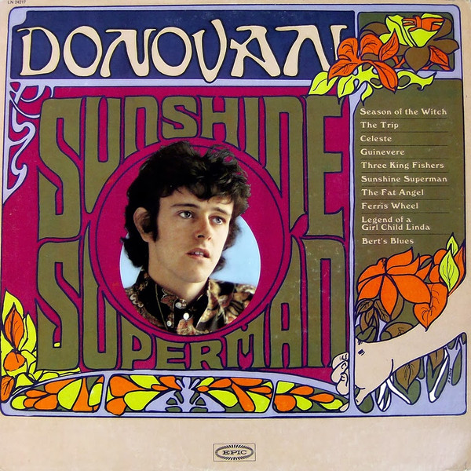

# Sunshine Superman

By **Donovan**

## Album Data

- **Catalog:** Beets
- **Format:** Digital, Album
- **Album:** Sunshine Superman
- **Artist:** Donovan
- **Albumartist:** Donovan
- **Genre:** Psychedelic Rock
- **MusicBrainz Album Artist ID:** [72d7d717-0837-4f2a-9641-d0f9fdd3acf7](https://musicbrainz.org/artist/72d7d717-0837-4f2a-9641-d0f9fdd3acf7)
- **MusicBrainz Album ID:** [1e8417b0-6a00-3f7e-be06-f92a8c4dadb9](https://musicbrainz.org/release/1e8417b0-6a00-3f7e-be06-f92a8c4dadb9)
- **MusicBrainz Release Group ID:** [092eedd3-b8e2-33a6-8a9b-e9788e060886](https://musicbrainz.org/release-group/092eedd3-b8e2-33a6-8a9b-e9788e060886)
- **Year:** 1990
- **Catalog #:** 
- **Label:** Sony
- **Total Tracks:** 00

## Album Tracks

### Track 01 - Sunshine Superman

- **Artist:** Donovan
- **Format:** MP3
- **Genre:** Psychedelic Rock
- **Length:** 4:33
- **MusicBrainz Track ID:** 
- **Title:** Sunshine Superman
- **Track:** 01
- **Year:** 2000

### Track 02 - Mellow Yellow

- **Artist:** Donovan
- **Format:** MP3
- **Genre:** Folk Rock
- **Length:** 3:40
- **MusicBrainz Track ID:** 
- **Title:** Mellow Yellow
- **Track:** 02
- **Year:** 2000

### Track 03 - To Susan on the West Coast Waiting

- **Artist:** Donovan
- **Format:** MP3
- **Genre:** Psychedelic Rock
- **Length:** 3:12
- **MusicBrainz Track ID:** 
- **Title:** To Susan on the West Coast Waiting
- **Track:** 03
- **Year:** 2000

### Track 04 - Lalena

- **Artist:** Donovan
- **Format:** MP3
- **Genre:** Folk Rock
- **Length:** 2:55
- **MusicBrainz Track ID:** 
- **Title:** Lalena
- **Track:** 04
- **Year:** 2000

### Track 05 - Atlantis

- **Artist:** Donovan
- **Format:** MP3
- **Genre:** Folk Rock
- **Length:** 4:59
- **MusicBrainz Track ID:** 
- **Title:** Atlantis
- **Track:** 05
- **Year:** 2000

### Track 06 - Atlantis

- **Artist:** Donovan
- **Format:** ALAC
- **Genre:** Folk Rock
- **Length:** 4:59
- **MusicBrainz Track ID:** 
- **Title:** Atlantis
- **Track:** 06
- **Year:** 2000

### Track 07 - The Trip

- **Artist:** Donovan
- **Format:** MP3
- **Genre:** Psychedelic Rock
- **Length:** 4:34
- **MusicBrainz Track ID:** 
- **Title:** The Trip
- **Track:** 07
- **Year:** 2000

### Track 08 - Guinevere

- **Artist:** Donovan
- **Format:** MP3
- **Genre:** Rock
- **Length:** 3:40
- **MusicBrainz Track ID:** 
- **Title:** Guinevere
- **Track:** 08
- **Year:** 2000

### Track 09 - Writer in the Sun

- **Artist:** Donovan
- **Format:** MP3
- **Genre:** Psychedelic Rock
- **Length:** 4:28
- **MusicBrainz Track ID:** 
- **Title:** Writer in the Sun
- **Track:** 09
- **Year:** 2000

### Track 10 - Cosmic Wheels

- **Artist:** Donovan
- **Format:** MP3
- **Genre:** Psychedelic Pop
- **Length:** 4:02
- **MusicBrainz Track ID:** 
- **Title:** Cosmic Wheels
- **Track:** 10
- **Year:** 2000

### Track 06 - Barabajagal (Love Is Hot)

- **Artist:** Donovan/Group/Jeff Beck
- **Format:** MP3
- **Genre:** Folk Rock
- **Length:** 3:19
- **MusicBrainz Track ID:** 
- **Title:** Barabajagal (Love Is Hot)
- **Track:** 06
- **Year:** 2000

## See also

- [a gift from a flower to a garden](a_gift_from_a_flower_to_a_garden.md)
- [A Golden Hour of Donovan](A_Golden_Hour_of_Donovan.md)
- [Donovan's Greatest Hits](Donovans_Greatest_Hits.md)
- [Super Hits](Super_Hits.md)
- [Try For The Sun](Try_For_The_Sun_2_3.md)
- [Try For The Sun](Try_For_The_Sun_2.md)
- [Try For The Sun](Try_For_The_Sun.md)
- [CD: ](../../CD/Donovan/Donovan.md)
- [CD: Try For The Sun](../../CD/Donovan/Try_For_The_Sun-_The_Journey_Of_Donovan_Disc_1.md)
- [CD: Try For The Sun](../../CD/Donovan/Try_For_The_Sun-_The_Journey_Of_Donovan_Disc_2.md)
- [CD: Try For The Sun](../../CD/Donovan/Try_For_The_Sun-_The_Journey_Of_Donovan_Disc_3.md)
- [Roon: A Gift From A Flower To A Garden](../../Roon/Donovan/A_Gift_From_A_Flower_To_A_Garden.md)
- [Roon: Barabajagal](../../Roon/Donovan/Barabajagal.md)
- [Roon: Catch the Wind](../../Roon/Donovan/Catch_the_Wind.md)
- [Roon: Donovan's Greatest Hits](../../Roon/Donovan/Donovans_Greatest_Hits.md)
- [Roon: Fairytale (Deluxe Expanded Edition)](../../Roon/Donovan/Fairytale_Deluxe_Expanded_Edition.md)
- [Roon: Fairytales and Colours](../../Roon/Donovan/Fairytales_and_Colours.md)
- [Roon: Mellow Yellow](../../Roon/Donovan/Mellow_Yellow.md)
- [Roon: Open Road](../../Roon/Donovan/Open_Road.md)
- [Roon: Sunshine Superman](../../Roon/Donovan/Sunshine_Superman.md)
- [Roon: The Hurdy Gurdy Man](../../Roon/Donovan/The_Hurdy_Gurdy_Man.md)
- [Vinyl: A Gift From A Flower To A Garden](../../Vinyl/Donovan/A_Gift_From_A_Flower_To_A_Garden.md)
- [Vinyl: Cosmic Wheels](../../Vinyl/Donovan/Cosmic_Wheels.md)
- [Vinyl: ](../../Vinyl/Donovan/Donovan.md)
- [Vinyl: Sunshine Superman](../../Vinyl/Donovan/Sunshine_Superman.md)
- [Vinyl: To Susan On The West Coast Waiting / Atlantis](../../Vinyl/Donovan/To_Susan_On_The_West_Coast_Waiting_-_Atlantis.md)
