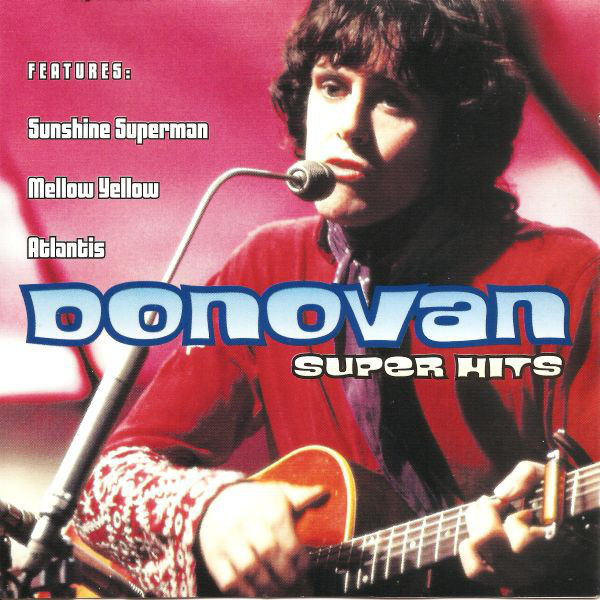

# Super Hits

By **Donovan**

## Album Data

- **Catalog:** Beets
- **Format:** Digital, Album
- **Album:** Super Hits
- **Artist:** Donovan
- **Albumartist:** Donovan
- **Genre:** Folk Rock
- **MusicBrainz Album Artist ID:** 
- **MusicBrainz Album ID:** 
- **MusicBrainz Release Group ID:** 
- **Year:** 2000
- **Catalog #:** 
- **Label:** 
- **Total Tracks:** 20

## Album Tracks

### Track 01 - Catch The Wind [Single Version]

- **Artist:** Donovan
- **Format:** ALAC
- **Genre:** Folk Rock
- **Length:** 2:17
- **MusicBrainz Track ID:** 
- **Title:** Catch The Wind [Single Version]
- **Track:** 01
- **Year:** 1965

### Track 02 - Josie

- **Artist:** Donovan
- **Format:** ALAC
- **Genre:** Easy Listening
- **Length:** 3:27
- **MusicBrainz Track ID:** 
- **Title:** Josie
- **Track:** 02
- **Year:** 1965

### Track 03 - Codine [Demo Version]

- **Artist:** Donovan
- **Format:** ALAC
- **Genre:** Folk Rock
- **Length:** 4:47
- **MusicBrainz Track ID:** 
- **Title:** Codine [Demo Version]
- **Track:** 03
- **Year:** 1965

### Track 04 - Colours

- **Artist:** Donovan
- **Format:** ALAC
- **Genre:** Folk Rock
- **Length:** 2:45
- **MusicBrainz Track ID:** 
- **Title:** Colours
- **Track:** 04
- **Year:** 1965

### Track 05 - Universal Soldier

- **Artist:** Donovan
- **Format:** ALAC
- **Genre:** Folk Rock
- **Length:** 2:12
- **MusicBrainz Track ID:** 
- **Title:** Universal Soldier
- **Track:** 05
- **Year:** 1965

### Track 06 - Sunny Goodge Street

- **Artist:** Donovan
- **Format:** ALAC
- **Genre:** Swing
- **Length:** 2:55
- **MusicBrainz Track ID:** 
- **Title:** Sunny Goodge Street
- **Track:** 06
- **Year:** 1965

### Track 07 - Hey Gyp (Dig The Slowness)

- **Artist:** Donovan
- **Format:** ALAC
- **Genre:** Folk Rock
- **Length:** 3:10
- **MusicBrainz Track ID:** 
- **Title:** Hey Gyp (Dig The Slowness)
- **Track:** 07
- **Year:** 1965

### Track 08 - Sunshine Superman [Extended Version]

- **Artist:** Donovan
- **Format:** ALAC
- **Genre:** Folk Rock
- **Length:** 4:33
- **MusicBrainz Track ID:** 
- **Title:** Sunshine Superman [Extended Version]
- **Track:** 08
- **Year:** 1966

### Track 09 - Trip [Single Version]

- **Artist:** Donovan
- **Format:** ALAC
- **Genre:** Folk Rock
- **Length:** 4:34
- **MusicBrainz Track ID:** 
- **Title:** Trip [Single Version]
- **Track:** 09
- **Year:** 1966

### Track 10 - Legend Of A Girl Child Linda

- **Artist:** Donovan
- **Format:** ALAC
- **Genre:** Psychedelic Rock
- **Length:** 6:53
- **MusicBrainz Track ID:** 
- **Title:** Legend Of A Girl Child Linda
- **Track:** 10
- **Year:** 1966

### Track 11 - Three King Fishers

- **Artist:** Donovan
- **Format:** ALAC
- **Genre:** Psychedelic Pop
- **Length:** 3:17
- **MusicBrainz Track ID:** 
- **Title:** Three King Fishers
- **Track:** 11
- **Year:** 1966

### Track 12 - Season Of The Witch

- **Artist:** Donovan
- **Format:** ALAC
- **Genre:** Folk Rock
- **Length:** 4:56
- **MusicBrainz Track ID:** 
- **Title:** Season Of The Witch
- **Track:** 12
- **Year:** 1966

### Track 13 - Guinevere

- **Artist:** Donovan
- **Format:** ALAC
- **Genre:** Rock
- **Length:** 3:41
- **MusicBrainz Track ID:** 
- **Title:** Guinevere
- **Track:** 13
- **Year:** 1966

### Track 14 - Fat Angel

- **Artist:** Donovan
- **Format:** ALAC
- **Genre:** Folk Rock
- **Length:** 4:12
- **MusicBrainz Track ID:** 
- **Title:** Fat Angel
- **Track:** 14
- **Year:** 1966

### Track 15 - Mellow Yellow

- **Artist:** Donovan
- **Format:** ALAC
- **Genre:** Folk Rock
- **Length:** 3:43
- **MusicBrainz Track ID:** 
- **Title:** Mellow Yellow
- **Track:** 15
- **Year:** 1966

### Track 16 - Sand And Foam

- **Artist:** Donovan
- **Format:** ALAC
- **Genre:** Folk Rock
- **Length:** 3:17
- **MusicBrainz Track ID:** 
- **Title:** Sand And Foam
- **Track:** 16
- **Year:** 1966

### Track 17 - Young Girl Blues

- **Artist:** Donovan
- **Format:** ALAC
- **Genre:** Indie Folk
- **Length:** 3:46
- **MusicBrainz Track ID:** 
- **Title:** Young Girl Blues
- **Track:** 17
- **Year:** 1966

### Track 18 - Museum

- **Artist:** Donovan
- **Format:** ALAC
- **Genre:** Psychedelic Rock
- **Length:** 2:56
- **MusicBrainz Track ID:** 
- **Title:** Museum
- **Track:** 18
- **Year:** 1967

### Track 19 - Hampstead Incident

- **Artist:** Donovan
- **Format:** ALAC
- **Genre:** Baroque Pop
- **Length:** 4:42
- **MusicBrainz Track ID:** 
- **Title:** Hampstead Incident
- **Track:** 19
- **Year:** 1966

### Track 20 - Sunny South Kensington

- **Artist:** Donovan
- **Format:** ALAC
- **Genre:** Rock
- **Length:** 3:49
- **MusicBrainz Track ID:** 
- **Title:** Sunny South Kensington
- **Track:** 20
- **Year:** 1966

## See also

- [a gift from a flower to a garden](a_gift_from_a_flower_to_a_garden.md)
- [A Golden Hour of Donovan](A_Golden_Hour_of_Donovan.md)
- [Donovan's Greatest Hits](Donovans_Greatest_Hits.md)
- [Sunshine Superman](Sunshine_Superman.md)
- [Try For The Sun](Try_For_The_Sun_2_3.md)
- [Try For The Sun](Try_For_The_Sun_2.md)
- [Try For The Sun](Try_For_The_Sun.md)
- [CD: ](../../CD/Donovan/Donovan.md)
- [CD: Try For The Sun](../../CD/Donovan/Try_For_The_Sun-_The_Journey_Of_Donovan_Disc_1.md)
- [CD: Try For The Sun](../../CD/Donovan/Try_For_The_Sun-_The_Journey_Of_Donovan_Disc_2.md)
- [CD: Try For The Sun](../../CD/Donovan/Try_For_The_Sun-_The_Journey_Of_Donovan_Disc_3.md)
- [Roon: A Gift From A Flower To A Garden](../../Roon/Donovan/A_Gift_From_A_Flower_To_A_Garden.md)
- [Roon: Barabajagal](../../Roon/Donovan/Barabajagal.md)
- [Roon: Catch the Wind](../../Roon/Donovan/Catch_the_Wind.md)
- [Roon: Donovan's Greatest Hits](../../Roon/Donovan/Donovans_Greatest_Hits.md)
- [Roon: Fairytale (Deluxe Expanded Edition)](../../Roon/Donovan/Fairytale_Deluxe_Expanded_Edition.md)
- [Roon: Fairytales and Colours](../../Roon/Donovan/Fairytales_and_Colours.md)
- [Roon: Mellow Yellow](../../Roon/Donovan/Mellow_Yellow.md)
- [Roon: Open Road](../../Roon/Donovan/Open_Road.md)
- [Roon: Sunshine Superman](../../Roon/Donovan/Sunshine_Superman.md)
- [Roon: The Hurdy Gurdy Man](../../Roon/Donovan/The_Hurdy_Gurdy_Man.md)
- [Vinyl: A Gift From A Flower To A Garden](../../Vinyl/Donovan/A_Gift_From_A_Flower_To_A_Garden.md)
- [Vinyl: Cosmic Wheels](../../Vinyl/Donovan/Cosmic_Wheels.md)
- [Vinyl: ](../../Vinyl/Donovan/Donovan.md)
- [Vinyl: Sunshine Superman](../../Vinyl/Donovan/Sunshine_Superman.md)
- [Vinyl: To Susan On The West Coast Waiting / Atlantis](../../Vinyl/Donovan/To_Susan_On_The_West_Coast_Waiting_-_Atlantis.md)
