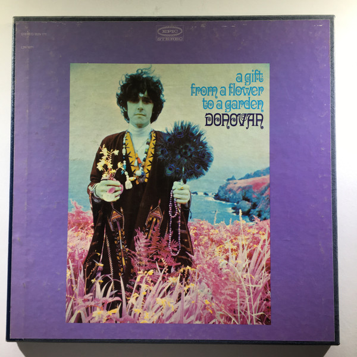

# a gift from a flower to a garden

By **Donovan**

## Album Data

- **Catalog:** Beets
- **Format:** Digital, Album
- **Album:** a gift from a flower to a garden
- **Artist:** Donovan
- **Albumartist:** Donovan
- **Genre:** Psychedelic Rock
- **MusicBrainz Album Artist ID:** 
- **MusicBrainz Album ID:** 
- **MusicBrainz Release Group ID:** 
- **Year:** 0000
- **Catalog #:** KGH CD 107
- **Label:** Knight Records
- **Total Tracks:** 20

## Album Tracks

### Track 01 - Universal Soldier

- **Artist:** Donovan
- **Format:** AAC
- **Genre:** Folk Rock
- **Length:** 2:15
- **MusicBrainz Track ID:** [e2a14306-52a0-4523-a0a1-aa35c746a74d](https://musicbrainz.org/recording/e2a14306-52a0-4523-a0a1-aa35c746a74d)
- **Title:** Universal Soldier
- **Track:** 01
- **Year:** 1990

### Track 02 - Sunny Goodge Street

- **Artist:** Donovan
- **Format:** AAC
- **Genre:** Swing
- **Length:** 3:01
- **MusicBrainz Track ID:** [584fd3d3-040c-4a51-aa7d-c0601b5caf52](https://musicbrainz.org/recording/584fd3d3-040c-4a51-aa7d-c0601b5caf52)
- **Title:** Sunny Goodge Street
- **Track:** 02
- **Year:** 1990

### Track 03 - Josie

- **Artist:** Donovan
- **Format:** AAC
- **Genre:** Easy Listening
- **Length:** 3:33
- **MusicBrainz Track ID:** [417a23e1-6fb1-4246-ae8f-a9203e611c09](https://musicbrainz.org/recording/417a23e1-6fb1-4246-ae8f-a9203e611c09)
- **Title:** Josie
- **Track:** 03
- **Year:** 1990

### Track 04 - Little Tin Soldier

- **Artist:** Donovan
- **Format:** AAC
- **Genre:** Folk Rock
- **Length:** 3:05
- **MusicBrainz Track ID:** [3dfbbb3e-0e10-47dd-80b9-d260bf4a8a16](https://musicbrainz.org/recording/3dfbbb3e-0e10-47dd-80b9-d260bf4a8a16)
- **Title:** Little Tin Soldier
- **Track:** 04
- **Year:** 1990

### Track 05 - To Sing For You

- **Artist:** Donovan
- **Format:** AAC
- **Genre:** Soft Rock
- **Length:** 1:31
- **MusicBrainz Track ID:** [854f6b8a-9d78-40ee-a84f-75694553129e](https://musicbrainz.org/recording/854f6b8a-9d78-40ee-a84f-75694553129e)
- **Title:** To Sing For You
- **Track:** 05
- **Year:** 1990

### Track 06 - Gold Watch Blues

- **Artist:** Donovan
- **Format:** AAC
- **Genre:** Folk Rock
- **Length:** 2:37
- **MusicBrainz Track ID:** [1dfec34c-871c-418a-9c7f-3ea196c7fc91](https://musicbrainz.org/recording/1dfec34c-871c-418a-9c7f-3ea196c7fc91)
- **Title:** Gold Watch Blues
- **Track:** 06
- **Year:** 1990

### Track 07 - Donna Donna

- **Artist:** Donovan
- **Format:** AAC
- **Genre:** Psychedelic Rock
- **Length:** 3:02
- **MusicBrainz Track ID:** [411d0488-c363-412f-ac9a-291d467a9925](https://musicbrainz.org/recording/411d0488-c363-412f-ac9a-291d467a9925)
- **Title:** Donna Donna
- **Track:** 07
- **Year:** 1990

### Track 08 - The Ballad of Geraldine

- **Artist:** Donovan
- **Format:** AAC
- **Genre:** Folk Rock
- **Length:** 4:49
- **MusicBrainz Track ID:** [51f38c89-fe87-4ec7-95c7-ff621167cf65](https://musicbrainz.org/recording/51f38c89-fe87-4ec7-95c7-ff621167cf65)
- **Title:** The Ballad of Geraldine
- **Track:** 08
- **Year:** 1990

### Track 09 - Colours

- **Artist:** Donovan
- **Format:** AAC
- **Genre:** Folk Rock
- **Length:** 2:52
- **MusicBrainz Track ID:** [747b0297-87b7-44d7-b4b5-1ab93a8ba1e9](https://musicbrainz.org/recording/747b0297-87b7-44d7-b4b5-1ab93a8ba1e9)
- **Title:** Colours
- **Track:** 09
- **Year:** 1990

### Track 10 - The War Drags On

- **Artist:** Donovan
- **Format:** AAC
- **Genre:** Folk Rock
- **Length:** 3:48
- **MusicBrainz Track ID:** [2a62a32f-c3ea-428d-a15e-b0dcebfe8aae](https://musicbrainz.org/recording/2a62a32f-c3ea-428d-a15e-b0dcebfe8aae)
- **Title:** The War Drags On
- **Track:** 10
- **Year:** 1990

### Track 11 - Catch The Wind

- **Artist:** Donovan
- **Format:** AAC
- **Genre:** Folk Rock
- **Length:** 2:23
- **MusicBrainz Track ID:** [81b0c695-d993-4fd8-a787-4dccf29fc7f2](https://musicbrainz.org/recording/81b0c695-d993-4fd8-a787-4dccf29fc7f2)
- **Title:** Catch The Wind
- **Track:** 11
- **Year:** 1990

### Track 12 - Turquoise

- **Artist:** Donovan
- **Format:** AAC
- **Genre:** Soul
- **Length:** 3:39
- **MusicBrainz Track ID:** [56280ca3-334b-49f1-951c-2142190b4540](https://musicbrainz.org/recording/56280ca3-334b-49f1-951c-2142190b4540)
- **Title:** Turquoise
- **Track:** 12
- **Year:** 1990

### Track 13 - Candy Man

- **Artist:** Donovan
- **Format:** AAC
- **Genre:** Folk Rock
- **Length:** 3:37
- **MusicBrainz Track ID:** [9d31063a-1aa1-4abc-8b81-3b945442c351](https://musicbrainz.org/recording/9d31063a-1aa1-4abc-8b81-3b945442c351)
- **Title:** Candy Man
- **Track:** 13
- **Year:** 1990

### Track 14 - Jersey Thursday

- **Artist:** Donovan
- **Format:** AAC
- **Genre:** Folk Rock
- **Length:** 2:19
- **MusicBrainz Track ID:** [b62bcefa-2dc1-4e27-8bee-9dd15e293000](https://musicbrainz.org/recording/b62bcefa-2dc1-4e27-8bee-9dd15e293000)
- **Title:** Jersey Thursday
- **Track:** 14
- **Year:** 1990

### Track 15 - Why Do You Treat Me Like You Do

- **Artist:** Donovan
- **Format:** AAC
- **Genre:** Folk Rock
- **Length:** 3:03
- **MusicBrainz Track ID:** [77dd2934-e989-4297-92cf-6ea023ead2df](https://musicbrainz.org/recording/77dd2934-e989-4297-92cf-6ea023ead2df)
- **Title:** Why Do You Treat Me Like You Do
- **Track:** 15
- **Year:** 1990

### Track 16 - Ballad of a Crystal Man

- **Artist:** Donovan
- **Format:** AAC
- **Genre:** Folk Rock
- **Length:** 3:25
- **MusicBrainz Track ID:** [7dc9dd09-68bf-4404-9edf-7fdc632f5fb4](https://musicbrainz.org/recording/7dc9dd09-68bf-4404-9edf-7fdc632f5fb4)
- **Title:** Ballad of a Crystal Man
- **Track:** 16
- **Year:** 1990

### Track 17 - Hey Gyp (Dig The Slowness)

- **Artist:** Donovan
- **Format:** AAC
- **Genre:** Folk Rock
- **Length:** 3:19
- **MusicBrainz Track ID:** [7c72a8e0-f7a8-46f2-a31f-fc14f73ada4c](https://musicbrainz.org/recording/7c72a8e0-f7a8-46f2-a31f-fc14f73ada4c)
- **Title:** Hey Gyp (Dig The Slowness)
- **Track:** 17
- **Year:** 1990

### Track 18 - Remember The Alamo

- **Artist:** Donovan
- **Format:** AAC
- **Genre:** Folk Rock
- **Length:** 3:11
- **MusicBrainz Track ID:** [5c34addd-43eb-4bbe-b01d-0b833f414bab](https://musicbrainz.org/recording/5c34addd-43eb-4bbe-b01d-0b833f414bab)
- **Title:** Remember The Alamo
- **Track:** 18
- **Year:** 1990

### Track 19 - I'll Try For The Sun

- **Artist:** Donovan
- **Format:** AAC
- **Genre:** Folk Rock
- **Length:** 3:46
- **MusicBrainz Track ID:** [b9c831bf-e54a-4786-a635-78b722ff1e3d](https://musicbrainz.org/recording/b9c831bf-e54a-4786-a635-78b722ff1e3d)
- **Title:** I'll Try For The Sun
- **Track:** 19
- **Year:** 1990

### Track 20 - Belated Forgiveness Plea

- **Artist:** Donovan
- **Format:** AAC
- **Genre:** Folk Rock
- **Length:** 3:02
- **MusicBrainz Track ID:** [a48861e1-4b2c-4e34-b680-434eea946917](https://musicbrainz.org/recording/a48861e1-4b2c-4e34-b680-434eea946917)
- **Title:** Belated Forgiveness Plea
- **Track:** 20
- **Year:** 1990

## See also

- [A Golden Hour of Donovan](A_Golden_Hour_of_Donovan.md)
- [Donovan's Greatest Hits](Donovans_Greatest_Hits.md)
- [Sunshine Superman](Sunshine_Superman.md)
- [Super Hits](Super_Hits.md)
- [Try For The Sun](Try_For_The_Sun_2_3.md)
- [Try For The Sun](Try_For_The_Sun_2.md)
- [Try For The Sun](Try_For_The_Sun.md)
- [CD: ](../../CD/Donovan/Donovan.md)
- [CD: Try For The Sun](../../CD/Donovan/Try_For_The_Sun-_The_Journey_Of_Donovan_Disc_1.md)
- [CD: Try For The Sun](../../CD/Donovan/Try_For_The_Sun-_The_Journey_Of_Donovan_Disc_2.md)
- [CD: Try For The Sun](../../CD/Donovan/Try_For_The_Sun-_The_Journey_Of_Donovan_Disc_3.md)
- [Roon: A Gift From A Flower To A Garden](../../Roon/Donovan/A_Gift_From_A_Flower_To_A_Garden.md)
- [Roon: Barabajagal](../../Roon/Donovan/Barabajagal.md)
- [Roon: Catch the Wind](../../Roon/Donovan/Catch_the_Wind.md)
- [Roon: Donovan's Greatest Hits](../../Roon/Donovan/Donovans_Greatest_Hits.md)
- [Roon: Fairytale (Deluxe Expanded Edition)](../../Roon/Donovan/Fairytale_Deluxe_Expanded_Edition.md)
- [Roon: Fairytales and Colours](../../Roon/Donovan/Fairytales_and_Colours.md)
- [Roon: Mellow Yellow](../../Roon/Donovan/Mellow_Yellow.md)
- [Roon: Open Road](../../Roon/Donovan/Open_Road.md)
- [Roon: Sunshine Superman](../../Roon/Donovan/Sunshine_Superman.md)
- [Roon: The Hurdy Gurdy Man](../../Roon/Donovan/The_Hurdy_Gurdy_Man.md)
- [Vinyl: A Gift From A Flower To A Garden](../../Vinyl/Donovan/A_Gift_From_A_Flower_To_A_Garden.md)
- [Vinyl: Cosmic Wheels](../../Vinyl/Donovan/Cosmic_Wheels.md)
- [Vinyl: ](../../Vinyl/Donovan/Donovan.md)
- [Vinyl: Sunshine Superman](../../Vinyl/Donovan/Sunshine_Superman.md)
- [Vinyl: To Susan On The West Coast Waiting / Atlantis](../../Vinyl/Donovan/To_Susan_On_The_West_Coast_Waiting_-_Atlantis.md)
