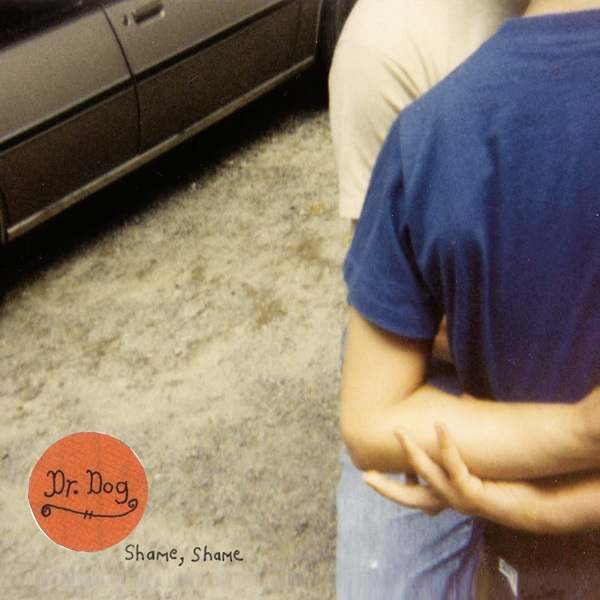

# Shame, Shame

By **Dr. Dog**

## Album Data

- **Catalog:** Beets
- **Format:** Digital, Album
- **Album:** Shame, Shame
- **Artist:** Dr. Dog
- **Albumartist:** Dr. Dog
- **Genre:** Indie Rock
- **MusicBrainz Album Artist ID:** [https](https://musicbrainz.org/artist/https)
- **MusicBrainz Album ID:** [https](https://musicbrainz.org/release/https)
- **MusicBrainz Release Group ID:** 
- **Year:** 2010
- **Catalog #:** 
- **Label:** Anti- Records
- **Total Tracks:** 11

## Album Tracks

### Track 01 - Stranger

- **Artist:** Dr. Dog
- **Format:** MP3
- **Genre:** Indie Rock
- **Length:** 3:43
- **MusicBrainz Track ID:** [https](https://musicbrainz.org/recording/https)
- **Title:** Stranger
- **Track:** 01
- **Year:** 2010

### Track 02 - Shadow People

- **Artist:** Dr. Dog
- **Format:** MP3
- **Genre:** Psychedelic Rock
- **Length:** 4:13
- **MusicBrainz Track ID:** [https](https://musicbrainz.org/recording/https)
- **Title:** Shadow People
- **Track:** 02
- **Year:** 2010

### Track 03 - Station

- **Artist:** Dr. Dog
- **Format:** MP3
- **Genre:** Indie Pop
- **Length:** 3:11
- **MusicBrainz Track ID:** [https](https://musicbrainz.org/recording/https)
- **Title:** Station
- **Track:** 03
- **Year:** 2010

### Track 04 - Unbearable Why

- **Artist:** Dr. Dog
- **Format:** MP3
- **Genre:** Indie Rock
- **Length:** 3:13
- **MusicBrainz Track ID:** [https](https://musicbrainz.org/recording/https)
- **Title:** Unbearable Why
- **Track:** 04
- **Year:** 2010

### Track 05 - Where'd All The Time Go?

- **Artist:** Dr. Dog
- **Format:** MP3
- **Genre:** Indie Rock
- **Length:** 3:54
- **MusicBrainz Track ID:** [https](https://musicbrainz.org/recording/https)
- **Title:** Where'd All The Time Go?
- **Track:** 05
- **Year:** 2010

### Track 06 - Later

- **Artist:** Dr. Dog
- **Format:** MP3
- **Genre:** Indie Pop
- **Length:** 3:09
- **MusicBrainz Track ID:** [https](https://musicbrainz.org/recording/https)
- **Title:** Later
- **Track:** 06
- **Year:** 2010

### Track 07 - I Only Wear Blue

- **Artist:** Dr. Dog
- **Format:** MP3
- **Genre:** Indie Pop
- **Length:** 3:43
- **MusicBrainz Track ID:** [https](https://musicbrainz.org/recording/https)
- **Title:** I Only Wear Blue
- **Track:** 07
- **Year:** 2010

### Track 08 - Someday

- **Artist:** Dr. Dog
- **Format:** MP3
- **Genre:** Indie Pop
- **Length:** 3:20
- **MusicBrainz Track ID:** [https](https://musicbrainz.org/recording/https)
- **Title:** Someday
- **Track:** 08
- **Year:** 2010

### Track 09 - Mirror, Mirror

- **Artist:** Dr. Dog
- **Format:** MP3
- **Genre:** Indie Rock
- **Length:** 2:50
- **MusicBrainz Track ID:** [https](https://musicbrainz.org/recording/https)
- **Title:** Mirror, Mirror
- **Track:** 09
- **Year:** 2010

### Track 10 - Jackie Wants A Black Eye

- **Artist:** Dr. Dog
- **Format:** MP3
- **Genre:** Indie Pop
- **Length:** 3:04
- **MusicBrainz Track ID:** [https](https://musicbrainz.org/recording/https)
- **Title:** Jackie Wants A Black Eye
- **Track:** 10
- **Year:** 2010

### Track 11 - Shame, Shame

- **Artist:** Dr. Dog
- **Format:** MP3
- **Genre:** Indie Pop
- **Length:** 5:16
- **MusicBrainz Track ID:** [https](https://musicbrainz.org/recording/https)
- **Title:** Shame, Shame
- **Track:** 11
- **Year:** 2010

## See also

- [Roon: Shame, Shame (Deluxe Edition)](../../Roon/Dr_Dog/Shame__Shame_Deluxe_Edition.md)
