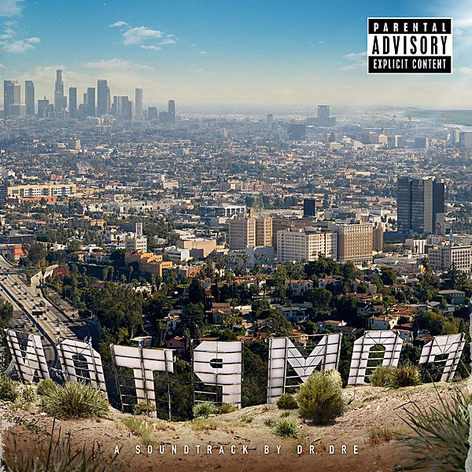

# Compton

By **Dr. Dre**

## Album Data

- **Catalog:** Beets
- **Format:** Digital, Album
- **Album:** Compton
- **Artist:** Dr. Dre
- **Albumartist:** Dr. Dre
- **Genre:** Gangsta Rap
- **MusicBrainz Album Artist ID:** [5f6ab597-f57a-40da-be9e-adad48708203](https://musicbrainz.org/artist/5f6ab597-f57a-40da-be9e-adad48708203)
- **MusicBrainz Album ID:** [09fb31e5-3a07-4727-9642-aac4060b034b](https://musicbrainz.org/release/09fb31e5-3a07-4727-9642-aac4060b034b)
- **MusicBrainz Release Group ID:** [0f7a9bb0-c99a-48ea-93fb-ecdcc0ed636e](https://musicbrainz.org/release-group/0f7a9bb0-c99a-48ea-93fb-ecdcc0ed636e)
- **Year:** 2015
- **Catalog #:** [none]
- **Label:** Aftermath Entertainment
- **Total Tracks:** 16

## Album Tracks

### Track 10 - One Shot One Kill

- **Artist:** Jon Connor feat. Snoop Dogg
- **Format:** ALAC
- **Genre:** Gangsta Rap
- **Length:** 3:25
- **MusicBrainz Track ID:** [9fd3bb9f-b6b9-45eb-bf7f-e7134517981d](https://musicbrainz.org/recording/9fd3bb9f-b6b9-45eb-bf7f-e7134517981d)
- **Title:** One Shot One Kill
- **Track:** 10
- **Year:** 2015

### Track 01 - Intro

- **Artist:** Dr. Dre
- **Format:** ALAC
- **Genre:** Gangsta Rap
- **Length:** 1:15
- **MusicBrainz Track ID:** [4b49d3a6-9787-4c68-ab09-c7216773071f](https://musicbrainz.org/recording/4b49d3a6-9787-4c68-ab09-c7216773071f)
- **Title:** Intro
- **Track:** 01
- **Year:** 2015

### Track 16 - Talking to My Diary

- **Artist:** Dr. Dre
- **Format:** ALAC
- **Genre:** Gangsta Rap
- **Length:** 4:23
- **MusicBrainz Track ID:** [8a804cd4-8c79-4850-b94c-299b5e39ecd5](https://musicbrainz.org/recording/8a804cd4-8c79-4850-b94c-299b5e39ecd5)
- **Title:** Talking to My Diary
- **Track:** 16
- **Year:** 2015

### Track 14 - Animals

- **Artist:** Dr. Dre feat. Anderson .Paak
- **Format:** ALAC
- **Genre:** Gangsta Rap
- **Length:** 3:47
- **MusicBrainz Track ID:** [280a5df5-af21-451f-85f9-7194cc0ae6ec](https://musicbrainz.org/recording/280a5df5-af21-451f-85f9-7194cc0ae6ec)
- **Title:** Animals
- **Track:** 14
- **Year:** 2015

### Track 05 - All in a Day’s Work

- **Artist:** Dr. Dre feat. Anderson .Paak & Marsha Ambrosius
- **Format:** ALAC
- **Genre:** Gangsta Rap
- **Length:** 5:13
- **MusicBrainz Track ID:** [66ca81e2-213d-47d5-b3a5-b75981c89951](https://musicbrainz.org/recording/66ca81e2-213d-47d5-b3a5-b75981c89951)
- **Title:** All in a Day’s Work
- **Track:** 05
- **Year:** 2015

### Track 15 - Medicine Man

- **Artist:** Dr. Dre feat. Eminem, Candice Pillay & Anderson .Paak
- **Format:** ALAC
- **Genre:** Gangsta Rap
- **Length:** 4:14
- **MusicBrainz Track ID:** [95520270-b4a7-4aa8-b991-8c5b93ebdcc4](https://musicbrainz.org/recording/95520270-b4a7-4aa8-b991-8c5b93ebdcc4)
- **Title:** Medicine Man
- **Track:** 15
- **Year:** 2015

### Track 08 - Issues

- **Artist:** Dr. Dre feat. Ice Cube, Anderson .Paak & Dem Jointz
- **Format:** ALAC
- **Genre:** Gangsta Rap
- **Length:** 3:41
- **MusicBrainz Track ID:** [f2710d6a-c7fd-467b-b872-7c99abf9b80e](https://musicbrainz.org/recording/f2710d6a-c7fd-467b-b872-7c99abf9b80e)
- **Title:** Issues
- **Track:** 08
- **Year:** 2015

### Track 04 - It’s All on Me

- **Artist:** Dr. Dre feat. Justus & BJ the Chicago Kid
- **Format:** ALAC
- **Genre:** Gangsta Rap
- **Length:** 3:47
- **MusicBrainz Track ID:** [6e58d72b-7cda-491e-bf3e-6ef7607f6457](https://musicbrainz.org/recording/6e58d72b-7cda-491e-bf3e-6ef7607f6457)
- **Title:** It’s All on Me
- **Track:** 04
- **Year:** 2015

### Track 03 - Genocide

- **Artist:** Dr. Dre feat. Kendrick Lamar, Marsha Ambrosius & Candice Pillay
- **Format:** ALAC
- **Genre:** Gangsta Rap
- **Length:** 4:26
- **MusicBrainz Track ID:** [c219140d-a4d2-4cd5-bfe2-087e8142b144](https://musicbrainz.org/recording/c219140d-a4d2-4cd5-bfe2-087e8142b144)
- **Title:** Genocide
- **Track:** 03
- **Year:** 2015

### Track 09 - Deep Water

- **Artist:** Dr. Dre feat. Kendrick Lamar, Justus & Anderson .Paak
- **Format:** ALAC
- **Genre:** Gangsta Rap
- **Length:** 5:11
- **MusicBrainz Track ID:** [ef4f86cd-b210-451e-89b4-70549cd2fdbf](https://musicbrainz.org/recording/ef4f86cd-b210-451e-89b4-70549cd2fdbf)
- **Title:** Deep Water
- **Track:** 09
- **Year:** 2015

### Track 02 - Talk About It

- **Artist:** Dr. Dre feat. Mez & Justus
- **Format:** ALAC
- **Genre:** Gangsta Rap
- **Length:** 3:15
- **MusicBrainz Track ID:** [5e9f898b-3a95-4b0c-a028-a073e2ae3ad0](https://musicbrainz.org/recording/5e9f898b-3a95-4b0c-a028-a073e2ae3ad0)
- **Title:** Talk About It
- **Track:** 02
- **Year:** 2015

### Track 06 - Darkside / Gone

- **Artist:** Dr. Dre feat. Mez, Marsha Ambrosius & Kendrick Lamar
- **Format:** ALAC
- **Genre:** Gangsta Rap
- **Length:** 3:53
- **MusicBrainz Track ID:** [a15e5e28-af5c-4359-8886-c550e586d283](https://musicbrainz.org/recording/a15e5e28-af5c-4359-8886-c550e586d283)
- **Title:** Darkside / Gone
- **Track:** 06
- **Year:** 2015

### Track 12 - For the Love of Money

- **Artist:** Dr. Dre feat. Jill Scott, Jon Connor & Anderson .Paak
- **Format:** ALAC
- **Genre:** Gangsta Rap
- **Length:** 4:08
- **MusicBrainz Track ID:** [bed4a78c-19d4-40ff-9029-f12de4a4fd5e](https://musicbrainz.org/recording/bed4a78c-19d4-40ff-9029-f12de4a4fd5e)
- **Title:** For the Love of Money
- **Track:** 12
- **Year:** 2015

### Track 13 - Satisfiction

- **Artist:** Dr. Dre feat. Snoop Dogg, Marsha Ambrosius & Mez
- **Format:** ALAC
- **Genre:** Gangsta Rap
- **Length:** 4:24
- **MusicBrainz Track ID:** [76080ab7-d87e-4ee1-b580-b8361e9fb7fa](https://musicbrainz.org/recording/76080ab7-d87e-4ee1-b580-b8361e9fb7fa)
- **Title:** Satisfiction
- **Track:** 13
- **Year:** 2015

### Track 07 - Loose Cannons

- **Artist:** Dr. Dre feat. Xzibit, Cold 187um & Sylvester Jordan, Jr.
- **Format:** ALAC
- **Genre:** Gangsta Rap
- **Length:** 4:13
- **MusicBrainz Track ID:** [93d6721e-4065-4fc8-b494-93cfd9830490](https://musicbrainz.org/recording/93d6721e-4065-4fc8-b494-93cfd9830490)
- **Title:** Loose Cannons
- **Track:** 07
- **Year:** 2015

### Track 11 - Just Another Day

- **Artist:** The Game feat. Asiahn
- **Format:** ALAC
- **Genre:** Gangsta Rap
- **Length:** 2:21
- **MusicBrainz Track ID:** [943f0275-df9b-4ba5-b584-d39da97d1f98](https://musicbrainz.org/recording/943f0275-df9b-4ba5-b584-d39da97d1f98)
- **Title:** Just Another Day
- **Track:** 11
- **Year:** 2015

## See also

- [2001](2001.md)
- [Roon: Compton](../../Roon/Dr_Dre/Compton.md)
