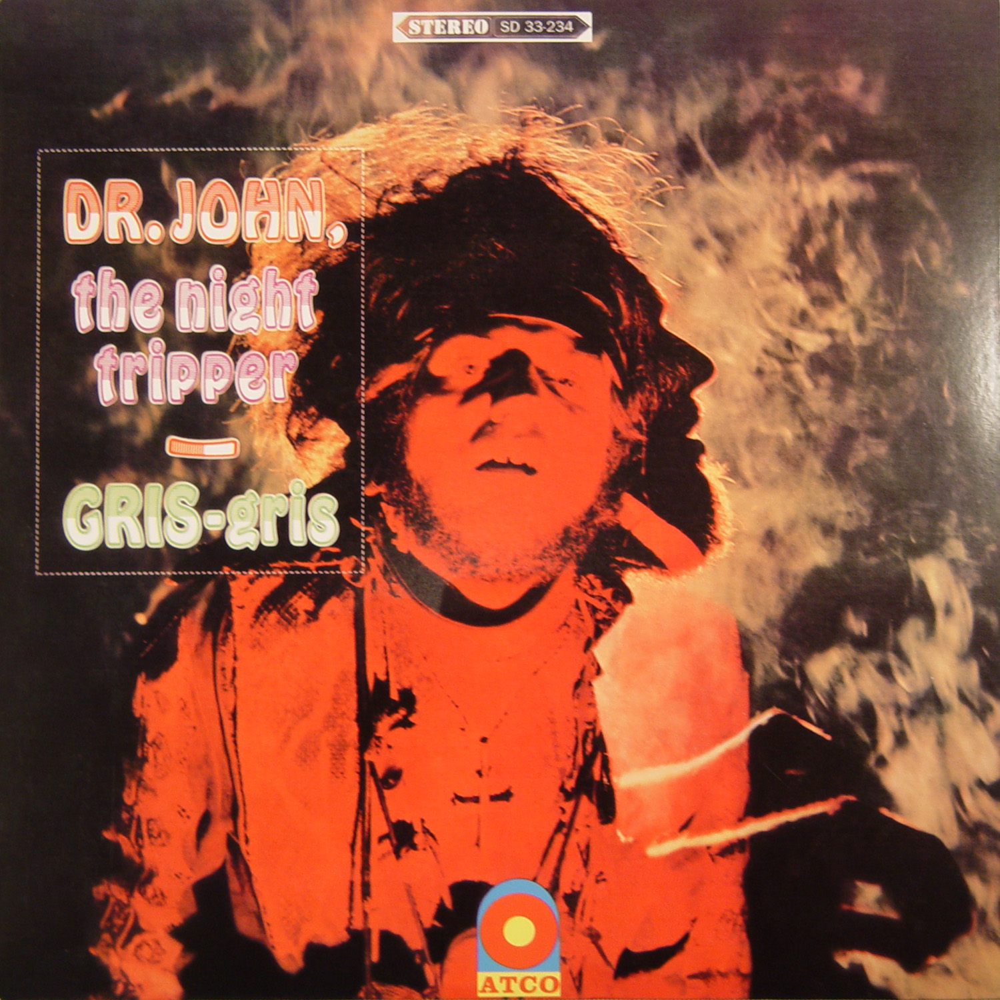

# Gris‐Gris

By **Dr. John**

## Album Data

- **Catalog:** Beets
- **Format:** Digital, Album
- **Album:** Gris‐Gris
- **Artist:** Dr. John
- **Albumartist:** Dr. John
- **Genre:** Psychedelic Rock
- **MusicBrainz Album Artist ID:** [fe0e1895-aa84-47d9-8e5b-7930fc20709b](https://musicbrainz.org/artist/fe0e1895-aa84-47d9-8e5b-7930fc20709b)
- **MusicBrainz Album ID:** [e243f8cb-f7e5-4a13-ac51-7ff984c35bc9](https://musicbrainz.org/release/e243f8cb-f7e5-4a13-ac51-7ff984c35bc9)
- **MusicBrainz Release Group ID:** [8ceb6d06-3a60-37eb-81de-9cc8fe538e16](https://musicbrainz.org/release-group/8ceb6d06-3a60-37eb-81de-9cc8fe538e16)
- **Year:** 2000
- **Catalog #:** 
- **Label:** Rhino Atlantic
- **Total Tracks:** 11

## Album Tracks

### Track 01 - Right Place Wrong Time

- **Artist:** Dr. John
- **Format:** MP3
- **Genre:** Uk Garage
- **Length:** 2:54
- **MusicBrainz Track ID:** [b1e5a424-5712-4746-b068-6d95656d8eb4](https://musicbrainz.org/recording/b1e5a424-5712-4746-b068-6d95656d8eb4)
- **Title:** Right Place Wrong Time
- **Track:** 01
- **Year:** 2014

### Track 02 - Same Old Same Old

- **Artist:** Dr. John
- **Format:** MP3
- **Genre:** Funk
- **Length:** 2:40
- **MusicBrainz Track ID:** [570023d7-d18c-4d37-924a-eb2049f50f29](https://musicbrainz.org/recording/570023d7-d18c-4d37-924a-eb2049f50f29)
- **Title:** Same Old Same Old
- **Track:** 02
- **Year:** 2014

### Track 03 - Just the Same

- **Artist:** Dr. John
- **Format:** MP3
- **Genre:** Soul
- **Length:** 2:54
- **MusicBrainz Track ID:** [d6d2915a-697f-4ff7-9e7e-130a10889ec4](https://musicbrainz.org/recording/d6d2915a-697f-4ff7-9e7e-130a10889ec4)
- **Title:** Just the Same
- **Track:** 03
- **Year:** 2014

### Track 04 - Qualified

- **Artist:** Dr. John
- **Format:** MP3
- **Genre:** Soul
- **Length:** 4:51
- **MusicBrainz Track ID:** [b4030c7e-f7c4-4001-ba4f-04c416337cc8](https://musicbrainz.org/recording/b4030c7e-f7c4-4001-ba4f-04c416337cc8)
- **Title:** Qualified
- **Track:** 04
- **Year:** 2014

### Track 05 - Traveling Mood

- **Artist:** Dr. John
- **Format:** MP3
- **Genre:** Uk Garage
- **Length:** 2:52
- **MusicBrainz Track ID:** [d93e52ff-43ee-4311-a48b-a6c0b4a13280](https://musicbrainz.org/recording/d93e52ff-43ee-4311-a48b-a6c0b4a13280)
- **Title:** Traveling Mood
- **Track:** 05
- **Year:** 2014

### Track 06 - Peace Brother Peace

- **Artist:** Dr. John
- **Format:** MP3
- **Genre:** Funk
- **Length:** 2:53
- **MusicBrainz Track ID:** [afe5a647-15f8-4c26-98c3-d55a4b910721](https://musicbrainz.org/recording/afe5a647-15f8-4c26-98c3-d55a4b910721)
- **Title:** Peace Brother Peace
- **Track:** 06
- **Year:** 2014

### Track 07 - Life

- **Artist:** Dr. John
- **Format:** MP3
- **Genre:** Rock
- **Length:** 2:30
- **MusicBrainz Track ID:** [e6c5e388-7a0c-40dc-bc4e-701206433082](https://musicbrainz.org/recording/e6c5e388-7a0c-40dc-bc4e-701206433082)
- **Title:** Life
- **Track:** 07
- **Year:** 2014

### Track 08 - Such a Night

- **Artist:** Dr. John
- **Format:** MP3
- **Genre:** Funk
- **Length:** 2:57
- **MusicBrainz Track ID:** [c415c73f-5710-412c-b8b7-24471406833b](https://musicbrainz.org/recording/c415c73f-5710-412c-b8b7-24471406833b)
- **Title:** Such a Night
- **Track:** 08
- **Year:** 2014

### Track 09 - Shoo Fly Marches On

- **Artist:** Dr. John
- **Format:** MP3
- **Genre:** Uk Garage
- **Length:** 3:16
- **MusicBrainz Track ID:** [e856d371-6ec5-4e0d-9f0c-1e5e93d61bad](https://musicbrainz.org/recording/e856d371-6ec5-4e0d-9f0c-1e5e93d61bad)
- **Title:** Shoo Fly Marches On
- **Track:** 09
- **Year:** 2014

### Track 10 - I Been Hoodood

- **Artist:** Dr. John
- **Format:** MP3
- **Genre:** Funk
- **Length:** 3:15
- **MusicBrainz Track ID:** [adb4f5d3-6052-4988-b3aa-d0809666bfb8](https://musicbrainz.org/recording/adb4f5d3-6052-4988-b3aa-d0809666bfb8)
- **Title:** I Been Hoodood
- **Track:** 10
- **Year:** 2014

### Track 11 - Cold Cold Cold

- **Artist:** Dr. John
- **Format:** MP3
- **Genre:** Soul
- **Length:** 2:38
- **MusicBrainz Track ID:** [982cfc57-3661-4db3-a918-77fd1d986b5d](https://musicbrainz.org/recording/982cfc57-3661-4db3-a918-77fd1d986b5d)
- **Title:** Cold Cold Cold
- **Track:** 11
- **Year:** 2014

## See also

- [In the Right Place](In_the_Right_Place.md)
- [Mos' Scocious_ The Dr. John A](Mos_Scocious__The_Dr_John_A.md)
- [Roon: Gris Gris](../../Roon/Dr_John/Gris_Gris.md)
- [Vinyl: ](../../Vinyl/Dr_John/Dr_John.md)
- [Vinyl: In The Right Place](../../Vinyl/Dr_John/In_The_Right_Place.md)
