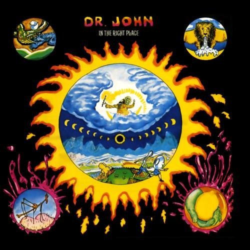

# In the Right Place

By **Dr. John**

## Album Data

- **Catalog:** Beets
- **Format:** Digital, Album
- **Album:** In the Right Place
- **Artist:** Dr. John
- **Albumartist:** Dr. John
- **Genre:** Uk Garage
- **MusicBrainz Album Artist ID:** [fe0e1895-aa84-47d9-8e5b-7930fc20709b](https://musicbrainz.org/artist/fe0e1895-aa84-47d9-8e5b-7930fc20709b)
- **MusicBrainz Album ID:** [d53ef707-1484-48e9-87e8-fa1cdb4054e5](https://musicbrainz.org/release/d53ef707-1484-48e9-87e8-fa1cdb4054e5)
- **MusicBrainz Release Group ID:** [4bec5aa0-b2ee-3931-a8d9-81d4e533b8b2](https://musicbrainz.org/release-group/4bec5aa0-b2ee-3931-a8d9-81d4e533b8b2)
- **Year:** 2014
- **Catalog #:** 
- **Label:** 
- **Total Tracks:** 00

## Album Tracks

### Track 00 - Loop Garoo

- **Artist:** Dr. John
- **Format:** AAC
- **Genre:** Funk
- **Length:** 4:43
- **MusicBrainz Track ID:** 
- **Title:** Loop Garoo
- **Track:** 00
- **Year:** 0000

## See also

- [Gris‐Gris](Gris‐Gris.md)
- [Mos' Scocious_ The Dr. John A](Mos_Scocious__The_Dr_John_A.md)
- [Roon: Gris Gris](../../Roon/Dr_John/Gris_Gris.md)
- [Vinyl: ](../../Vinyl/Dr_John/Dr_John.md)
- [Vinyl: In The Right Place](../../Vinyl/Dr_John/In_The_Right_Place.md)
