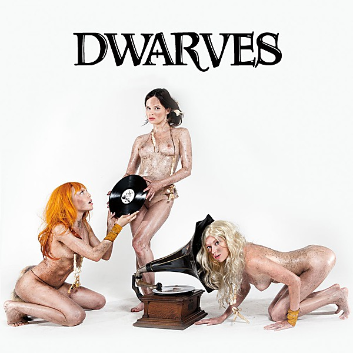

# The Dwarves Invented Rock & Roll

By **Dwarves**

## Album Data

- **Catalog:** Beets
- **Format:** Digital, Album
- **Album:** The Dwarves Invented Rock & Roll
- **Artist:** Dwarves
- **Albumartist:** Dwarves
- **Genre:** Hardcore Punk
- **MusicBrainz Album Artist ID:** [762e1e6d-ba12-4946-b8ee-dfa0cf9a2655](https://musicbrainz.org/artist/762e1e6d-ba12-4946-b8ee-dfa0cf9a2655)
- **MusicBrainz Album ID:** [695c1a10-631d-416c-8326-7c48323267f5](https://musicbrainz.org/release/695c1a10-631d-416c-8326-7c48323267f5)
- **MusicBrainz Release Group ID:** [fcca98f1-ad66-4621-833d-bbb400fbed4b](https://musicbrainz.org/release-group/fcca98f1-ad66-4621-833d-bbb400fbed4b)
- **Year:** 2014
- **Catalog #:** 
- **Label:** 
- **Total Tracks:** 15

## Album Tracks

### Track 01 - Hate Rock

- **Artist:** Dwarves
- **Format:** MP3
- **Genre:** Hardcore Punk
- **Length:** 1:30
- **MusicBrainz Track ID:** [58d55695-5f35-42a4-b2cf-d0002ba5e1fd](https://musicbrainz.org/recording/58d55695-5f35-42a4-b2cf-d0002ba5e1fd)
- **Title:** Hate Rock
- **Track:** 01
- **Year:** 2014

### Track 02 - Bleed Alright

- **Artist:** Dwarves
- **Format:** MP3
- **Genre:** Hardcore Punk
- **Length:** 2:55
- **MusicBrainz Track ID:** [2df7ce60-a65c-4ac8-9ca5-fdd7e4ff1cba](https://musicbrainz.org/recording/2df7ce60-a65c-4ac8-9ca5-fdd7e4ff1cba)
- **Title:** Bleed Alright
- **Track:** 02
- **Year:** 2014

### Track 03 - Trailer Trash

- **Artist:** Dwarves
- **Format:** MP3
- **Genre:** Hardcore Punk
- **Length:** 1:50
- **MusicBrainz Track ID:** [073bab6d-a759-46e3-ac74-8d27d15d87dd](https://musicbrainz.org/recording/073bab6d-a759-46e3-ac74-8d27d15d87dd)
- **Title:** Trailer Trash
- **Track:** 03
- **Year:** 2014

### Track 04 - Kings of the World

- **Artist:** Dwarves
- **Format:** MP3
- **Genre:** Hardcore Punk
- **Length:** 2:11
- **MusicBrainz Track ID:** [a990cd10-a8fe-440a-986d-608dc6e35a3a](https://musicbrainz.org/recording/a990cd10-a8fe-440a-986d-608dc6e35a3a)
- **Title:** Kings of the World
- **Track:** 04
- **Year:** 2014

### Track 05 - Fiction

- **Artist:** Dwarves
- **Format:** MP3
- **Genre:** Hardcore Punk
- **Length:** 2:57
- **MusicBrainz Track ID:** [bc869a11-2c26-4b93-acbb-8dda38cacbd6](https://musicbrainz.org/recording/bc869a11-2c26-4b93-acbb-8dda38cacbd6)
- **Title:** Fiction
- **Track:** 05
- **Year:** 2014

### Track 06 - Sluts of the USA

- **Artist:** Dwarves
- **Format:** MP3
- **Genre:** Hardcore Punk
- **Length:** 1:22
- **MusicBrainz Track ID:** [414538a6-b89b-4f91-a03d-409f18617d22](https://musicbrainz.org/recording/414538a6-b89b-4f91-a03d-409f18617d22)
- **Title:** Sluts of the USA
- **Track:** 06
- **Year:** 2014

### Track 07 - Gentleman Blag

- **Artist:** Dwarves
- **Format:** MP3
- **Genre:** Hardcore Punk
- **Length:** 1:23
- **MusicBrainz Track ID:** [55271130-1d56-4671-aba7-c4dd67b50836](https://musicbrainz.org/recording/55271130-1d56-4671-aba7-c4dd67b50836)
- **Title:** Gentleman Blag
- **Track:** 07
- **Year:** 2014

### Track 08 - Irresistible

- **Artist:** Dwarves
- **Format:** MP3
- **Genre:** Hardcore Punk
- **Length:** 0:54
- **MusicBrainz Track ID:** [afb16d3f-d99c-43c3-a343-ea5ea63d32c6](https://musicbrainz.org/recording/afb16d3f-d99c-43c3-a343-ea5ea63d32c6)
- **Title:** Irresistible
- **Track:** 08
- **Year:** 2014

### Track 09 - Armageddon Party

- **Artist:** Dwarves
- **Format:** MP3
- **Genre:** Hardcore Punk
- **Length:** 2:15
- **MusicBrainz Track ID:** [40979de2-8ecd-4b31-9802-c94d9781922b](https://musicbrainz.org/recording/40979de2-8ecd-4b31-9802-c94d9781922b)
- **Title:** Armageddon Party
- **Track:** 09
- **Year:** 2014

### Track 10 - Get Up & Get High

- **Artist:** Dwarves
- **Format:** MP3
- **Genre:** Hardcore Punk
- **Length:** 1:30
- **MusicBrainz Track ID:** [eb1bbc29-fc4b-4115-b729-b30df9209d9b](https://musicbrainz.org/recording/eb1bbc29-fc4b-4115-b729-b30df9209d9b)
- **Title:** Get Up & Get High
- **Track:** 10
- **Year:** 2014

### Track 11 - Dead on the Floor

- **Artist:** Dwarves
- **Format:** MP3
- **Genre:** Hardcore Punk
- **Length:** 1:32
- **MusicBrainz Track ID:** [4b50b916-16a6-44ff-a5e4-78905dd3f4eb](https://musicbrainz.org/recording/4b50b916-16a6-44ff-a5e4-78905dd3f4eb)
- **Title:** Dead on the Floor
- **Track:** 11
- **Year:** 2014

### Track 12 - Fun to Try

- **Artist:** Dwarves
- **Format:** MP3
- **Genre:** Hardcore Punk
- **Length:** 1:52
- **MusicBrainz Track ID:** [8c28ceaf-9c08-442a-82f0-3bcba5f1944c](https://musicbrainz.org/recording/8c28ceaf-9c08-442a-82f0-3bcba5f1944c)
- **Title:** Fun to Try
- **Track:** 12
- **Year:** 2014

### Track 13 - Who I Am

- **Artist:** Dwarves
- **Format:** MP3
- **Genre:** Hardcore Punk
- **Length:** 1:11
- **MusicBrainz Track ID:** [83cdc0a0-dfb4-4d13-bf35-6368a91a409e](https://musicbrainz.org/recording/83cdc0a0-dfb4-4d13-bf35-6368a91a409e)
- **Title:** Who I Am
- **Track:** 13
- **Year:** 2014

### Track 14 - Anything You Want

- **Artist:** Dwarves
- **Format:** MP3
- **Genre:** Hardcore Punk
- **Length:** 1:50
- **MusicBrainz Track ID:** [0fda5981-fc54-403c-815b-aa028644a191](https://musicbrainz.org/recording/0fda5981-fc54-403c-815b-aa028644a191)
- **Title:** Anything You Want
- **Track:** 14
- **Year:** 2014

### Track 15 - Unpredictable

- **Artist:** Dwarves
- **Format:** MP3
- **Genre:** Hardcore Punk
- **Length:** 1:13
- **MusicBrainz Track ID:** [7e17961d-7a69-43a6-87bd-2a9cc102dbfa](https://musicbrainz.org/recording/7e17961d-7a69-43a6-87bd-2a9cc102dbfa)
- **Title:** Unpredictable
- **Track:** 15
- **Year:** 2014

## See also

- [Vinyl: ](../../Vinyl/Dwarves/Dwarves.md)
- [Vinyl: Invented Rock & Roll](../../Vinyl/Dwarves/Invented_Rock_and_Roll.md)
