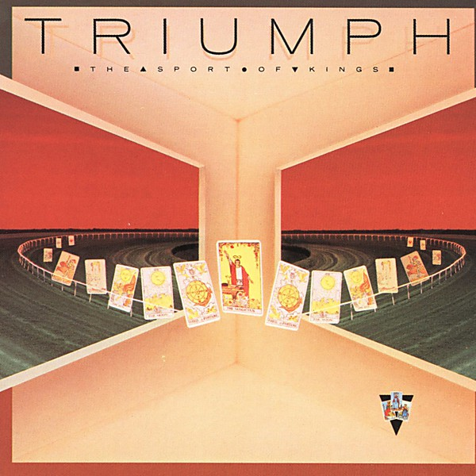

# Between the Cracks - Volume One

By **Dwight Twilley**

## Album Data

- **Catalog:** Beets
- **Format:** Digital, Album
- **Album:** Between the Cracks - Volume One
- **Artist:** Dwight Twilley
- **Albumartist:** Dwight Twilley
- **Genre:** Power Pop
- **MusicBrainz Album Artist ID:** 
- **MusicBrainz Album ID:** 
- **MusicBrainz Release Group ID:** 
- **Year:** 1983
- **Catalog #:** ST-17107
- **Label:** EMI America
- **Total Tracks:** 10

## Album Tracks

### Track 01 - Little Bit of Love

- **Artist:** Dwight Twilley
- **Format:** MP3
- **Genre:** Power Pop
- **Length:** 3:54
- **MusicBrainz Track ID:** [ca7c2c80-b0f2-4657-8fa0-ecf98933e907](https://musicbrainz.org/recording/ca7c2c80-b0f2-4657-8fa0-ecf98933e907)
- **Title:** Little Bit of Love
- **Track:** 01
- **Year:** 1984

### Track 02 - Girls

- **Artist:** Dwight Twilley
- **Format:** MP3
- **Genre:** Power Pop
- **Length:** 3:31
- **MusicBrainz Track ID:** [3e761327-19da-4303-89b0-0dd4e6a3c363](https://musicbrainz.org/recording/3e761327-19da-4303-89b0-0dd4e6a3c363)
- **Title:** Girls
- **Track:** 02
- **Year:** 1984

### Track 03 - Why You Wanna Break My Heart

- **Artist:** Dwight Twilley
- **Format:** MP3
- **Genre:** Power Pop
- **Length:** 3:40
- **MusicBrainz Track ID:** [d477bb91-6c09-4633-a4bd-321992c41b7a](https://musicbrainz.org/recording/d477bb91-6c09-4633-a4bd-321992c41b7a)
- **Title:** Why You Wanna Break My Heart
- **Track:** 03
- **Year:** 1984

### Track 04 - You Can Change It

- **Artist:** Dwight Twilley
- **Format:** MP3
- **Genre:** Power Pop
- **Length:** 3:02
- **MusicBrainz Track ID:** [b961ab22-5a90-4299-9bb0-a9f1b446be85](https://musicbrainz.org/recording/b961ab22-5a90-4299-9bb0-a9f1b446be85)
- **Title:** You Can Change It
- **Track:** 04
- **Year:** 1984

### Track 05 - Cry Baby

- **Artist:** Dwight Twilley
- **Format:** MP3
- **Genre:** Power Pop
- **Length:** 3:46
- **MusicBrainz Track ID:** [70f0b6c2-46f7-4ceb-a9eb-1637f94a7b01](https://musicbrainz.org/recording/70f0b6c2-46f7-4ceb-a9eb-1637f94a7b01)
- **Title:** Cry Baby
- **Track:** 05
- **Year:** 1984

### Track 06 - Don't You Love Her

- **Artist:** Dwight Twilley
- **Format:** MP3
- **Genre:** Power Pop
- **Length:** 3:44
- **MusicBrainz Track ID:** [e0d810bf-4a36-4454-a175-b6d02d17034b](https://musicbrainz.org/recording/e0d810bf-4a36-4454-a175-b6d02d17034b)
- **Title:** Don't You Love Her
- **Track:** 06
- **Year:** 1984

### Track 07 - Long Lonely Nights

- **Artist:** Dwight Twilley
- **Format:** MP3
- **Genre:** Power Pop
- **Length:** 4:01
- **MusicBrainz Track ID:** [5599d44d-48c6-4536-9a07-814c3607e843](https://musicbrainz.org/recording/5599d44d-48c6-4536-9a07-814c3607e843)
- **Title:** Long Lonely Nights
- **Track:** 07
- **Year:** 1984

### Track 08 - Jungle

- **Artist:** Dwight Twilley
- **Format:** MP3
- **Genre:** Power Pop
- **Length:** 4:39
- **MusicBrainz Track ID:** [d9b13f4b-d161-4c98-bf26-c65c9d1bf3bd](https://musicbrainz.org/recording/d9b13f4b-d161-4c98-bf26-c65c9d1bf3bd)
- **Title:** Jungle
- **Track:** 08
- **Year:** 1984

### Track 09 - To Get to You

- **Artist:** Dwight Twilley
- **Format:** MP3
- **Genre:** Power Pop
- **Length:** 3:45
- **MusicBrainz Track ID:** [603880fa-6a8e-4f5f-bb69-0280c9245ca6](https://musicbrainz.org/recording/603880fa-6a8e-4f5f-bb69-0280c9245ca6)
- **Title:** To Get to You
- **Track:** 09
- **Year:** 1984

### Track 10 - Max Dog

- **Artist:** Dwight Twilley
- **Format:** MP3
- **Genre:** Power Pop
- **Length:** 1:47
- **MusicBrainz Track ID:** [548549cd-47f2-483b-a0b2-842307e0b117](https://musicbrainz.org/recording/548549cd-47f2-483b-a0b2-842307e0b117)
- **Title:** Max Dog
- **Track:** 10
- **Year:** 1984

## See also

- [Jungle](Jungle.md)
- [Twilley](Twilley.md)
