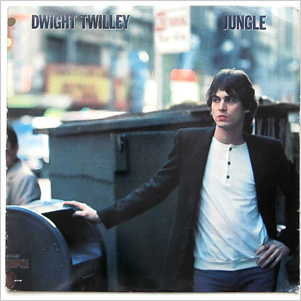

# Jungle

By **Dwight Twilley**

## Album Data

- **Catalog:** Beets
- **Format:** Digital, Album
- **Album:** Jungle
- **Artist:** Dwight Twilley
- **Albumartist:** Dwight Twilley
- **Genre:** Power Pop
- **MusicBrainz Album Artist ID:** [07aaebd9-0c37-4a65-80c8-48ae7cc99337](https://musicbrainz.org/artist/07aaebd9-0c37-4a65-80c8-48ae7cc99337)
- **MusicBrainz Album ID:** [a41d9cfe-271f-447e-b870-bf197c8631b4](https://musicbrainz.org/release/a41d9cfe-271f-447e-b870-bf197c8631b4)
- **MusicBrainz Release Group ID:** [0fe8976d-4c42-36c4-ba2c-b5c6d319749e](https://musicbrainz.org/release-group/0fe8976d-4c42-36c4-ba2c-b5c6d319749e)
- **Year:** 1984
- **Catalog #:** AB 4214
- **Label:** Arista
- **Total Tracks:** 10

## Album Tracks

### Track 01 - Out of My Hands

- **Artist:** Dwight Twilley
- **Format:** MP3
- **Genre:** Folk Rock
- **Length:** 5:31
- **MusicBrainz Track ID:** [7dc0a9d6-2c2b-4ca9-ab3f-e4c0d800f9f0](https://musicbrainz.org/recording/7dc0a9d6-2c2b-4ca9-ab3f-e4c0d800f9f0)
- **Title:** Out of My Hands
- **Track:** 01
- **Year:** 1979

### Track 02 - Nothing's Ever Gonna Change So Fast

- **Artist:** Dwight Twilley
- **Format:** MP3
- **Genre:** Power Pop
- **Length:** 3:35
- **MusicBrainz Track ID:** [ff79e5ea-e21b-4ea6-9119-f5af8d3239fc](https://musicbrainz.org/recording/ff79e5ea-e21b-4ea6-9119-f5af8d3239fc)
- **Title:** Nothing's Ever Gonna Change So Fast
- **Track:** 02
- **Year:** 1979

### Track 03 - Runaway

- **Artist:** Dwight Twilley
- **Format:** MP3
- **Genre:** Power Pop
- **Length:** 3:11
- **MusicBrainz Track ID:** [cd9a7459-01c6-4ef9-aa3f-c0c5f92bd9fb](https://musicbrainz.org/recording/cd9a7459-01c6-4ef9-aa3f-c0c5f92bd9fb)
- **Title:** Runaway
- **Track:** 03
- **Year:** 1979

### Track 04 - Standin' in the Shadow of Love

- **Artist:** Dwight Twilley
- **Format:** MP3
- **Genre:** Folk Rock
- **Length:** 2:54
- **MusicBrainz Track ID:** [ecd2576f-e21c-4ac5-b8f1-f9c6d51ffed6](https://musicbrainz.org/recording/ecd2576f-e21c-4ac5-b8f1-f9c6d51ffed6)
- **Title:** Standin' in the Shadow of Love
- **Track:** 04
- **Year:** 1979

### Track 05 - Alone in My Room

- **Artist:** Dwight Twilley
- **Format:** MP3
- **Genre:** Folk Rock
- **Length:** 2:40
- **MusicBrainz Track ID:** [b7ff8666-4ffa-417b-ac8d-b26a2b7ba7dc](https://musicbrainz.org/recording/b7ff8666-4ffa-417b-ac8d-b26a2b7ba7dc)
- **Title:** Alone in My Room
- **Track:** 05
- **Year:** 1979

### Track 06 - Betsy Sue

- **Artist:** Dwight Twilley
- **Format:** MP3
- **Genre:** Power Pop
- **Length:** 2:20
- **MusicBrainz Track ID:** [0e47baf6-fcdf-4c23-9bee-c78575f50467](https://musicbrainz.org/recording/0e47baf6-fcdf-4c23-9bee-c78575f50467)
- **Title:** Betsy Sue
- **Track:** 06
- **Year:** 1979

### Track 07 - Darlin'

- **Artist:** Dwight Twilley
- **Format:** MP3
- **Genre:** Power Pop
- **Length:** 3:13
- **MusicBrainz Track ID:** [520f2092-b7d2-483b-b794-0bc3a40d9050](https://musicbrainz.org/recording/520f2092-b7d2-483b-b794-0bc3a40d9050)
- **Title:** Darlin'
- **Track:** 07
- **Year:** 1979

### Track 08 - I Wanna Make Love to You

- **Artist:** Dwight Twilley
- **Format:** MP3
- **Genre:** Power Pop
- **Length:** 3:35
- **MusicBrainz Track ID:** [00a96c65-eb80-48f2-8b03-ee511eb9f962](https://musicbrainz.org/recording/00a96c65-eb80-48f2-8b03-ee511eb9f962)
- **Title:** I Wanna Make Love to You
- **Track:** 08
- **Year:** 1979

### Track 09 - Got You Where I Want You

- **Artist:** Dwight Twilley
- **Format:** MP3
- **Genre:** Power Pop
- **Length:** 2:39
- **MusicBrainz Track ID:** [1ba64bf2-ccbb-45ae-9cab-7cedd942c808](https://musicbrainz.org/recording/1ba64bf2-ccbb-45ae-9cab-7cedd942c808)
- **Title:** Got You Where I Want You
- **Track:** 09
- **Year:** 1979

### Track 10 - It Takes a Lot of Love

- **Artist:** Dwight Twilley
- **Format:** MP3
- **Genre:** Power Pop
- **Length:** 3:07
- **MusicBrainz Track ID:** [5956ef9f-029b-415d-8a73-74c38a52a0e4](https://musicbrainz.org/recording/5956ef9f-029b-415d-8a73-74c38a52a0e4)
- **Title:** It Takes a Lot of Love
- **Track:** 10
- **Year:** 1979

## See also

- [Between the Cracks - Volume One](Between_the_Cracks_-_Volume_One.md)
- [Twilley](Twilley.md)
