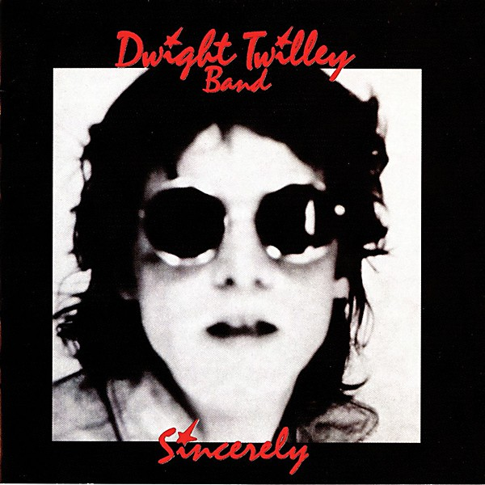

# Sincerely

By **Dwight Twilley Band**

## Album Data

- **Catalog:** Beets
- **Format:** Digital, Album
- **Album:** Sincerely
- **Artist:** Dwight Twilley Band
- **Albumartist:** Dwight Twilley Band
- **Genre:** Power Pop
- **MusicBrainz Album Artist ID:** [5e8a6795-ae6e-41d8-80d8-9359215615ef](https://musicbrainz.org/artist/5e8a6795-ae6e-41d8-80d8-9359215615ef)
- **MusicBrainz Album ID:** [dec3c02b-681f-4e11-9b7b-5373be0ae88e](https://musicbrainz.org/release/dec3c02b-681f-4e11-9b7b-5373be0ae88e)
- **MusicBrainz Release Group ID:** [c62163fb-bcfd-3dc2-8738-6a19664f6cdb](https://musicbrainz.org/release-group/c62163fb-bcfd-3dc2-8738-6a19664f6cdb)
- **Year:** 1976
- **Catalog #:** SRZ-8015
- **Label:** DCC Compact Classics
- **Total Tracks:** 10

## Album Tracks

### Track 01 - Twilley Don’t Mind

- **Artist:** Dwight Twilley Band
- **Format:** AAC
- **Genre:** Rock And Roll
- **Length:** 2:56
- **MusicBrainz Track ID:** [537fa94b-3a95-4b0c-8ab9-8734a09f3de3](https://musicbrainz.org/recording/537fa94b-3a95-4b0c-8ab9-8734a09f3de3)
- **Title:** Twilley Don’t Mind
- **Track:** 01
- **Year:** 1990

### Track 02 - Looking for the Magic

- **Artist:** Dwight Twilley Band
- **Format:** AAC
- **Genre:** Power Pop
- **Length:** 3:18
- **MusicBrainz Track ID:** [75ea3b83-949d-4f30-b63f-09a0b450d31d](https://musicbrainz.org/recording/75ea3b83-949d-4f30-b63f-09a0b450d31d)
- **Title:** Looking for the Magic
- **Track:** 02
- **Year:** 1990

### Track 03 - That I Remember

- **Artist:** Dwight Twilley Band
- **Format:** AAC
- **Genre:** Rock And Roll
- **Length:** 3:34
- **MusicBrainz Track ID:** [2e74ce13-01f9-4a25-b0f5-931ae4076e98](https://musicbrainz.org/recording/2e74ce13-01f9-4a25-b0f5-931ae4076e98)
- **Title:** That I Remember
- **Track:** 03
- **Year:** 1990

### Track 04 - Rock & Roll

- **Artist:** Dwight Twilley Band
- **Format:** AAC
- **Genre:** Rock And Roll
- **Length:** 3:24
- **MusicBrainz Track ID:** [ab5c273e-ed7a-41ad-be50-b46625261770](https://musicbrainz.org/recording/ab5c273e-ed7a-41ad-be50-b46625261770)
- **Title:** Rock & Roll
- **Track:** 04
- **Year:** 1990

### Track 05 - Trying to Find My Baby

- **Artist:** Dwight Twilley Band
- **Format:** AAC
- **Genre:** Rock And Roll
- **Length:** 3:39
- **MusicBrainz Track ID:** [44c7398b-d07d-4b35-8408-86c5a5435d77](https://musicbrainz.org/recording/44c7398b-d07d-4b35-8408-86c5a5435d77)
- **Title:** Trying to Find My Baby
- **Track:** 05
- **Year:** 1990

### Track 06 - Here She Comes

- **Artist:** Dwight Twilley Band
- **Format:** AAC
- **Genre:** Rock And Roll
- **Length:** 4:08
- **MusicBrainz Track ID:** [9242bfef-f85f-4d7c-949a-3179170308b1](https://musicbrainz.org/recording/9242bfef-f85f-4d7c-949a-3179170308b1)
- **Title:** Here She Comes
- **Track:** 06
- **Year:** 1990

### Track 07 - Sleeping

- **Artist:** Dwight Twilley Band
- **Format:** AAC
- **Genre:** Rock And Roll
- **Length:** 6:14
- **MusicBrainz Track ID:** [cc604f20-13dd-4d06-b589-454a4557649a](https://musicbrainz.org/recording/cc604f20-13dd-4d06-b589-454a4557649a)
- **Title:** Sleeping
- **Track:** 07
- **Year:** 1990

### Track 08 - Chance to Get Away

- **Artist:** Dwight Twilley Band
- **Format:** AAC
- **Genre:** Rock And Roll
- **Length:** 2:36
- **MusicBrainz Track ID:** [409cac39-6ad1-4536-852d-95d046876b13](https://musicbrainz.org/recording/409cac39-6ad1-4536-852d-95d046876b13)
- **Title:** Chance to Get Away
- **Track:** 08
- **Year:** 1990

### Track 09 - Invasion

- **Artist:** Dwight Twilley Band
- **Format:** AAC
- **Genre:** Rock And Roll
- **Length:** 3:30
- **MusicBrainz Track ID:** [02bfd410-be53-4ccd-8870-798d7f31ec79](https://musicbrainz.org/recording/02bfd410-be53-4ccd-8870-798d7f31ec79)
- **Title:** Invasion
- **Track:** 09
- **Year:** 1990

## See also

- [Twilley Don’t Mind](Twilley_Don’t_Mind.md)
