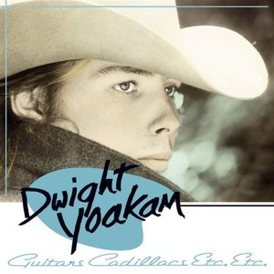

# Guitars Cadillacs Etc. Etc

By **Dwight Yoakam**

## Album Data

- **Catalog:** Beets
- **Format:** Digital, Album
- **Album:** Guitars Cadillacs Etc. Etc
- **Artist:** Dwight Yoakam
- **Albumartist:** Dwight Yoakam
- **Genre:** Honky Tonk
- **MusicBrainz Album Artist ID:** [0fb711af-c7ba-4bdc-b0b6-b8495fc0a590](https://musicbrainz.org/artist/0fb711af-c7ba-4bdc-b0b6-b8495fc0a590)
- **MusicBrainz Album ID:** [bfb20b30-2308-4cf2-a7d5-5e239acad23a](https://musicbrainz.org/release/bfb20b30-2308-4cf2-a7d5-5e239acad23a)
- **MusicBrainz Release Group ID:** [22ab4e5a-50fc-3eb8-a59a-ccb1be21c5a6](https://musicbrainz.org/release-group/22ab4e5a-50fc-3eb8-a59a-ccb1be21c5a6)
- **Year:** 1986
- **Catalog #:** 
- **Label:** Reprise Records
- **Total Tracks:** 10

## Album Tracks

### Track 01 - Little Ways

- **Artist:** Dwight Yoakam
- **Format:** MP3
- **Genre:** Honky Tonk
- **Length:** 3:22
- **MusicBrainz Track ID:** [9d2e3763-2aae-496c-b57c-5f634c6c9f48](https://musicbrainz.org/recording/9d2e3763-2aae-496c-b57c-5f634c6c9f48)
- **Title:** Little Ways
- **Track:** 01
- **Year:** 1987

### Track 02 - Smoke Along the Track

- **Artist:** Dwight Yoakam
- **Format:** MP3
- **Genre:** Honky Tonk
- **Length:** 3:14
- **MusicBrainz Track ID:** [a948d7ed-22f6-459b-b2fc-d0caa86e7dbd](https://musicbrainz.org/recording/a948d7ed-22f6-459b-b2fc-d0caa86e7dbd)
- **Title:** Smoke Along the Track
- **Track:** 02
- **Year:** 1987

### Track 03 - Johnson's Love

- **Artist:** Dwight Yoakam
- **Format:** MP3
- **Genre:** Country
- **Length:** 4:33
- **MusicBrainz Track ID:** [5610403e-1f21-400c-9764-70cc89eb6933](https://musicbrainz.org/recording/5610403e-1f21-400c-9764-70cc89eb6933)
- **Title:** Johnson's Love
- **Track:** 03
- **Year:** 1987

### Track 04 - Please, Please Baby

- **Artist:** Dwight Yoakam
- **Format:** MP3
- **Genre:** Rockabilly
- **Length:** 3:37
- **MusicBrainz Track ID:** [12610fbc-3289-4cda-b510-dc01c6d55029](https://musicbrainz.org/recording/12610fbc-3289-4cda-b510-dc01c6d55029)
- **Title:** Please, Please Baby
- **Track:** 04
- **Year:** 1987

### Track 05 - Readin', Rightin', Rt. 23

- **Artist:** Dwight Yoakam
- **Format:** MP3
- **Genre:** Country
- **Length:** 3:34
- **MusicBrainz Track ID:** [51160773-d6b5-40cf-9d13-527a1a2cfe85](https://musicbrainz.org/recording/51160773-d6b5-40cf-9d13-527a1a2cfe85)
- **Title:** Readin', Rightin', Rt. 23
- **Track:** 05
- **Year:** 1987

### Track 06 - Always Late With Your Kisses

- **Artist:** Dwight Yoakam
- **Format:** MP3
- **Genre:** Honky Tonk
- **Length:** 2:14
- **MusicBrainz Track ID:** [f848ad3e-d8cb-4ba8-9336-a309b4f927e6](https://musicbrainz.org/recording/f848ad3e-d8cb-4ba8-9336-a309b4f927e6)
- **Title:** Always Late With Your Kisses
- **Track:** 06
- **Year:** 1987

### Track 07 - 1,000 Miles

- **Artist:** Dwight Yoakam
- **Format:** MP3
- **Genre:** Honky Tonk
- **Length:** 4:13
- **MusicBrainz Track ID:** [4b5e5be5-fc57-4d68-8869-e824ac3bd85f](https://musicbrainz.org/recording/4b5e5be5-fc57-4d68-8869-e824ac3bd85f)
- **Title:** 1,000 Miles
- **Track:** 07
- **Year:** 1987

### Track 08 - Throughout All Time

- **Artist:** Dwight Yoakam
- **Format:** MP3
- **Genre:** Country
- **Length:** 3:56
- **MusicBrainz Track ID:** [3e2bc8f6-2a23-41a9-b13a-2e01dec6f66d](https://musicbrainz.org/recording/3e2bc8f6-2a23-41a9-b13a-2e01dec6f66d)
- **Title:** Throughout All Time
- **Track:** 08
- **Year:** 1987

### Track 09 - Little Sister

- **Artist:** Dwight Yoakam
- **Format:** MP3
- **Genre:** Honky Tonk
- **Length:** 3:06
- **MusicBrainz Track ID:** [9375e8dc-c93f-4f16-8288-7ab2aad65016](https://musicbrainz.org/recording/9375e8dc-c93f-4f16-8288-7ab2aad65016)
- **Title:** Little Sister
- **Track:** 09
- **Year:** 1987

### Track 10 - This Drinkin' Will Kill Me

- **Artist:** Dwight Yoakam
- **Format:** MP3
- **Genre:** Classic Country
- **Length:** 2:36
- **MusicBrainz Track ID:** [e1fdc4e1-8e2f-4f81-9af6-c1ce6d13744e](https://musicbrainz.org/recording/e1fdc4e1-8e2f-4f81-9af6-c1ce6d13744e)
- **Title:** This Drinkin' Will Kill Me
- **Track:** 10
- **Year:** 1987

## See also

- [Hillbilly Deluxe](Hillbilly_Deluxe.md)
- [This Time](This_Time.md)
- [Roon: Guitars, Cadillacs, Etc., Etc.](../../Roon/Dwight_Yoakam/Guitars__Cadillacs__Etc__Etc.md)
