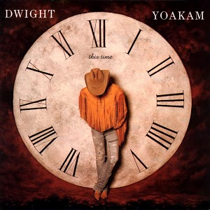

# This Time

By **Dwight Yoakam**

## Album Data

- **Catalog:** Beets
- **Format:** Digital, Album
- **Album:** This Time
- **Artist:** Dwight Yoakam
- **Albumartist:** Dwight Yoakam
- **Genre:** Honky Tonk
- **MusicBrainz Album Artist ID:** [0fb711af-c7ba-4bdc-b0b6-b8495fc0a590](https://musicbrainz.org/artist/0fb711af-c7ba-4bdc-b0b6-b8495fc0a590)
- **MusicBrainz Album ID:** [ba970a63-912b-4fd3-9bd6-59c7d35c6b4c](https://musicbrainz.org/release/ba970a63-912b-4fd3-9bd6-59c7d35c6b4c)
- **MusicBrainz Release Group ID:** [7bc2872e-1497-3c46-bcb9-d5bcd277c901](https://musicbrainz.org/release-group/7bc2872e-1497-3c46-bcb9-d5bcd277c901)
- **Year:** 1993
- **Catalog #:** 9 45241-2
- **Label:** Reprise Records
- **Total Tracks:** 11

## Album Tracks

### Track 01 - Pocket of a Clown

- **Artist:** Dwight Yoakam
- **Format:** ALAC
- **Genre:** Rockabilly
- **Length:** 2:57
- **MusicBrainz Track ID:** [ae3aa724-9455-4b78-b892-6aeb4bf488f5](https://musicbrainz.org/recording/ae3aa724-9455-4b78-b892-6aeb4bf488f5)
- **Title:** Pocket of a Clown
- **Track:** 01
- **Year:** 1993

### Track 02 - A Thousand Miles From Nowhere

- **Artist:** Dwight Yoakam
- **Format:** ALAC
- **Genre:** Honky Tonk
- **Length:** 4:29
- **MusicBrainz Track ID:** [e23272b7-6c9e-42b2-99c4-ea29850d59aa](https://musicbrainz.org/recording/e23272b7-6c9e-42b2-99c4-ea29850d59aa)
- **Title:** A Thousand Miles From Nowhere
- **Track:** 02
- **Year:** 1993

### Track 03 - Home for Sale

- **Artist:** Dwight Yoakam
- **Format:** ALAC
- **Genre:** Classic Country
- **Length:** 3:39
- **MusicBrainz Track ID:** [b14f44db-acbe-4112-84fb-f9e1deee687a](https://musicbrainz.org/recording/b14f44db-acbe-4112-84fb-f9e1deee687a)
- **Title:** Home for Sale
- **Track:** 03
- **Year:** 1993

### Track 04 - This Time

- **Artist:** Dwight Yoakam
- **Format:** ALAC
- **Genre:** Classic Country
- **Length:** 3:58
- **MusicBrainz Track ID:** [65496492-06dd-4219-816b-7de417cc52c2](https://musicbrainz.org/recording/65496492-06dd-4219-816b-7de417cc52c2)
- **Title:** This Time
- **Track:** 04
- **Year:** 1993

### Track 05 - Two Doors Down

- **Artist:** Dwight Yoakam
- **Format:** ALAC
- **Genre:** Classic Country
- **Length:** 3:54
- **MusicBrainz Track ID:** [90db9025-3567-4415-81f6-9cbe966ca219](https://musicbrainz.org/recording/90db9025-3567-4415-81f6-9cbe966ca219)
- **Title:** Two Doors Down
- **Track:** 05
- **Year:** 1993

### Track 06 - Ain’t That Lonely Yet

- **Artist:** Dwight Yoakam
- **Format:** ALAC
- **Genre:** Honky Tonk
- **Length:** 3:20
- **MusicBrainz Track ID:** [c7ea06de-c48c-44a4-8b60-32972a2ea842](https://musicbrainz.org/recording/c7ea06de-c48c-44a4-8b60-32972a2ea842)
- **Title:** Ain’t That Lonely Yet
- **Track:** 06
- **Year:** 1993

### Track 07 - King of Fools

- **Artist:** Dwight Yoakam
- **Format:** ALAC
- **Genre:** Country
- **Length:** 4:07
- **MusicBrainz Track ID:** [1b08e91b-dfb6-454f-adfd-f9daf6b4b1ea](https://musicbrainz.org/recording/1b08e91b-dfb6-454f-adfd-f9daf6b4b1ea)
- **Title:** King of Fools
- **Track:** 07
- **Year:** 1993

### Track 08 - Fast as You

- **Artist:** Dwight Yoakam
- **Format:** ALAC
- **Genre:** Honky Tonk
- **Length:** 4:48
- **MusicBrainz Track ID:** [9548342a-96bb-490e-80a9-4e6716dc5744](https://musicbrainz.org/recording/9548342a-96bb-490e-80a9-4e6716dc5744)
- **Title:** Fast as You
- **Track:** 08
- **Year:** 1993

### Track 09 - Try Not to Look So Pretty

- **Artist:** Dwight Yoakam
- **Format:** ALAC
- **Genre:** Bakersfield Sound
- **Length:** 2:54
- **MusicBrainz Track ID:** [792c856c-4bcf-43c1-81a8-f9b26b14147d](https://musicbrainz.org/recording/792c856c-4bcf-43c1-81a8-f9b26b14147d)
- **Title:** Try Not to Look So Pretty
- **Track:** 09
- **Year:** 1993

### Track 10 - Wild Ride

- **Artist:** Dwight Yoakam
- **Format:** ALAC
- **Genre:** Classic Country
- **Length:** 4:43
- **MusicBrainz Track ID:** [7f88525e-3628-4d7e-8805-47fbf5b766e9](https://musicbrainz.org/recording/7f88525e-3628-4d7e-8805-47fbf5b766e9)
- **Title:** Wild Ride
- **Track:** 10
- **Year:** 1993

### Track 11 - Lonesome Roads

- **Artist:** Dwight Yoakam
- **Format:** ALAC
- **Genre:** Classic Country
- **Length:** 3:06
- **MusicBrainz Track ID:** [3b213a72-a278-4317-a806-ae5144c96d03](https://musicbrainz.org/recording/3b213a72-a278-4317-a806-ae5144c96d03)
- **Title:** Lonesome Roads
- **Track:** 11
- **Year:** 1993

## See also

- [Guitars Cadillacs Etc. Etc](Guitars_Cadillacs_Etc_Etc.md)
- [Hillbilly Deluxe](Hillbilly_Deluxe.md)
- [Roon: Guitars, Cadillacs, Etc., Etc.](../../Roon/Dwight_Yoakam/Guitars__Cadillacs__Etc__Etc.md)
