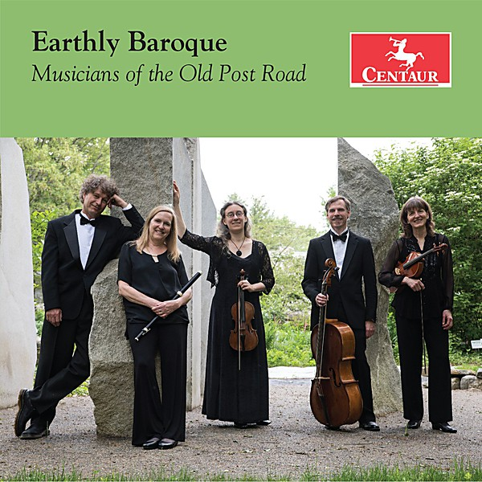

# D'CüCKOO

By **D’CüCKOO**

## Album Data

- **Catalog:** Beets
- **Format:** Digital, Album
- **Album:** D'CüCKOO
- **Artist:** D’cückoo
- **Albumartist:** D’CüCKOO
- **Genre:** Unknown
- **MusicBrainz Album Artist ID:** [c46b674e-1cbc-4dab-ba9f-da2130bd7171](https://musicbrainz.org/artist/c46b674e-1cbc-4dab-ba9f-da2130bd7171)
- **MusicBrainz Album ID:** [e606232b-5923-4e1f-a607-214663b52ddf](https://musicbrainz.org/release/e606232b-5923-4e1f-a607-214663b52ddf)
- **MusicBrainz Release Group ID:** [95fd83d2-9191-3ccb-8355-227bebd165d2](https://musicbrainz.org/release-group/95fd83d2-9191-3ccb-8355-227bebd165d2)
- **Year:** 1991
- **Catalog #:** D'Kayla 1992
- **Label:** Aisle of Women
- **Total Tracks:** 12

## Album Tracks

### Track 01 - One World

- **Artist:** D’CüCKOO
- **Format:** ALAC
- **Genre:** Unknown
- **Length:** 4:23
- **MusicBrainz Track ID:** [bd927dad-641d-45b4-a05e-9c29c644d76e](https://musicbrainz.org/recording/bd927dad-641d-45b4-a05e-9c29c644d76e)
- **Title:** One World
- **Track:** 01
- **Year:** 1991

### Track 02 - No One Receiving

- **Artist:** D’CüCKOO
- **Format:** ALAC
- **Genre:** Unknown
- **Length:** 5:26
- **MusicBrainz Track ID:** [8aa972fb-20a7-4af3-9458-1a7d8376a61c](https://musicbrainz.org/recording/8aa972fb-20a7-4af3-9458-1a7d8376a61c)
- **Title:** No One Receiving
- **Track:** 02
- **Year:** 1991

### Track 03 - Love Again

- **Artist:** D’CüCKOO
- **Format:** ALAC
- **Genre:** Unknown
- **Length:** 4:54
- **MusicBrainz Track ID:** [626221f3-5ee2-49db-8fed-85d97e29968a](https://musicbrainz.org/recording/626221f3-5ee2-49db-8fed-85d97e29968a)
- **Title:** Love Again
- **Track:** 03
- **Year:** 1991

### Track 04 - The Whole World

- **Artist:** D’CüCKOO
- **Format:** ALAC
- **Genre:** Unknown
- **Length:** 5:31
- **MusicBrainz Track ID:** [748c6bd0-25bd-4284-80c6-d1865a6a88f2](https://musicbrainz.org/recording/748c6bd0-25bd-4284-80c6-d1865a6a88f2)
- **Title:** The Whole World
- **Track:** 04
- **Year:** 1991

### Track 05 - Somebody Else's Dreams

- **Artist:** D’CüCKOO
- **Format:** ALAC
- **Genre:** Unknown
- **Length:** 5:27
- **MusicBrainz Track ID:** [d747fbdf-b2d9-464c-b055-94872ddbc73f](https://musicbrainz.org/recording/d747fbdf-b2d9-464c-b055-94872ddbc73f)
- **Title:** Somebody Else's Dreams
- **Track:** 05
- **Year:** 1991

### Track 06 - Distant Worlds

- **Artist:** D’CüCKOO
- **Format:** ALAC
- **Genre:** Unknown
- **Length:** 5:03
- **MusicBrainz Track ID:** [53387cd0-8727-4b71-9988-ccf82cf90100](https://musicbrainz.org/recording/53387cd0-8727-4b71-9988-ccf82cf90100)
- **Title:** Distant Worlds
- **Track:** 06
- **Year:** 1991

### Track 07 - Maya / The Dream

- **Artist:** D’CüCKOO
- **Format:** ALAC
- **Genre:** Unknown
- **Length:** 3:12
- **MusicBrainz Track ID:** [2f0d8fb5-fd43-4e58-b155-b7c8ed1bcad8](https://musicbrainz.org/recording/2f0d8fb5-fd43-4e58-b155-b7c8ed1bcad8)
- **Title:** Maya / The Dream
- **Track:** 07
- **Year:** 1991

### Track 08 - Gems

- **Artist:** D’CüCKOO
- **Format:** ALAC
- **Genre:** Unknown
- **Length:** 5:12
- **MusicBrainz Track ID:** [3e0dfe08-c00a-4e72-bbfe-3493dcfd2319](https://musicbrainz.org/recording/3e0dfe08-c00a-4e72-bbfe-3493dcfd2319)
- **Title:** Gems
- **Track:** 08
- **Year:** 1991

### Track 09 - Slice

- **Artist:** D’CüCKOO
- **Format:** ALAC
- **Genre:** Unknown
- **Length:** 6:06
- **MusicBrainz Track ID:** [10640ae5-2417-4785-b702-24049e0e010d](https://musicbrainz.org/recording/10640ae5-2417-4785-b702-24049e0e010d)
- **Title:** Slice
- **Track:** 09
- **Year:** 1991

### Track 10 - Talk II

- **Artist:** D’CüCKOO
- **Format:** ALAC
- **Genre:** Unknown
- **Length:** 4:35
- **MusicBrainz Track ID:** [b924e271-9460-4da9-ab4a-c634cdf71c20](https://musicbrainz.org/recording/b924e271-9460-4da9-ab4a-c634cdf71c20)
- **Title:** Talk II
- **Track:** 10
- **Year:** 1991

### Track 11 - 1000 Miles

- **Artist:** D’CüCKOO
- **Format:** ALAC
- **Genre:** Unknown
- **Length:** 4:22
- **MusicBrainz Track ID:** [42aa7a04-ee26-49ec-a6a9-fb9aea20a021](https://musicbrainz.org/recording/42aa7a04-ee26-49ec-a6a9-fb9aea20a021)
- **Title:** 1000 Miles
- **Track:** 11
- **Year:** 1991

### Track 12 - Cyber

- **Artist:** D’CüCKOO
- **Format:** ALAC
- **Genre:** Unknown
- **Length:** 1:47
- **MusicBrainz Track ID:** [1ea5f29c-fa64-4d56-9383-cf6f7c4c6035](https://musicbrainz.org/recording/1ea5f29c-fa64-4d56-9383-cf6f7c4c6035)
- **Title:** Cyber
- **Track:** 12
- **Year:** 1991

