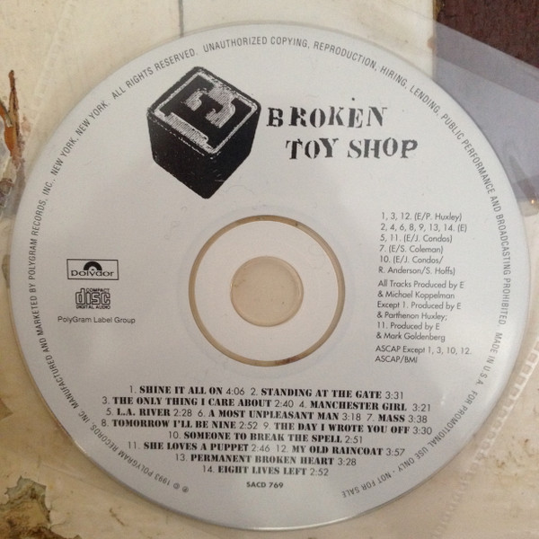

# Broken Toy Shop

By **E**

## Album Data

- **Catalog:** Beets
- **Format:** Digital, Album
- **Album:** Broken Toy Shop
- **Artist:** E
- **Albumartist:** E
- **Genre:** Indie Rock
- **MusicBrainz Album Artist ID:** 
- **MusicBrainz Album ID:** 
- **MusicBrainz Release Group ID:** 
- **Year:** 1993
- **Catalog #:** 
- **Label:** Polygram
- **Total Tracks:** 00

## Album Tracks

### Track 01 - Shine It All On

- **Artist:** E
- **Format:** MP3
- **Genre:** Baroque Pop
- **Length:** 4:03
- **MusicBrainz Track ID:** 
- **Title:** Shine It All On
- **Track:** 01
- **Year:** 1993

### Track 02 - Standing at the Gate

- **Artist:** E
- **Format:** MP3
- **Genre:** Alternative Rock
- **Length:** 3:31
- **MusicBrainz Track ID:** 
- **Title:** Standing at the Gate
- **Track:** 02
- **Year:** 1993

### Track 03 - The Only Thing I Care About

- **Artist:** E
- **Format:** MP3
- **Genre:** Emo
- **Length:** 2:41
- **MusicBrainz Track ID:** 
- **Title:** The Only Thing I Care About
- **Track:** 03
- **Year:** 1993

### Track 04 - Manchester Girl

- **Artist:** E
- **Format:** MP3
- **Genre:** Electronic
- **Length:** 3:22
- **MusicBrainz Track ID:** 
- **Title:** Manchester Girl
- **Track:** 04
- **Year:** 1993

### Track 05 - L.A. River

- **Artist:** E
- **Format:** MP3
- **Genre:** Indie Rock
- **Length:** 2:28
- **MusicBrainz Track ID:** 
- **Title:** L.A. River
- **Track:** 05
- **Year:** 1993

### Track 06 - A Most Unpleasant Man

- **Artist:** E
- **Format:** MP3
- **Genre:** Alternative Rock
- **Length:** 3:21
- **MusicBrainz Track ID:** 
- **Title:** A Most Unpleasant Man
- **Track:** 06
- **Year:** 1993

### Track 07 - Mass

- **Artist:** E
- **Format:** MP3
- **Genre:** Post-Punk
- **Length:** 4:28
- **MusicBrainz Track ID:** 
- **Title:** Mass
- **Track:** 07
- **Year:** 1993

### Track 08 - Tomorrow I'll Be Nine

- **Artist:** E
- **Format:** MP3
- **Genre:** Post-Punk
- **Length:** 2:52
- **MusicBrainz Track ID:** 
- **Title:** Tomorrow I'll Be Nine
- **Track:** 08
- **Year:** 1993

### Track 09 - The Day I Wrote You Off

- **Artist:** E
- **Format:** MP3
- **Genre:** Alternative Rock
- **Length:** 3:28
- **MusicBrainz Track ID:** 
- **Title:** The Day I Wrote You Off
- **Track:** 09
- **Year:** 1993

### Track 10 - Someone to Break the Spell

- **Artist:** E
- **Format:** MP3
- **Genre:** Post-Punk
- **Length:** 2:51
- **MusicBrainz Track ID:** 
- **Title:** Someone to Break the Spell
- **Track:** 10
- **Year:** 1993

### Track 11 - She Loves a Puppet

- **Artist:** E
- **Format:** MP3
- **Genre:** Indie Rock
- **Length:** 2:47
- **MusicBrainz Track ID:** 
- **Title:** She Loves a Puppet
- **Track:** 11
- **Year:** 1993

### Track 12 - My Old Raincoat

- **Artist:** E
- **Format:** MP3
- **Genre:** Electronic
- **Length:** 3:59
- **MusicBrainz Track ID:** 
- **Title:** My Old Raincoat
- **Track:** 12
- **Year:** 1993

### Track 13 - Permanent Broken Heart

- **Artist:** E
- **Format:** MP3
- **Genre:** Indie Rock
- **Length:** 3:30
- **MusicBrainz Track ID:** 
- **Title:** Permanent Broken Heart
- **Track:** 13
- **Year:** 1993

### Track 14 - Eight Lives Left

- **Artist:** E
- **Format:** MP3
- **Genre:** Indie Rock
- **Length:** 3:09
- **MusicBrainz Track ID:** 
- **Title:** Eight Lives Left
- **Track:** 14
- **Year:** 1993

### Track 18 - Shine It All On

- **Artist:** E
- **Format:** ALAC
- **Genre:** Baroque Pop
- **Length:** 4:03
- **MusicBrainz Track ID:** 
- **Title:** Shine It All On
- **Track:** 18
- **Year:** 1993

### Track 19 - My Old Raincoat

- **Artist:** E
- **Format:** ALAC
- **Genre:** Electronic
- **Length:** 3:59
- **MusicBrainz Track ID:** 
- **Title:** My Old Raincoat
- **Track:** 19
- **Year:** 1993

## See also

- [Roon: A Man Called E](../../Roon/E/A_Man_Called_E.md)
- [Roon: Broken Toy Shop](../../Roon/E/Broken_Toy_Shop.md)
