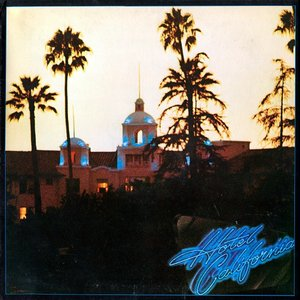

# Hotel California

By **Eagles**

## Album Data

- **Catalog:** Beets
- **Format:** Digital, Album
- **Album:** Hotel California
- **Artist:** Eagles
- **Albumartist:** Eagles
- **Genre:** Soft Rock
- **MusicBrainz Album Artist ID:** [f46bd570-5768-462e-b84c-c7c993bbf47e](https://musicbrainz.org/artist/f46bd570-5768-462e-b84c-c7c993bbf47e)
- **MusicBrainz Album ID:** [bb465529-b3d9-43be-9d3c-e71ce11be1b2](https://musicbrainz.org/release/bb465529-b3d9-43be-9d3c-e71ce11be1b2)
- **MusicBrainz Release Group ID:** [836f349a-0434-3e8b-a0bc-261f77a9f99c](https://musicbrainz.org/release-group/836f349a-0434-3e8b-a0bc-261f77a9f99c)
- **Year:** 1976
- **Catalog #:** 
- **Label:** 
- **Total Tracks:** 33

## Album Tracks

### Track 01 - Take it Easy

- **Artist:** Eagles
- **Format:** AAC
- **Genre:** Soft Rock
- **Length:** 3:29
- **MusicBrainz Track ID:** 
- **Title:** Take it Easy
- **Track:** 01
- **Year:** 2007

### Track 02 - Witchy Woman

- **Artist:** Eagles
- **Format:** AAC
- **Genre:** Soft Rock
- **Length:** 4:13
- **MusicBrainz Track ID:** 
- **Title:** Witchy Woman
- **Track:** 02
- **Year:** 2007

### Track 03 - Peaceful Easy Feeling

- **Artist:** Eagles
- **Format:** AAC
- **Genre:** Soft Rock
- **Length:** 4:16
- **MusicBrainz Track ID:** 
- **Title:** Peaceful Easy Feeling
- **Track:** 03
- **Year:** 2007

### Track 04 - Desperado

- **Artist:** Eagles
- **Format:** AAC
- **Genre:** Soft Rock
- **Length:** 3:34
- **MusicBrainz Track ID:** 
- **Title:** Desperado
- **Track:** 04
- **Year:** 2007

### Track 05 - Tequila Sunrise

- **Artist:** Eagles
- **Format:** AAC
- **Genre:** Soft Rock
- **Length:** 2:53
- **MusicBrainz Track ID:** 
- **Title:** Tequila Sunrise
- **Track:** 05
- **Year:** 2007

### Track 06 - Doolin-Dalton

- **Artist:** Eagles
- **Format:** AAC
- **Genre:** Soft Rock
- **Length:** 3:27
- **MusicBrainz Track ID:** 
- **Title:** Doolin-Dalton
- **Track:** 06
- **Year:** 2007

### Track 07 - Already Gone

- **Artist:** Eagles
- **Format:** AAC
- **Genre:** Soft Rock
- **Length:** 4:15
- **MusicBrainz Track ID:** 
- **Title:** Already Gone
- **Track:** 07
- **Year:** 2007

### Track 08 - The Best Of My Love

- **Artist:** Eagles
- **Format:** AAC
- **Genre:** Soft Rock
- **Length:** 4:34
- **MusicBrainz Track ID:** 
- **Title:** The Best Of My Love
- **Track:** 08
- **Year:** 2007

### Track 09 - James Dean

- **Artist:** Eagles
- **Format:** AAC
- **Genre:** Soft Rock
- **Length:** 3:39
- **MusicBrainz Track ID:** 
- **Title:** James Dean
- **Track:** 09
- **Year:** 2007

### Track 10 - Ol' 55

- **Artist:** Eagles
- **Format:** AAC
- **Genre:** Soft Rock
- **Length:** 4:21
- **MusicBrainz Track ID:** 
- **Title:** Ol' 55
- **Track:** 10
- **Year:** 2007

### Track 11 - Midnight Flyer

- **Artist:** Eagles
- **Format:** AAC
- **Genre:** Soft Rock
- **Length:** 3:58
- **MusicBrainz Track ID:** 
- **Title:** Midnight Flyer
- **Track:** 11
- **Year:** 2007

### Track 12 - On The Border

- **Artist:** Eagles
- **Format:** AAC
- **Genre:** Hard Rock
- **Length:** 4:22
- **MusicBrainz Track ID:** 
- **Title:** On The Border
- **Track:** 12
- **Year:** 2007

### Track 13 - Lyin' Eyes

- **Artist:** Eagles
- **Format:** AAC
- **Genre:** Soft Rock
- **Length:** 6:23
- **MusicBrainz Track ID:** 
- **Title:** Lyin' Eyes
- **Track:** 13
- **Year:** 2007

### Track 14 - One Of These Nights

- **Artist:** Eagles
- **Format:** AAC
- **Genre:** Soft Rock
- **Length:** 4:51
- **MusicBrainz Track ID:** 
- **Title:** One Of These Nights
- **Track:** 14
- **Year:** 2007

### Track 15 - Take It To The Limit

- **Artist:** Eagles
- **Format:** AAC
- **Genre:** Soft Rock
- **Length:** 4:46
- **MusicBrainz Track ID:** 
- **Title:** Take It To The Limit
- **Track:** 15
- **Year:** 2007

### Track 16 - After The Thrill Is Gone

- **Artist:** Eagles
- **Format:** AAC
- **Genre:** Soft Rock
- **Length:** 3:56
- **MusicBrainz Track ID:** 
- **Title:** After The Thrill Is Gone
- **Track:** 16
- **Year:** 2007

### Track 17 - Hotel California

- **Artist:** Eagles
- **Format:** AAC
- **Genre:** Soft Rock
- **Length:** 6:30
- **MusicBrainz Track ID:** 
- **Title:** Hotel California
- **Track:** 17
- **Year:** 2007

### Track 18 - Life In The Fast Lane

- **Artist:** Eagles
- **Format:** AAC
- **Genre:** Soft Rock
- **Length:** 4:46
- **MusicBrainz Track ID:** 
- **Title:** Life In The Fast Lane
- **Track:** 18
- **Year:** 2007

### Track 19 - Wasted Time

- **Artist:** Eagles
- **Format:** AAC
- **Genre:** Soft Rock
- **Length:** 4:56
- **MusicBrainz Track ID:** 
- **Title:** Wasted Time
- **Track:** 19
- **Year:** 2007

### Track 20 - Victim Of Love

- **Artist:** Eagles
- **Format:** AAC
- **Genre:** Soft Rock
- **Length:** 4:09
- **MusicBrainz Track ID:** 
- **Title:** Victim Of Love
- **Track:** 20
- **Year:** 2007

### Track 21 - The Last Resort

- **Artist:** Eagles
- **Format:** AAC
- **Genre:** Soft Rock
- **Length:** 7:28
- **MusicBrainz Track ID:** 
- **Title:** The Last Resort
- **Track:** 21
- **Year:** 2007

### Track 22 - New Kid In Town

- **Artist:** Eagles
- **Format:** AAC
- **Genre:** Soft Rock
- **Length:** 5:03
- **MusicBrainz Track ID:** 
- **Title:** New Kid In Town
- **Track:** 22
- **Year:** 2007

### Track 23 - Please Come Home For Christmas (Remastered LP Version)

- **Artist:** Eagles
- **Format:** AAC
- **Genre:** Soft Rock
- **Length:** 2:58
- **MusicBrainz Track ID:** 
- **Title:** Please Come Home For Christmas (Remastered LP Version)
- **Track:** 23
- **Year:** 2007

### Track 25 - The Sad Cafe

- **Artist:** Eagles
- **Format:** AAC
- **Genre:** Soft Rock
- **Length:** 5:33
- **MusicBrainz Track ID:** 
- **Title:** The Sad Cafe
- **Track:** 25
- **Year:** 2007

### Track 26 - I Can't Tell You Why

- **Artist:** Eagles
- **Format:** AAC
- **Genre:** Soft Rock
- **Length:** 4:54
- **MusicBrainz Track ID:** 
- **Title:** I Can't Tell You Why
- **Track:** 26
- **Year:** 2007

### Track 27 - The Long Run

- **Artist:** Eagles
- **Format:** AAC
- **Genre:** Soft Rock
- **Length:** 3:43
- **MusicBrainz Track ID:** 
- **Title:** The Long Run
- **Track:** 27
- **Year:** 2007

### Track 28 - In The City

- **Artist:** Eagles
- **Format:** AAC
- **Genre:** Soft Rock
- **Length:** 3:47
- **MusicBrainz Track ID:** 
- **Title:** In The City
- **Track:** 28
- **Year:** 2007

### Track 29 - Those Shoes

- **Artist:** Eagles
- **Format:** AAC
- **Genre:** Soft Rock
- **Length:** 4:54
- **MusicBrainz Track ID:** 
- **Title:** Those Shoes
- **Track:** 29
- **Year:** 2007

### Track 30 - Seven Bridges Road (Live Version)

- **Artist:** Eagles
- **Format:** MP3
- **Genre:** Soft Rock
- **Length:** 3:54
- **MusicBrainz Track ID:** 
- **Title:** Seven Bridges Road (Live Version)
- **Track:** 30
- **Year:** 2007

### Track 31 - Love Will Keep Us Alive (Remastered LP Version)

- **Artist:** Eagles
- **Format:** AAC
- **Genre:** Soft Rock
- **Length:** 4:02
- **MusicBrainz Track ID:** 
- **Title:** Love Will Keep Us Alive (Remastered LP Version)
- **Track:** 31
- **Year:** 2007

### Track 32 - Get Over It (Remastered LP Version)

- **Artist:** Eagles
- **Format:** AAC
- **Genre:** Soft Rock
- **Length:** 3:29
- **MusicBrainz Track ID:** 
- **Title:** Get Over It (Remastered LP Version)
- **Track:** 32
- **Year:** 2007

### Track 33 - Hole In The World (Stereo Mix)

- **Artist:** Eagles
- **Format:** AAC
- **Genre:** Soft Rock
- **Length:** 4:16
- **MusicBrainz Track ID:** 
- **Title:** Hole In The World (Stereo Mix)
- **Track:** 33
- **Year:** 2007

## See also

- [The Very Best Of The Eagles [Disc 1]](The_Very_Best_Of_The_Eagles_[Disc_1].md)
- [The Very Best of The Eagles [Disc 2]](The_Very_Best_of_The_Eagles_[Disc_2].md)
- [The Very Best Of The Eagles](The_Very_Best_Of_The_Eagles.md)
- [Roon: Desperado](../../Roon/Eagles/Desperado.md)
- [Roon: Eagles](../../Roon/Eagles/Eagles.md)
- [Roon: Hotel California (2013 Remaster)](../../Roon/Eagles/Hotel_California_2013_Remaster.md)
- [Roon: One of These Nights](../../Roon/Eagles/One_of_These_Nights.md)
- [Roon: On the Border](../../Roon/Eagles/On_the_Border.md)
- [Roon: The Long Run](../../Roon/Eagles/The_Long_Run.md)
- [Roon: The Very Best Of The Eagles](../../Roon/Eagles/The_Very_Best_Of_The_Eagles.md)
- [Vinyl: Desperado](../../Vinyl/Eagles/Desperado.md)
- [Vinyl: ](../../Vinyl/Eagles/Eagles.md)
- [Vinyl: Hotel California](../../Vinyl/Eagles/Hotel_California.md)
- [Vinyl: On The Border](../../Vinyl/Eagles/On_The_Border.md)
